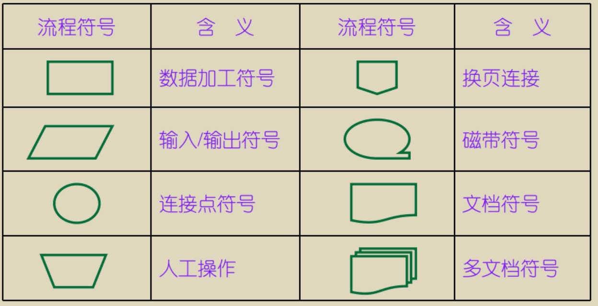
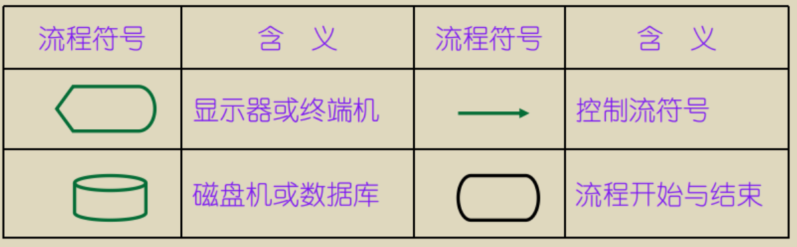
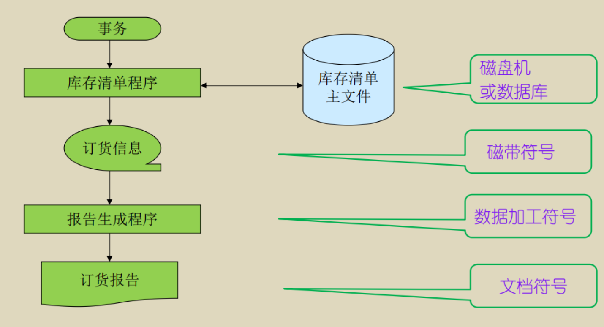
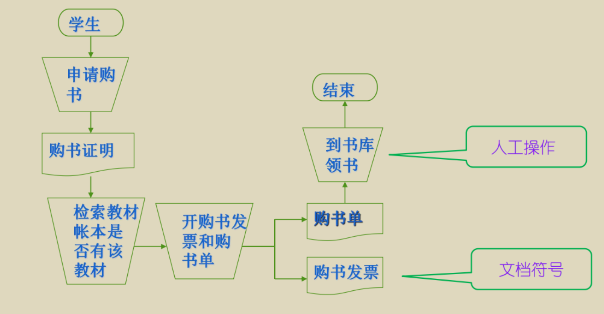
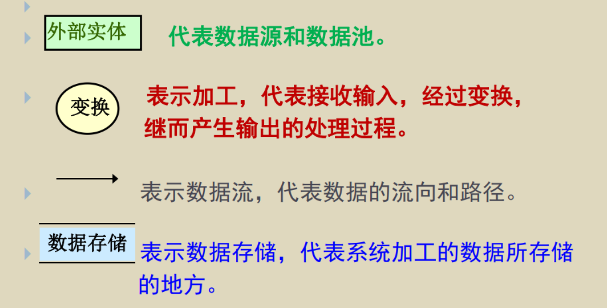
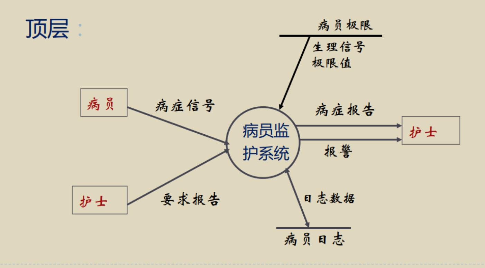
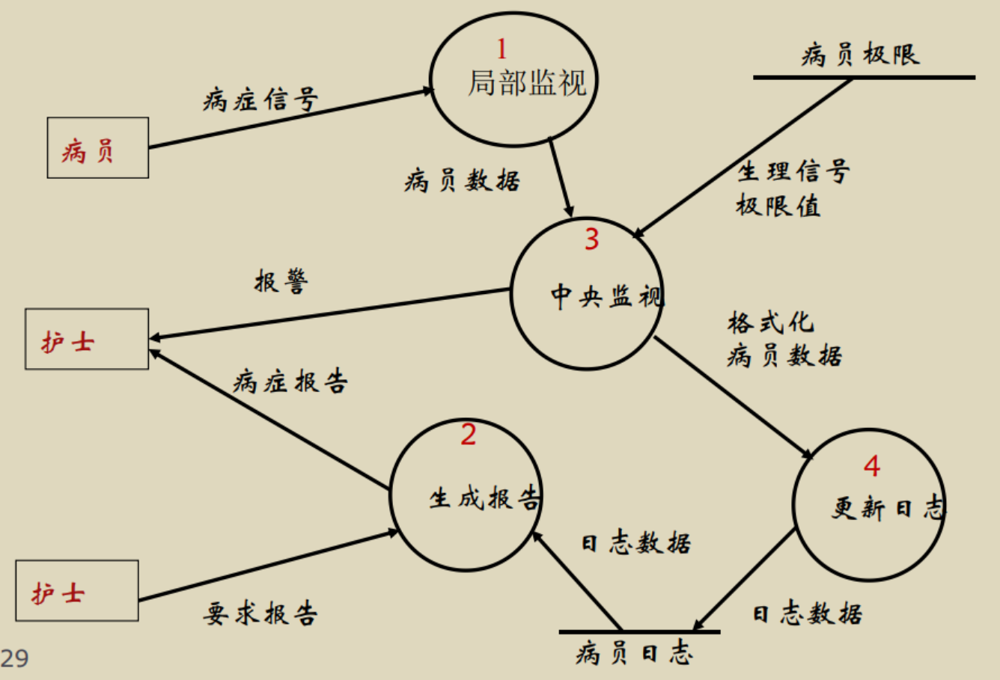
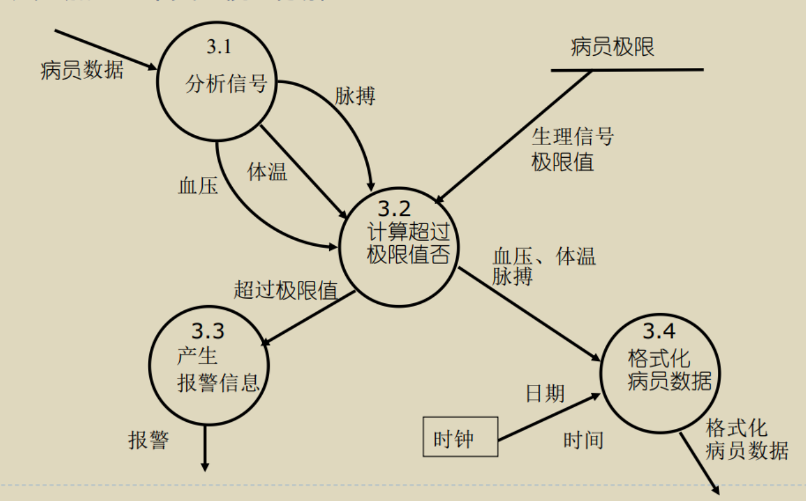
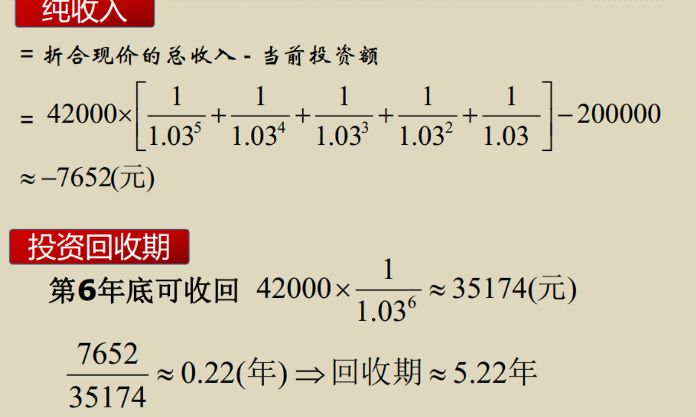
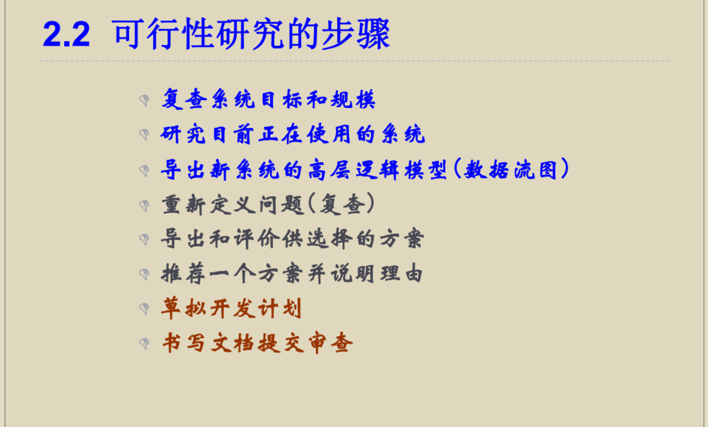

# 第2章 可行性研究

## 可行性研究的目的

1. 弄清要计算机解决的问题根本所在，确定新系统的作用域。
2. 所需费用
3. 所需资源  

!!! danger
	不是解决问题， 而是确定问题是否可以解决、 是否值得解决  

## 可行性研究的任务

总述：用最小的代价在尽可能短的时间内确定问题是否能够解决。  

### 可行性的分类

#### 技术可行性

> 使用现有的技术能实现系统吗？  这些程序员的编程语言能不能胜任？

- 使用的技术实用化程度
- 技术解决方案合理程度
- 参与人员的工作基础
- 基础硬件/软件的可用性
- 软件工具实用性

#### 经济可行性

基于计算机系统的成本由四部分组成：

1. 购置软、 硬件及有关设备费用
2. 系统开发费用
3. 系统安装和维护费用
4. 人员培训费用

#### 操作可行性

系统的操作方式在这个用户组织内能行得通吗？  

1. 用户类型
   外行型、熟练型、专家型  
2. 用户的操作习惯
3. 用户单位的计算机使用情况、普及情况
4. 用户单位的规章制度

#### 法律可行性

#### 社会效益

编写可行性报告说明书（ 系统目标、 可行性分析、 项目规约）  

### 一般需要的内容

- 主要功能概述
- 对现有系统的分析
- 研发系统论述
- 可行性研究（技术、操作、法律等）
- 市场需求情况和风险分析
- 投资估算
- 经济和社会效益分析
- 项目实施进度计划
- 结论
- 参考资料

## 系统流程图

是用来描述系统**物理模型**的一种传统工具。

!!! danger
	这里是可以有人工操作这些内容的，因为仅仅表达这个物理的系统是怎么运作的。





### 相关的例子





## 数据流图（ data flow diagram (DFD) ）  

数据流图是描述 **逻辑模型** 的图形工具， 图中没有具体的物理元素。 描述数据在 **系统中** 的流动和处理的情况， 

### 相关符号

- 数据源点或终点（正方形）
- 加工（圆）
- 文件（直线）
- 数据流（箭头）



### DFD的分层

DFD可以分层表示信息流和功能的细节， 既提供了**功能建模**的机制， 又提供了**信息流建模**的机制。

第0层：也被称为**基本系统模型**或**语境模型**。

>  DFD没有提供显式的处理顺序， 过程或顺序式隐含在DFD中的， 显式的推迟到系统设计时。

顶层图说明了系统的边界， 即系统的输入输出数据流，顶层图只有一张。

中间层的数据流图描述了某个加工的分解， 而它的组成部分又要进一步被分解。

底层由不必再分解的加工组成， 称为基本加工。

> 1. 分解应自然， 概念上合理， 清晰； 上层可以分解的快些， 而在下层应分解的慢一些。  
> 2. （重要）数据守恒  —— 父图中某个加工的输入输出数据流应该同相应的子图的输入输出相同。  
> 3. 子图的编号就是父图中相应加工的编号， 由图号， 小数点，局部号连接而成。  
> 4. 一个加工一般最多分解成7个子加工；  （葫芦娃）

### 画法及注意事项

从外向内：

1. 画系统的输入输出
2. 画系统的内部
3. 画加工的内部

适当的命名： 反映全体的情况； 避免空洞的名字

画数据流而不是控制流

先考虑稳定状态

忽略枝节

随时准备重画

### 数据流图举例

实例：医院病房监护系统  

1、监视病员的病症(血压、体温、脉搏等)。（需要有一个单独的小型计算机）

2、定时更新病历。

3、病员出现异常情况时报警。（异常情况要提前存在计算机中）

4、随机地产生某一病员的病情报告。（要求了才会产生，所以有“要求”这一个输入）

!!! tip
	这个病情报告里面是要包含有时间以及日期的（hahaha）

#### 顶层



#### 1层DFD  



#### 第二层（仅仅“中央监视”分解 ）

 

## 数据字典——给图形做注解

考点：数据字典是**结构化分析方法的核心**。  尝尝与各个模型的图形进行配合。

!!! note
     数据字典定义数据流图中出现的所有的名字。  

     1. 每一个数据流名， 每一个文件名和每一个加工名在字典中都应有一个条目给出这个名字的定义。
     2. 每一个组成部分在字典中也应有一个条目给出它们的定义。

### 具体组成

1) 词条描述 —— 对于在模型中每一个被命名的图形元素，均加以定义，其内容有: 名字，别名或编号，分类，描述，定义，位置，其它，等。

2) 数据结构的描述

3) 基本加工逻辑说明

### 标识符的描述方法

- X = a + b: X 由a和b构成。
- X = [a, b]: X 由a或b构成。
- X = [a|b]: X 由a或b构成。
- X = (a): a 可在X中出现，也可能不出现。
- X = {a}: X 由零次或多次重复的a构成。
- X = m{a}n: X 由m至n个a组成，即至少有m个a，至多有n个a。
- X = a..b: X可取a至b的任一值。
- X = "a": X为取值a的基本数据元素，即a无需进一步定义。

### 例题

某程序语言规定， 用户说明的标识符是长度不超过8个字符的字符串， 第一个字符必须是字母字符， 随后的字符既可以是字母也可以是数字字符。 请定义该标识符。  

````
标识符= 字母字符+字母数字串
字母数字串=0{字母或数字}7
字母或数字= [字母字符|数字字符]
字母字符=[a..z|A..Z]
数字字符=0..9
````

某高校可用电话号码有以下几类： 校内电话号码由4位数字组成， 第1位数字不是0；校外电话又分为本市电话和外地电话， 拨校外电话要先拨0， 若是本市电话则再接着拨8位数字（ 第1位不是0） ， 若是外地电话拨3位区码再拨8位电话号码（ 第1位不是0） 。 请定义上述的电话号码。  

`````
电话号码=[校内电话号码|校外电话号码】
校内电话号码=非零数字+3位数字 //后面继续定义
校外电话号码=[本市号码|外地号码]
本市号码=数字零+8位数字
外地号码=数字零+3位数字+8位数字
非零数字=[1|2|3|4|5|6|7|8|9]
数字零=0
3位数字=3{数字}3 //3至3个数字
8位数字=非零数字+7位数字
7位数字=7{数字}7
数字= [0|1|2|3|4|5|6|7|8|9]
`````

!!! danger
    老师特别提醒，在定义的时候不能使用英文：

    “数字字符=0..9”中的左面的必须是汉字！

## 成本效益分析

### 规模估算

#### 代码行技术

1. 实现
2. 计算每个功能的代码行数平均值：\((a + 4m + b) / 6\)。——根据经验值尽心估计。
3. 确定每个子功能的代码成本（元/行）和生产率（行/人月）。
4. 计算每个子功能的成本（行 * 代码成本）和人力（行 / 生产率）。
5. 计算项目的总代码行数、总成本和总工作量。

| 功能           | 估算代码行数 | 生产率（行/人月） | 每行成本（元/行） | 成本（元） | 人力（人月） |
| -------------- | ------------ | ----------------- | ----------------- | ---------- | ------------ |
| 用户接口控制   | 1800         | 2342              | 14                | 32788      | 7.4          |
| 二维几何分析   | 4100         | 5383              | 20                | 107660     | 24.5         |
| 计算机图形显示 | 4050         | 4975              | 22                | 109450     | 24.9         |
| 外部设备控制   | 2000         | 2142              | 28                | 59976      | 15.3         |
| **合计**       | **14842**    |                   |                   | **309874** | **72.1**     |

#### 任务分解技术  

使用下列的步骤（类似于分治）

1. 把软件开发工程分解为若干个相对独立的任务（最常用的办法是按开发阶段进行）
2. 分别估计每个单独的开发任务的成本（需要使用的人力（以人月为单位） 乘以 每人每月的平均工资）
3. 最后累加起来得出软件开发工程的总成本

### 成本估算——专家估算技术(Delphi技术)

利用一个或者是多个专家的专业知识或技能，近似猜测出项目的成本。

!!! note
	Delphi 方法**是最流行**的专家评估技术，**了解即可**。

1. 项目协调人向每个专家提供软件规模（信息）和估算表格；
2. 项目协调人召集专家小组会讨论与规模相关的因素；
3. 每个专家匿名填写成本估算表格；
4. 项目协调人整理出一个估算总结，并将其反馈给专家；
5. 项目协调人召集专家小组会，讨论较大的估算差异；
6. 专家复查估算总结，并在估算表上提交另一个匿名估计；
7. 重复 4 － 6 ，直到估算结果中的最低和最高达到一致

### 效益估算——成本/效益分析

!!! danger
	**未来的钱和现在的钱并不一样，因为现在的钱什么都不做，放在银行中也会增值！**

#### 纯收入

在整个生命周期之内系统累计经济效益(**折合成现在值**)  - 投资的钱

#### 投资回收期  

使得纯收入为0所需要的时间（回本的时间）【**注意折算！**】

- 投资回收期越短就能越快获得利润，这项工程也就越值得投资  

$$
F=P(1+i)^n
$$

- P为初始投资
- i为年利率  
- F 为 n 年底的P值

#### 例题

现在投资20万元，平均年利率3%。从第一年起，每年年底收入4.2万元。软件生命期为5年。  




## 未整理但是可能有用

---


