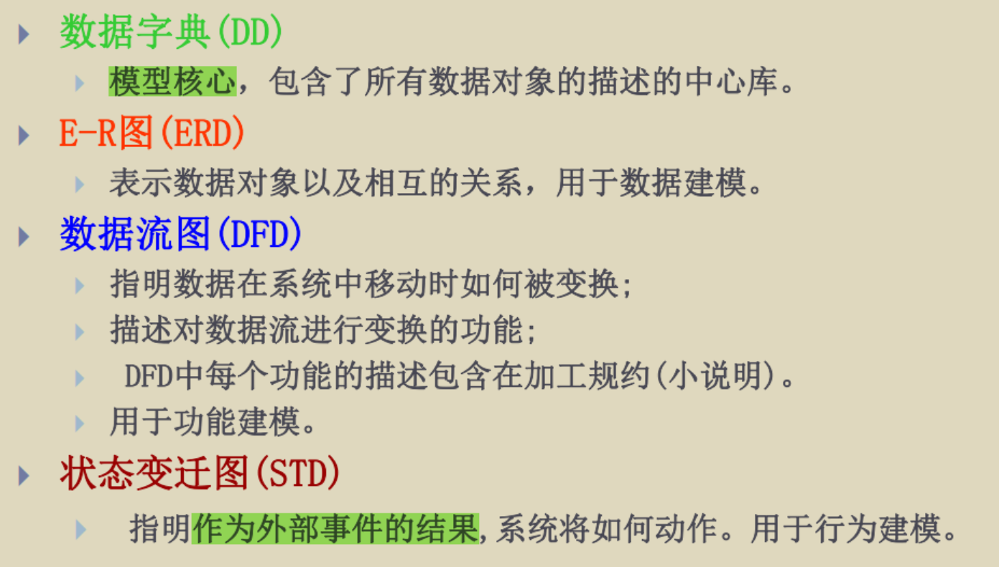

# 第3章 需求分析

## 需求的定义

需求，是：

1. 人们要解决的某个问题或达到某种目的的需要  
2. 系统或其组成部门为满足某种书面约定（ 合同、 标准、规范等） 所具有的能力。

> 需求将作为系统开发、 测试、 验收的正式文档依据。
>
> 由于忽略需求过程造成的项目返工是恶性的， 大量的项目在需求阶段就注定了它的失败。  

## 需求分析所固有的困难

1. 用户与程序员之间的沟通不清楚
   - 用户不清楚要什么，不懂计算机
   - 程序员不懂业务
2. 日常交流所使用的语言文字不精确
3. 用户企业不同部门之间的要求矛盾
4. 用户的需求经常发生变化

> [!tip]
>
> 如果需求分析错误，那么后面的开发成本会爆增！
> 

## 需求分析的任务

### 目的

澄清用户的需求

### 基本的任务

1. 用户和软件人员双方一起来充分地理解用户的要求。
2. 把双方共同的理解明确地表达成一份书面文档---**需求说明书**  

## 需求的分类

### 功能需求

就是这个软件要完成什么功能。

> [!caution]
>
> 仅仅说明干什么，而不说明怎么干！就是有干的过程的全部不是功能需求。

### 非功能需求


### 例子


## 需求分析的步骤

### 调查研究

**系统分析员**协同**程序员**向**用户**做需求调查。

1. 阅软件计划中的**可行性报告**和**项目开发计划报告**
2. 访问系统现场， 并由此确定当前系统必须做什么， 并获得当前系统的具体模型。具体方法如下：
   - 用户面谈
   - 专题研讨会
   - 问卷调查
   - 现场考察
   - 快速原型法
   - 基于用例图
3. 用**数据流图**、 **UML图**或**IPO图**表示

> [!tip]
>
> 做需求分析的时候不应该让用户单方面地描述，应该主动出击，给用户启发，push用户得出其真正想要的需求。

### 分析与综合

1. **分析员**需从**数据流**和**数据结构**出发。
2. **逐步细化**所有的软件功能， 找出系统中**各元素之间的联系**、 **接口特征**和**设计上的限制**， 分析它们能否满足功能要求， 是否合理。  
3. 依据<u>功能需求、 性能需求、 运行环境</u>需求等， 剔除其中不合理的部分， 增加其需要的部分。 最终综合成系统的解决方案后， 给出目标系统的**详细逻辑模型**。  

### 书写需求分析文档

用文档记录，有四种文档

1. 系统规格说明
2. 数据需求
3. 用户系统描述
4. 修正的开发计划

### 评审

需求分析阶段的复查手段，对功能的正确性、 完整性和清晰性， 以及其他需求给予评价。

### 以图书购买系统为例的分析步骤

1. 对现实环境的调查， 获得当前系统的物理模型。（调查研究）
2. 去掉具体模型中的非本质因素：抽取现实系统的实质， 抽象出当前系统的逻辑模型。
3. 分析当前系统与目标系统的差别， 建立目标系统的逻辑模型 。
4. 对目标系统的逻辑模型进行细化、 改进与优化  
5. 需求分析的验证（ 需求评审）  


> [!WARNING]
>
> 看起来又倒了回去，但是实际上是进步着的。


-------

比较突兀的一个东西：

`````````````
需求分析的具体任务总结：
（ 1） 确定软件系统的综合需求
（ 2） 分析系统的数据需求
（ 3） 导出软件系统的逻辑模型
（ 4） 修正系统开发计划
（ 5） 开发原型系统
（ 6） 验证软件需求分析的正确性
（ 7） 编写软件需求规格说明书
`````````````

## 分析建模与规格说明——SA(结构化分析方法 )

- 面向**数据流**、 自顶向下、逐步求精进行需求分析的方法。
- 适用于大型的系统
- 结构化分析方法（SA）通常 与 设计阶段的**结构化设计方法（SD）**结合使用  

### 分析的过程

1. 利用分层的数据流图（DFD），先建立系统环境图（ 顶层） ， 再逐步求精。  
2. 建立数据字典（为DFD注解）——采用结构化英语， 小说明， 补充材料等列出

**步骤：**理解￫ 获得具体模型￫ 抽象出逻辑模型  

### 用到的工具

- 一般**功能分析工具**： DFD、 数据字典、 结构化英语、 判定表、 判定树等。
- 一般**行为分析工具**： 状态迁移图、 Petri网等。
- 一般**数据分析工具**： ER图或者EER(扩展ER)图。

> [!tip]
>
> 这些工具在下文会讲解

> [!note]
>
> SA主要针对数据处理领域， 因此， 系统分析的侧重点在于**功能分析和数据分析**， 而**行为分析使用得较少**。



### SA分析的局限性

- 数据库
- 人机界面
- 实时系统

## 软件需求规格说明书

**软件需求规格说明书**（SRS-Software Requirements Specification）**精确地阐述了**一个软件系统必须提供的**功能和性能以及限制条件**。

### SRS的作用

1. 用户和软件人员之间的**合同**， 为双方相互了解提供基础。
2. 软件人员进行**设计和编写的基础**。
3. 作为**选取测试用例**和进行形式验证以及**验收**的依据。

### 内容


> [!caution]
>
> 不该包含的内容：
>
> 1. 软件的具体实现细节。
> 2. 不能有软件的质量保证。
> 3. 不含有开发计划。


### 写作要点

1. 简介，一句话列出一个点，**不要把一坨要求放在一句话上**！
2. 一致，上下文对于同一个内容的陈述应该一致（不是在写变化多端的英语作文），使用主动预语气。
3. 具体，||给出提示信息 ---> 立即弹出对话框显示该错误， 并进行声音提示。|| 避免： 用户友好、 容易、 简单、 美观、 迅速、 有效  这些无意义的东西。
4. 不要使用比较性词汇，要量化。
5. 多使用图和表

## 实体-联系图（ER图）

- 实体联系图是SA中的一般**数据分析工具**。
- 数据建模最常用的表示**概念性数据模型**的方法，是实体联系方法
- 仅仅表示实体，没有具体的实现方式

### 组成的元素（3个）

#### 实体


满足下面两个条件

1. 客观存在的
2. 可以相互区分的

> [!note]
>
> 可以是实际的物体，也可以是抽象的学生、老师这样的词汇

#### 联系


描述实体之间的联系

#### 属性


> [!caution]
>
> 用来描述实体、联系。

### 例子（略微抽象）


## 状态迁移图

- 状态迁移图是SA中的一般**行为分析工具**。

> [!caution]
>
> （这里略显寒酸，但是要学会两者之间的转化方式！）


## 判定表&判定树

- 是SA中的一般**功能分析工具**。
- 当条件是一坨基本条件的组合的时候，就很有必要了

### 判定表


（不要纠结具体的含义hhh）

### 判定树


### 选择的方法

1. 不太复杂的判断逻辑， 使用判断树比较好；
2. 复杂的判断逻辑， 使用判断表比较好；
3. 若一个处理逻辑既包含了一般的顺序执行动作， 又包含了判断或循环逻辑， 则使用结构化语言比较好。
   这，就是传说中该死的**伪代码**

## 层次方框图

用数形结构的一系列多层次的矩形框描绘数据的层次结构。


## 验证软件需求

### 验证指标

#### 完整性（ 不要遗漏）  

1. 有没有遗漏的内容
2. 不同功能之间是否有接口
3. 不同功能之间是否有消息传递
4. 谁是使用者？怎么交互？
5. 与外部接口怎么搞？
6. 有没有包含软件非功能性的需求

#### 正确性（ 明确用户动机、 正确的表达）

要与用户的期望相吻合，代表了**用户真正**的需求。

1. 用户的参与度
2. 用户是不是认真考虑了每一项描述
3. **这个需求与真实的系统一致吗？？**

> 在用户每次存钱的时候系统将进行信用检查
>
> 错误：与实际不符合

#### 无二意性（ 不矛盾、 表述统一） 

1. 有没有术语词汇表
2. 对有二义性、未知的术语是否定义
3. 是不是可量化（不能有很快...之类的形容词），可验证？
4. 有没有废话文学

> 如果用户想透支，那么采取适当行动
>
> 错误：采取适当行动不明确

#### 一致性

1. 对于统一个东西在不同处的描述是不是相同的
2. 文档的组织形式
3. 要求的功能是不是冲突了
4. 时序上有没有冲突

#### 现实性（ 不超出能力、 符合环境限制） 。

别整一些做不了的内容

#### 可测试性（ 可验证性）

1. 在需求文档中是否存在不可验证的陈述,诸如“用户界面友好”、“容易”、“简单”、“快速”、“健壮”、“最新技术”等?

> 1. 系统将在20秒内响应所有有效的请求。 
>    - OK，可以用表掐出来
> 2. 如果用户试图透支,系统将采取适当的行动。
>    - what is 适当行动

### 需求验证的技术

> 宗旨是要验证能不能满足客户的意愿
>
> 评审/走查、 测试是软件质量保证的重要方法。  

1. 需求评审:由不同代表(如**分析员**、**客户**、**设计人员、测试 人员**)组成的评审小组以会议形式对需求进行系统性分析。**需要不同的代表！**
2. **客户**在一个可运行的系统模型上实际检验系统是否符合他们的真正需要。
3. 通过**设计具体的测试方法**,发现需求中的许多问题。


### 需求评审过程


## 需求管理——与需求开发共同组成需求工程


### 需求跟踪管理表

需求跟踪矩阵（ Requirement tracking matrix ， RTM ）是一种主要管理需求变更和验证需求是否得到了实现

的有效工具， 借助RTM， 可以跟踪**每个需求的状态**。是否设计了， 是否实现了， 是否测试了。


