# 第5章 总体设计  

## 总体设计概念

总体设计（概要设计、初步设计）：回答“概括来说，这一个系统应该怎么设计”

!!! tip
	从需求分析的回答做什么到怎么做


如果没有设计，只能建立一个不稳定的系统结构。  

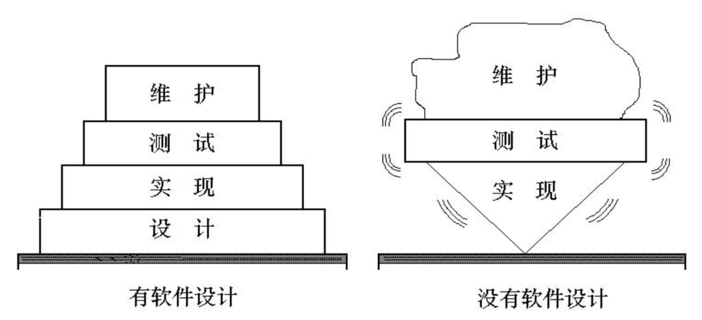

### 需要完成的任务

总的来说，有以下两点：

1. 应划分出组成系统的物理元素——程序、文件、数据库、人工过程和文档等  
2. 确定系统中每个程序由哪些模块组成以及这些模块相互间的关系。  

要将**分析的模型**转化为**设计的模型**

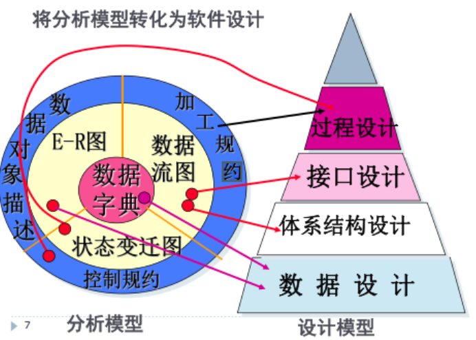

1. 数据设计（由数据字典【主要】、数据流图得到）：设计数据结构
2. 体系结构设计（数据流图）：软件的主要结构性元素  
3. 接口设计（数据流图）：**软件内部**， **软件和协作系统之间**以及**软件同人之间如何通信**。  
4. 过程设计（加工规约）  ：

!!! warning
	设计不是编码， 编码也不是设计。  

## 总体设计

### 总体设计的过程

通常由系统设计和结构设计组成。

- 系统设计阶段确定系统的具体实现方案。

- 结构设计阶段确定软件的结构。

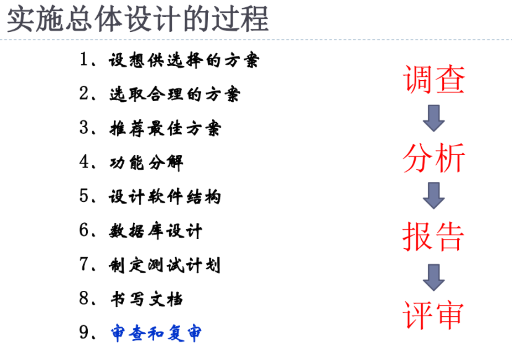

### 总体设计的原则——模块化设计

!!! tip
	模块化设计的基本原则是“高内聚低耦合”

- 模块(module)是**数据说明和可执行语句**等程序对象的**集合**，每个模块**单独命名并且可以通过名字对模块进行访问**。  
- 模块具有 输入和输出， 功能， 内部数据，程序代码等四个特性。
- 模块是完成一个独立功能的程序单元。  
- 模块化设计就是把大型的软件按照规定的原则分解为：①较小的②相对独立③又相关的模块的设计方法。
- 指导思想为：**分解，信息隐藏，独立性。**
- 为的就是：①降低开发难度；②增加系统的可维护性

!!! note
	模块内部的数据与过程， 应该对不需要了解这些数据与过程的模块隐藏起来。 仅仅暴露给外界接口以供访问。目的是为了增强独立性，提高可维护性，避免发错误传播到其他模块中

### 设计的方法

1. 分解
2. 确定每一个模块的功能
3. 决定调用关系
4. 决定模块之间的界面，相互之间怎么传递信息。

### 模块化的理论依据

模块化论据：

- C(x)定义为问题x的**感知复杂性**
- E(x)定义为解决问题x所需要的**工作量**

对于p1和p2两个问题，
若 $C(p1) > C(p2)，则 E(p1) > E(p2)$

$C(p1 + p2) > C(p1) + C(p2)$​

$E(p1 + p2) > E(p1) + E(p2)$​

也就是说：复杂性减小，工作量减小。

!!! danger
	不要过度模块化！每个模块的简单性将被集成的复杂性所掩盖。

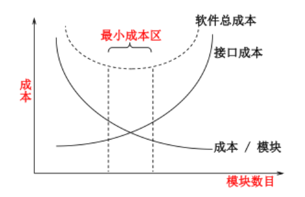

### 模块应该具有的性质&如何确定模块的大小&模块的评价方法 

判定依据如下：

1. 模块可分解性
2. 模块可组装性
3. 模块可理解性：模块可以被独立理解  
4. 模块连续性(系统需求的微小修改只导致对个别模块， 而不是整个系统的修改)
5. 模块保护（如果模块内出现了异常， 它的影响只局限在该模块内部， 则由错误引起的副作用小）

!!! warning
	不要过度模块化每个模块的简单性将被集成的复杂性所掩盖。  

### 自顶向下设计 与 由底向上设计  

自顶向下设计的特点：

- 易于修改和扩展
- 整体测试较易通过
- 需要进行详细的可行性论证（害怕到时候实现不了）

由底向上设计的特点：

- 可能导致较大的重新设计
- 整体测试中可能在模块接口间发现不一致等问题
- 如果在可行性上出现问题，可以较早发现

### 功能型模块的标准

1. 用一个简短的语句来描述这一个模块做什么
2. 只做一件事情

### 模块间以及模块内联系的设计准则

1. 每个模块只做一件事情
2. 通过简单的数据类型传递参数
3. 传递的参数尽可能少

## 模块的独立性——总述

模块独立性（module independence） 概括了把软件划分为模块时要遵守的准则， 也是判断模块构造是否合理的标准。  

度量独立性的两个方式：**内聚**，**耦合**

- 耦合：用于衡量**不同模块**彼此间互相依赖（连接） 的**紧密程度**；
- 内聚：用于衡量**一个模块**内部各个元素间彼此结合的紧密程度。

### 内聚与耦合的关系

1. 内聚和耦合是**密切相关**的， 模块内的**高内聚往往意味着模块间的低耦合**。  
2. 实践表明， 内聚更重要， 应该把更多注意力集中到提高模块的内聚程度上。  

## 模块的独立性——耦合

耦合强弱取决于模块间接口的复杂程度、 进入或访问一个模块的点以及通过接口的数据。

**松散耦合 VS 精密耦合**

- 松散耦合：当一个模块（子系统）发生变化的时候，对其他模块（子系统）的影响很小
- 紧密耦合：反之。

耦合度的三种分类：

1. 无耦合
2. 松散耦合
3. 紧密耦合

耦合度的七种详细分类：

1. 非直接耦合（最好）
2. 数据耦合
3. 标记耦合
4. 控制耦合
5. 外部耦合
6. 公共耦合
7. 内容耦合（寄）

!!! danger
	一定要区分，必考！要求判断那一种类型

### 非直接耦合

两个模块之间没有联系， 则它们之间为非直接耦合。模块之间的联系是通过主模块的控制和调用实现的，模块独立性最强

### 数据耦合

被调用模块的输入与输出是简单的参数或者是数据结构（该数据结构中的所有元素为被调用的模块使用） ，则它们之间为数据耦合。

> 主打一个要啥传啥

### 标记耦合、特征耦合

两个模块通过传递数据结构(**不是简单数据， 而是记录、数组等**)加以联系， 而被调用模块只需要部分数据项， 则称这两个模块之间存在标记耦合或特征耦合。

> 就是说：传了一坨，但是只用了里面的一点点

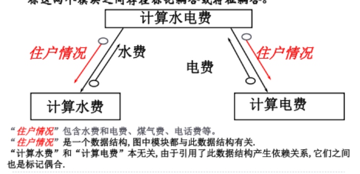

### 控制耦合

如果两个模块中的一个模块给另一个模块传递**控制信息**， 则它们具有控制耦合。

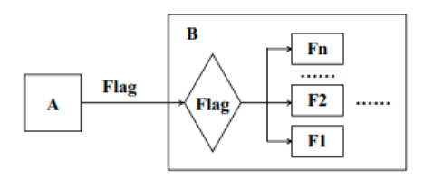

通过传入一个选择的参数来决定被调用的模块执行哪一种操作。

#### 解决方法

1. 面向过程：把功能拆开，一个功能一个函数（虽然很low，但是提高了可维护性）
2. 面对对象：直接使用多态，根据对象的类来具体决定使用哪一种方法。

````java
interface 形状 {
    public void 画图();
} 

class 圆形 implements 形状 {
    public void 画图() {
        System.out.println("圆形");
    }
} 

class 三角形 implements 形状 {
    public void 画图() {
        System.out.println("三角形");
    }
} 
class Test {
    public static void 画图(形状 graphic) {
        graphic.画图();
    }
    
    public static void main(String[] args) {
        形状 a = new 圆形();
        形状 b = new 三角形();
        Test.画图(a); // 打印出 圆形
        Test.画图(b); // 打印出 三角形
    }
}
````


### 外部耦合

当模块与软件的**外部环境联结**在一起， 并**受到约束**时就出现较高程度的耦合， 则它们之间为外部耦合。

两个模块共享一个**外部强加的数据结构**、 **通信协议或者设备接口**。 外部耦合基本上与外部工具和设备的通信有关 。

### 公共耦合

如果两个模块都可以**存取相同的全局数据**， 则它们之间是公共耦合。

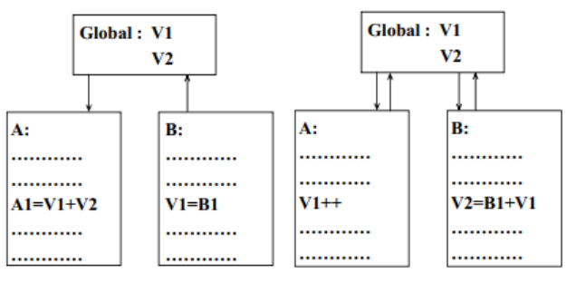

#### 存在的问题

1. 改一下公共的全局数据，那么所有调用它的模块全改
2. 对这一个变量的存取无法控制
3. 随着耦合模块个数增加，复杂程度增加

解决方法是：使用信息隐藏来避免公共耦合

### 内容耦合

如果两个模块中的一个直接引用了另一个模块的内容，则它们之间是内容耦合。

1. 直接goto到别的模块那里
2. 没有通过接口，直接访问了其他模块的数据

### 实现低耦合的方式

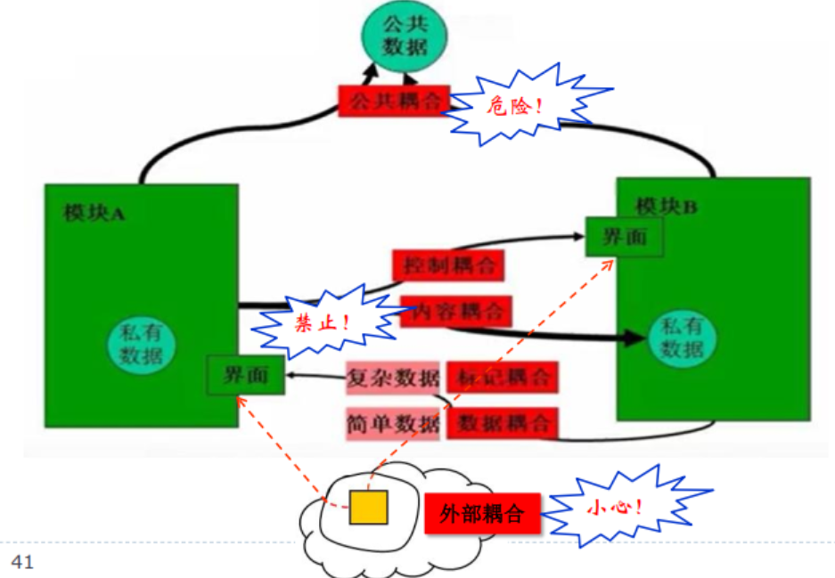

1. 非直接耦合（最好）
2. 数据耦合（用）
3. 标记耦合（转化为数据耦合）
4. 控制耦合（少用，尽量和谐掉）
5. 外部耦合（...）
6. 公共耦合（限制范围）
7. 内容耦合（这辈子不能碰）

## 模块的独立性——聚合度

简单地说， 理想内聚的模块只做一件事情。  

!!! tip "分情况讨论"
 	1. 高内聚：用！
	2. 中等内聚：也行，其实和高内聚也差不了多少
	3. 低内聚：坚决不用     

### 偶然内聚  

无关的函数、 过程或者数据出现在同一个模块里。  相当于没有联系、联系很少。

缺点：

1. 可维护性下降
2. 这样复用不了一点

解决：

- 分为更小的模块

### 逻辑内聚

把**几种功能组合在一起**， 每次调用时， 则**由传递给模块的判定参数**来**确定该模块应执行哪一种功能**。

1. 接口难以理解
2. 纠缠，可维护性低

!!! note
	和控制耦合类似，可以参考解决。

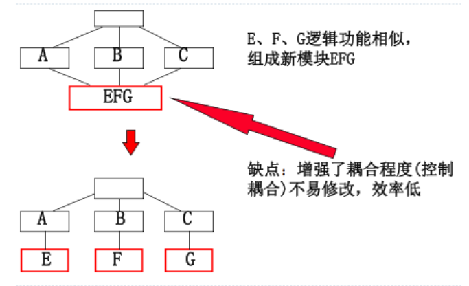

### 时间内聚

由于执行的时间（时机）是相同的

例如初始化模块

问题：

1. 不同功能的模块混在了一起，不好理解
2. 由于含有了很多功能的内容，修改一处，其他地方也要改。

### 过程内聚

一个模块内部各组成部分的处理**动作各不相同**， 彼此也**没有什么关系**， 但它们都受**同一个控制流**支配， 决定它们的执行顺序。

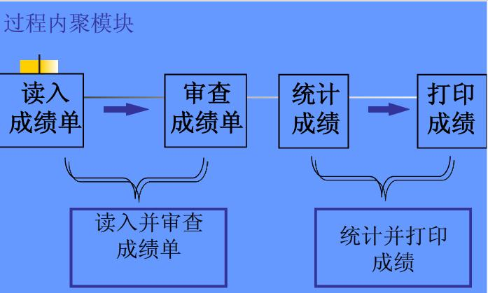

### 通信内聚  

出现在同一个模块里是由于操作或者生成同一个数据集。 （引用共同的数据）

例如对一个东西进行增删改查

### 顺序内聚

一个模块内部各个组成部分的处理动作是**按顺序执行**的， 且**前一个处理动作所产生的输出数据是下一个处理动作的输入数据**。

### 功能内聚

模块内所有处理元素属于一个整体， 完成一个单一的功能。

【没有一句多余的代码】

### 避免低内聚

在实际工作中， **确定内聚的精确级别是不必要的**， 重要的是**力争高内聚和识别低内聚**，可以使得设计的软件具有较高的功能独立性。  

## 启发式规则

!!! warning
	注： 在软件开发过程中**既要充分重视和利用**这些启发式规则，又要从实际情况出发**避免生搬硬套**  。
	
	启发式规则是人们从长期的软件开发实践中总结出来的规则， 在设计中应当普遍严格遵循【错误】要避免生搬硬套


### 启发式规则1 - 模块独立性

1. 高内聚，低耦合（要重点注重提高内聚）
2. 要注意模块的大小划分。太大不好理解，太小接口太复杂
3. 适当控制宽度和深度

### 启发式规则2- 深度、 宽度、 扇出和扇入应适中  

#### 深度

就是模块的总层数，过大表示分工过细。  

#### 宽度

**同一层**上模块数的最大值。 过大表示系统复杂度大。

记住是同一层

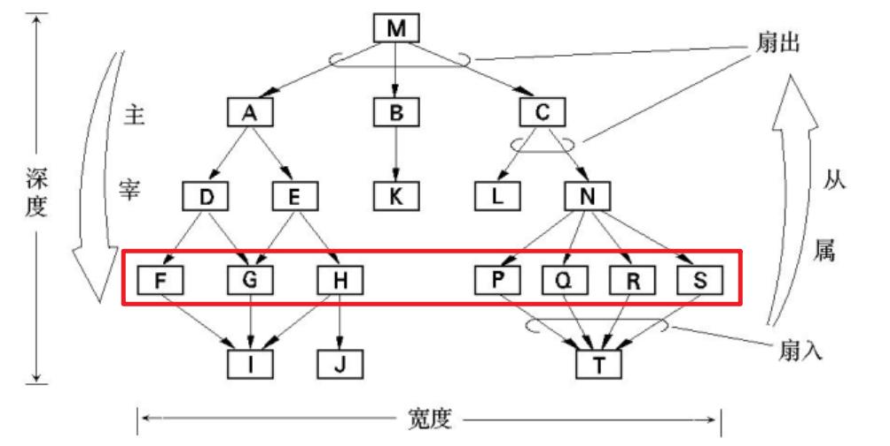

这个宽度是7！

#### 扇出

一个模块**直接**调用\控制的模块数。

!!! tip
	间接的不算

理论上: $3 \le fan-out \le 9$，一般3,4 上限 5-9

!!! note
	奇妙的$7\pm2$

- 如果一个模块的扇出太大了，那么增加中间的模块。
- 一般来说， 顶层扇出高， 中间扇出少， 低层高扇入。  

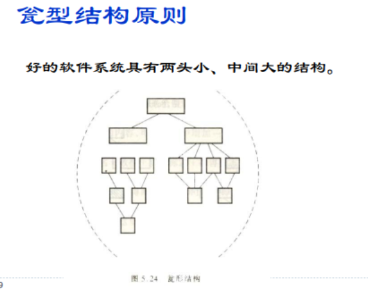

#### 扇入  

直接调用该模块的模块数。

越大越好（不破坏独立性的前提下），表示了这个模块的可重用性高

### 启发式规则3- 模块的作用域应该在控制域之内  

模块的**作用范围**(作用域)保持在该模块的**控制范围**（控制域）内 

 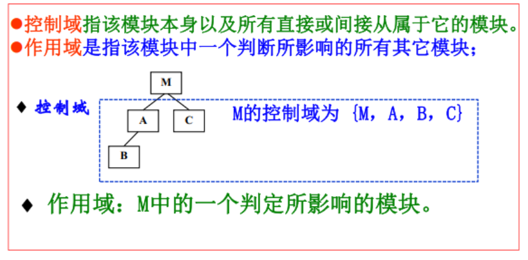

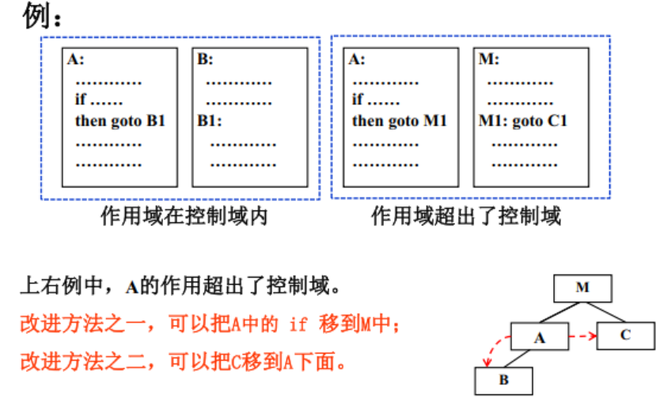

### 启发式规则4- 力争降低模块接口的复杂程度  

模块接口的复杂性是引起软件错误的一个主要原因。 接口设计应该使得信息**传递简单**并且与模块的功能一致。  

### 启发式规则5- 设计单入口、 单出口的模块  

避免内容耦合（目前的goto好像只能在函数里面跳，应该每个模块都是单入口，单出口的）

### 启发式规则6- 模块功能应该可以预测  

相同输入必定引发相同输出。

有了静态变量或者是全局变量就说不过去了

## 用于总体设计的图形工具

### 层次图和HIPO图

层次图用来描述软件的层次结构。矩形框代表一个模块，方框间的连线表示调用关系

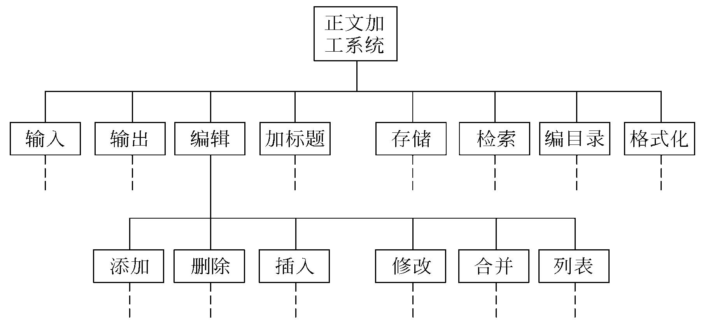

HIPO图是美国IBM公司发明的“层次图加输入/处理/输出图”的英文缩写。

1. 输入-处理-输出
2. 除了顶层模块之外，增加了编号

!!! danger
	带编号的就是推荐使用的

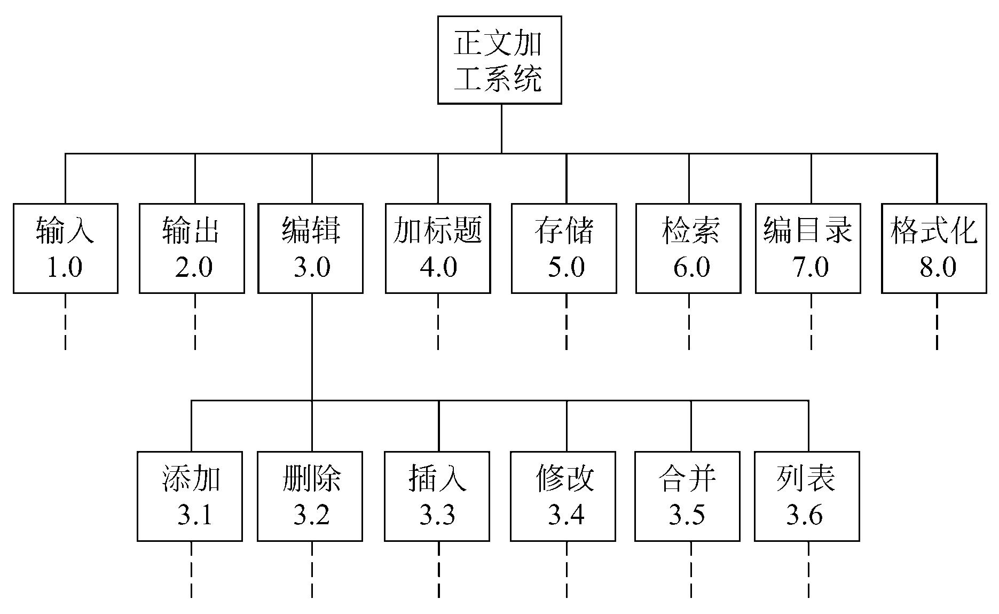

### 结构图

每个**方框代表一个模块**， 框内注明模块的名字或主要功能； 方框之间的**箭头（ 或直线） 表示模块间的调用关系。**  用带注释的箭头表示模块调用过程中模块之间传递的信息。   

- 尾部是空心圆表示传递的是数据
- 尾部是实心圆则表示传递的是控制信息


注意：

1. （输入模块在左， 计算模块在中间，输出模块在右——一般习惯）
2. **一个模块在结构图中只能出现一次。**  

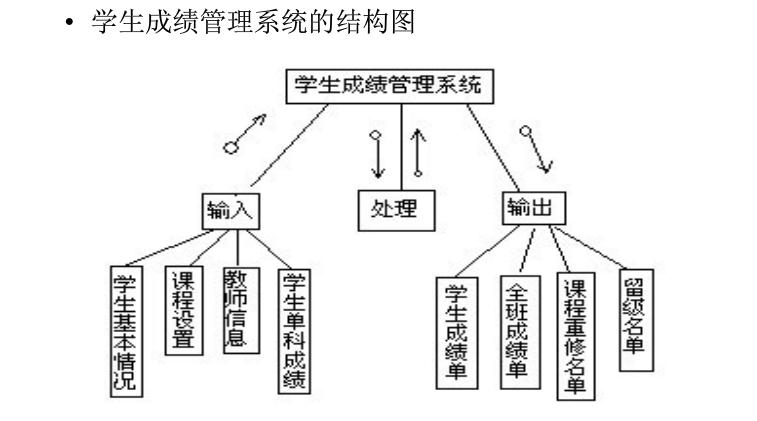

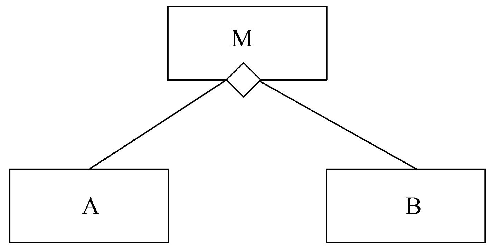

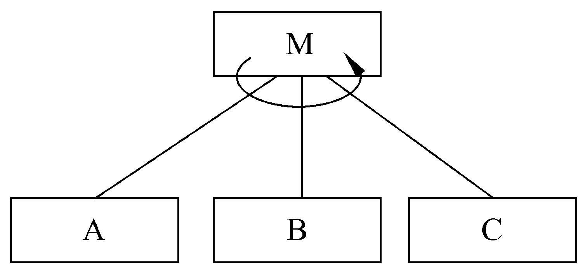

## 面向数据流的设计方法

### 变换流

根据基本系统模型， 信息通常①以“ 外部世界” 的形式进入软件系统， ②经过处理 ③以后再以“ 外部世界” 的形式离开系统。   

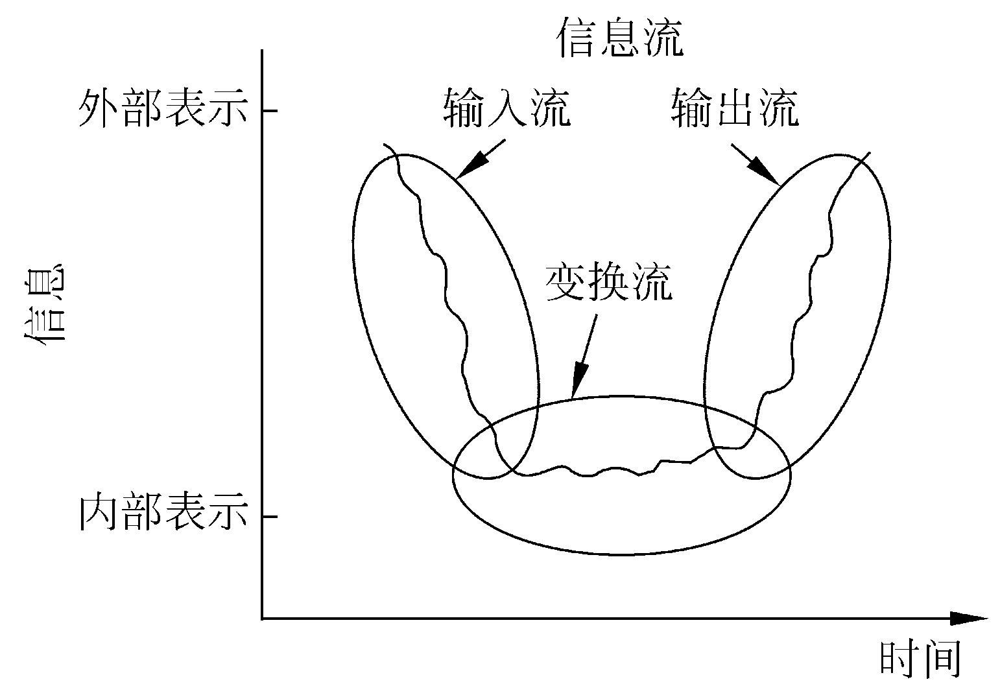

### 事务流

数据沿输入通路到达一个处理T， 这个处理根据输入数据的类型在若干个动作序列中**选出一个来执行**。  

事务型结构由至少**一条接受路径**、 **一个事务中心**和**若干条动作路径**组成。  

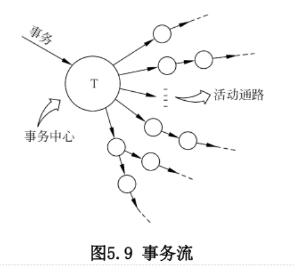

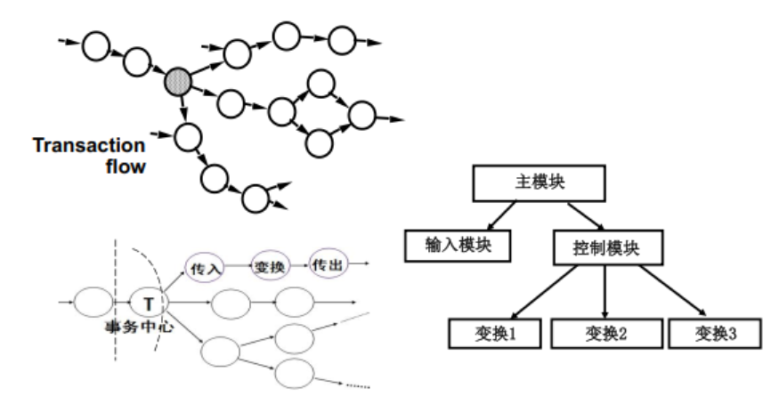

## 结构化设计方法（SD方法）

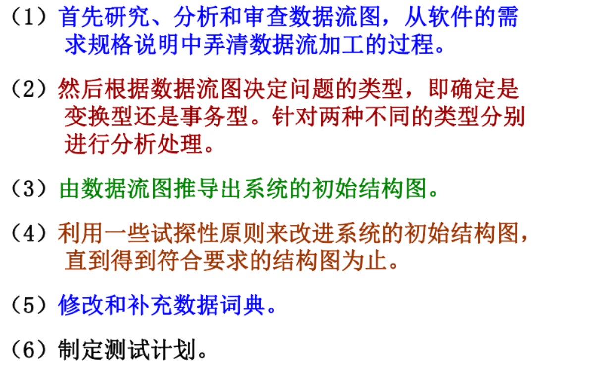

第一步是建立符合需求规格说明书要求的初始结构图（一般由数据流图导出初始结构图） ；

第二步再用块间联系和块内联系等概念对初始结构图做进一步改进。


## 概要设计的其他工作

