# 第6章 详细设计

## 详细设计的概念 

1. 详细设计以总体设计阶段的工作为基础的 ，但又不同于 总体设计 .
2. 主要表现为以下两个方面 ：（ 1 ）在总体设计阶段 ，数据项和数据结构以比较抽象的方式描述 ，而详细设计阶段则应在此基础上给出足够详细描述。（ 2 ）详细设计要提供关于算法的更多的细节。例如 ：总体设计可以声明一个模块的作用是对一个表进 行排序 ，详细设计则要确定使用哪种排序算法。 在详细 设计阶段为每个模块增加了足够的细节后 ，程序员才能 够以相当直接的方式进行下一阶段的编码工作。

### 详细设计的任务

1. 确定每个模块的**算法**。
2. 确定每一个模块的**数据**组织。
3. 为每个模块设计一组**测试用例**。
4. **编写详细设计说明书**。

### 详细设计的原则

1. 模块的逻辑描述**正确可靠、清晰易读**。
2. 采用结构化程序设计方法，改善控制结构，降低程序复杂度，提高程序的可读性、可测试性和可维护性。

## 结构程序设计  

结构程序设计是一种设计程序的技术 ，它采用①**自顶向下逐步求精**的**设计方法**和②**单入口单出口的控制结构**。

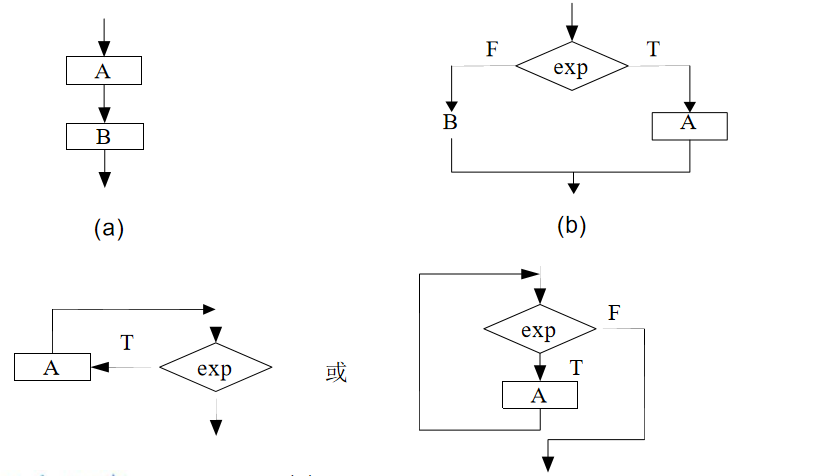

### 使用结构程序设计技术的好处

1. 自顶向下逐步求精的方法**符合人类解决复杂问题的普遍规律**，可以**显著提高软件开发的成功率和生产率**。
2. 先全局后局部、先整体后细节、先抽象后具体的逐步求精过程开发出的**程序有清晰的层次结构**。
3. 使用单入口单出口的控制结构而不使用 GOTO 语句，使得程序的**静态结构和它的动态执行情况比较一致**。
4. 控制结构有确定的逻辑模式，编写程序代码**只限于使用很少几种直截了当的方式**。
5. 程序清晰和模块化使得在修改和重新设计一个软件时**可以重用的代码量最大**。
6. 程序的逻辑结构清晰，**有利于程序正确性证明**。

## 详细设计的工具  

### 程序流程图（程序框图）

优点：

1. 独立于任何一种程序设计语言 
2. 直观 和清晰地描述过程的控制流程
3. 易于学习掌握
4. 至今仍是软件开发者最普遍采用 的一种工具。

缺点：

1. 由于程序流程图的特点，它本身并**不是逐步求精的好工具**。它**使程序员容易过早地考虑程序的具体控制流程**，而**忽略了程序的全局结构**。

2. 程序流程图中用箭头代表控制流，这使得程序员不受任何约束，可以完全**不顾结构程序设计的精神，随意转移控制**。就是箭头就相当于是goto

3. 程序流程图在表示**数据结构**方面存在不足。

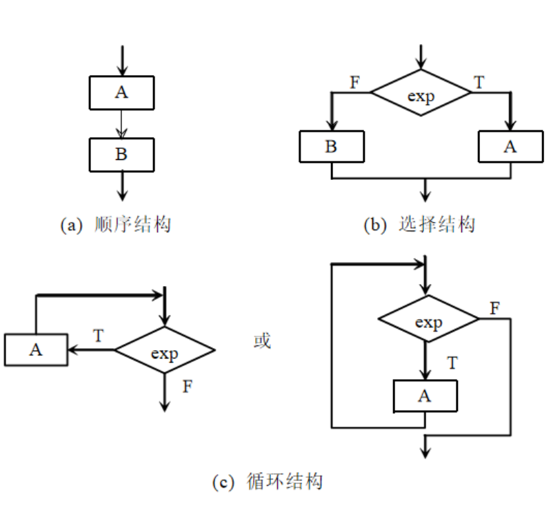

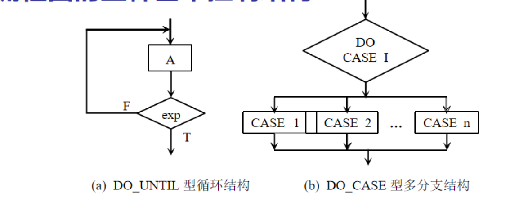

!!! danger
	注意DO_UNTIL语句的语句条件，条件为真的时候结束循环

常用的符号

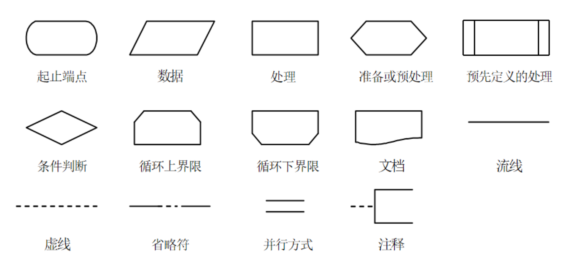


### N-S图

优点

1. **功能域**（即某一个特定控制结构的作用域）有**明确的规定**，并且可以很直观地从N-S图上看出来。

2. 它的**控制转移不能任意规定，必须遵守结构化程序设计的要求**。（一定只有顺序选择循环）

3. 很容易**确定局部数据和全局数据的作用域**。

4. 很容易表现**嵌套关系，也可以表示模块的层次结构**。

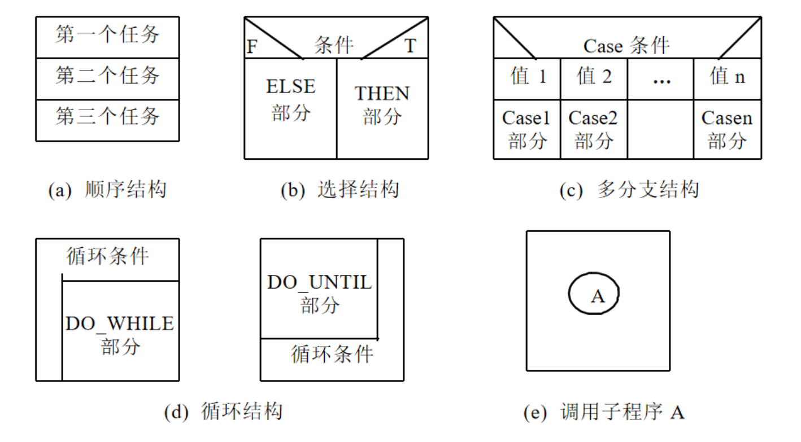

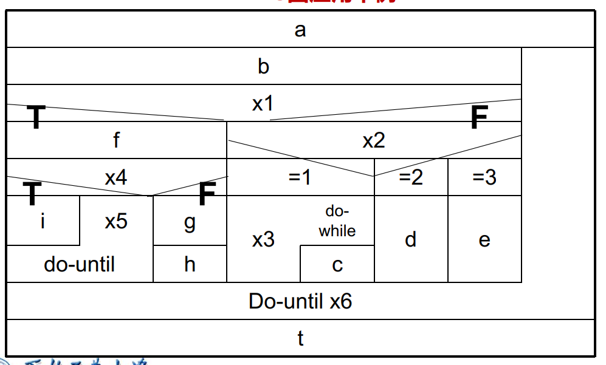

### PAD图（Problem Analysis Diagram）

优点

1. **清晰度和结构化程度高**。
2. PAD图中的最左面的线是程序的主干线,即程序的 第一层结构。 随着程序层次的增加 ，PAD图逐渐  向右延伸。 因此 ，PAD图**可读性强。**
3.  利用PAD图设计出的程序必定是**结构化的程序**。
4. 容易将PAD图转化成高级语言源程序。
5. PAD图支持自顶向下**逐步求精**的方法。

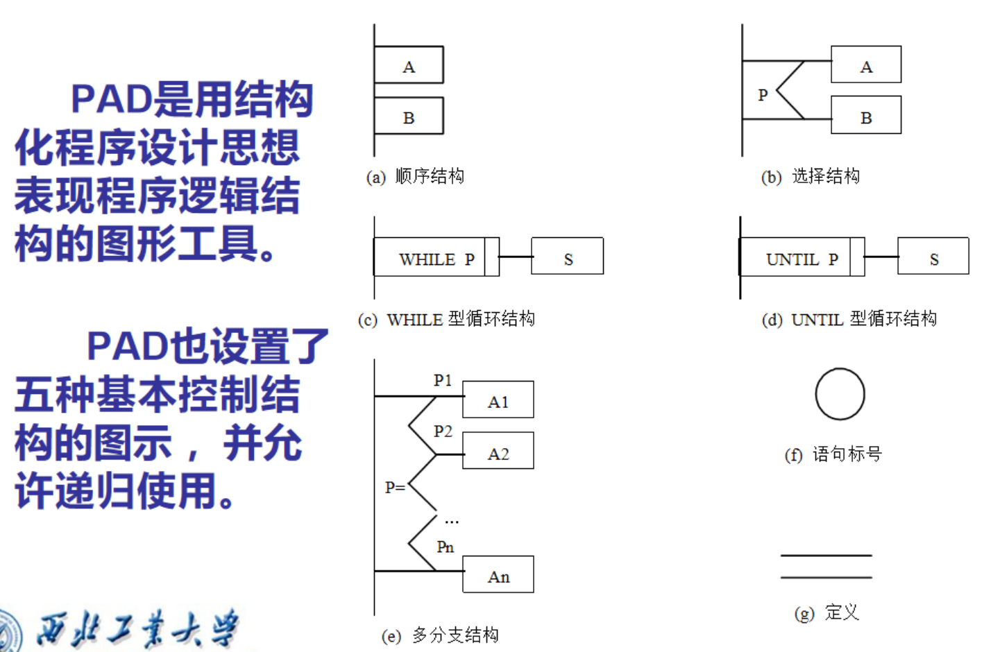

!!! note
	WHILE和UNTIL循环要注意写字

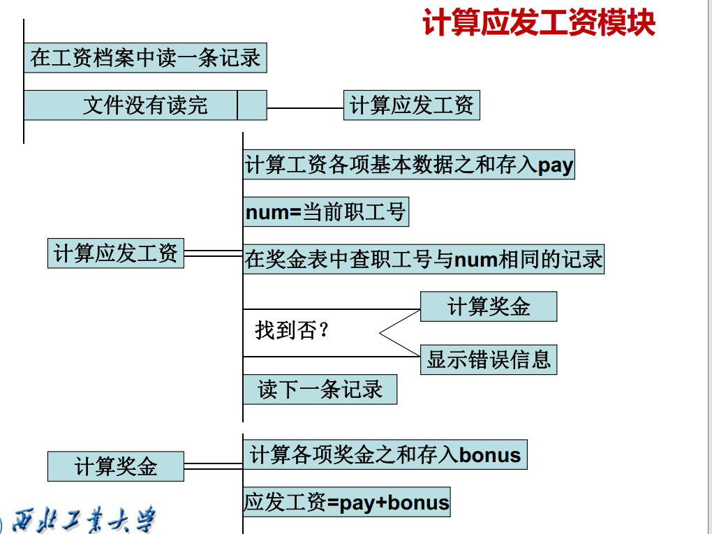

就是如果有嵌套的内容，可以使用定义

### PDL语言（过程设计语言、伪代码）

**PDL具有“非纯粹”  的编程语言的特点。**

**PDL-----关键字+自然语言**

过程设计语言 (PDL) 的特点如下：

1. PDL 采用严格的关键字外部语法，用于**定义控制结构和数据结构**。
2. 支持**结构化构件**、**数据说明机制**和**模块化**。
3. 处理部分采用自然语言描述，表示实际操作和条件的内部语法通常灵活自由，以适应各种工程项目的需要。
4. PDL 可以说明简单和复杂的数据结构。
5. 子程序的定义与调用规则不受具体接口方式的影响，具有很大的灵活性。
6. PDL 是一种“混杂”语言，使用自然语言的词汇，同时使用结构化程序设计语言的语法。
7. 然而，PDL 的**缺点是不如图形工具形象直观。**

#### 数据说明
其功能是定义数据的类型和作用域。

**格式**:
```pdl
TYPE <变量名> AS <限定词1> <限定词2>
TYPE number AS STRING LENGTH (12)
```

#### 程序块

PDL 的过程成分是由块结构构成的，而块将作为一个单个的实体来执行。

**格式**:
```pdl
BEGIN <块名>
    <一组伪代码语句>
END
```

#### 子程序结构
把 PDL 中的过程称为子程序。

**格式**:
```pdl
PROCEDURE <子程序名> <一组属性>
INTERFACE <参数表>
    <程序块或一组伪代码语句>
END
```

#### 基本控制结构

**条件语句**

**格式**:

```pdl
IF <条件>
THEN <程序块/伪代码语句组>
ELSE <程序块/伪代码语句组>
ENDIF
```

**循环结构**

**WHILE 循环**:

```pdl
DO WHILE <条件描述>
    <程序块/伪代码语句组>
ENDDO
```

**REPEAT UNTIL 循环**:
```pdl
REPEAT UNTIL <条件描述>
    <程序块/伪代码语句组>
ENDREP
```

**选择结构**

**格式**:

```pdl
CASE OF <case 变量名>
    WHEN <case 条件1> SELECT <程序块/伪代码语句组>
    WHEN <case 条件2> SELECT <程序块/伪代码语句组>
    ...
    DEFAULT: <缺省或错误case: <程序块/伪代码语句组>>
ENDCASE
```
## 程序复杂程度的定量度量  

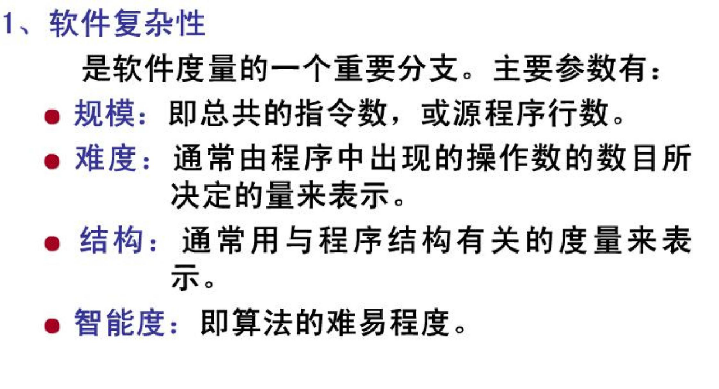

### McCabe方法（环形复杂度）

#### 度量

程序的环形复杂度 ，取决于程序**控制流**的复杂程度 ，也即是取决于**程序结构**的复杂程度。

**环形复杂度高的程序 ，往往是最困难、 最容易出问题的程序**。

模块规模以**V(G)≤10为宜** ，也就是说 ，**V(G)=10 是模块规模的一个更科学更精确的上限**。

#### 流图

“退化了的”程序流程图，它仅仅描绘程序的控制流程 ，完全不表现对数据的具体操 作以及分支或循环的具体条件。

1. 顺序的处理框序列和菱形判定框 --》一个节点
2. 箭头代表控制流

说白了就是一个控制流图

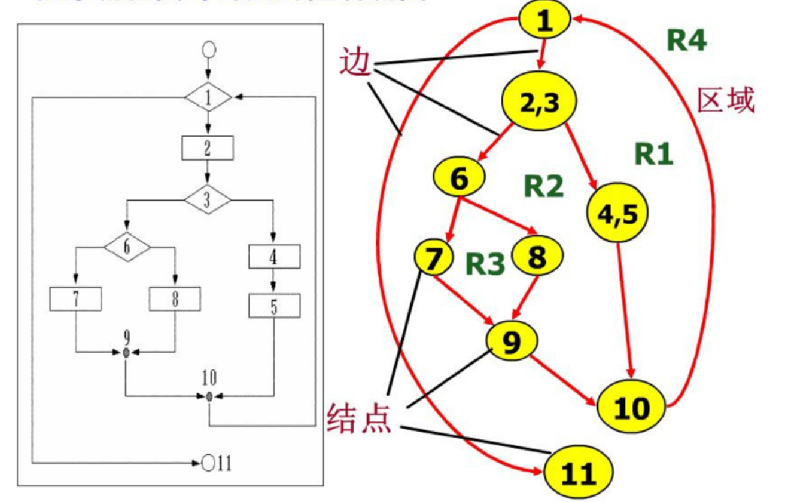

#### 环形复杂度的三种表示方法

!!! tip
	考试的时候，任意选择一种写上去就好

**方法一：**

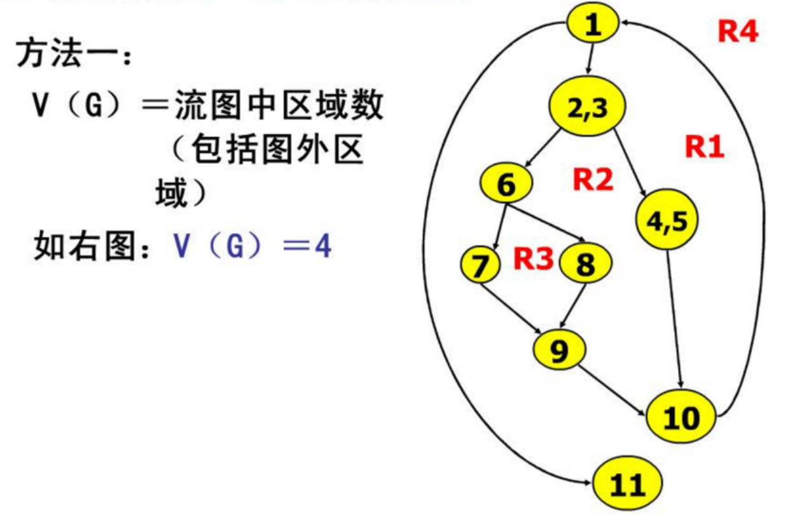

1. 所有的闭合的就是区域
2. **不要忘了加上最外层的区域**

**方法二：**

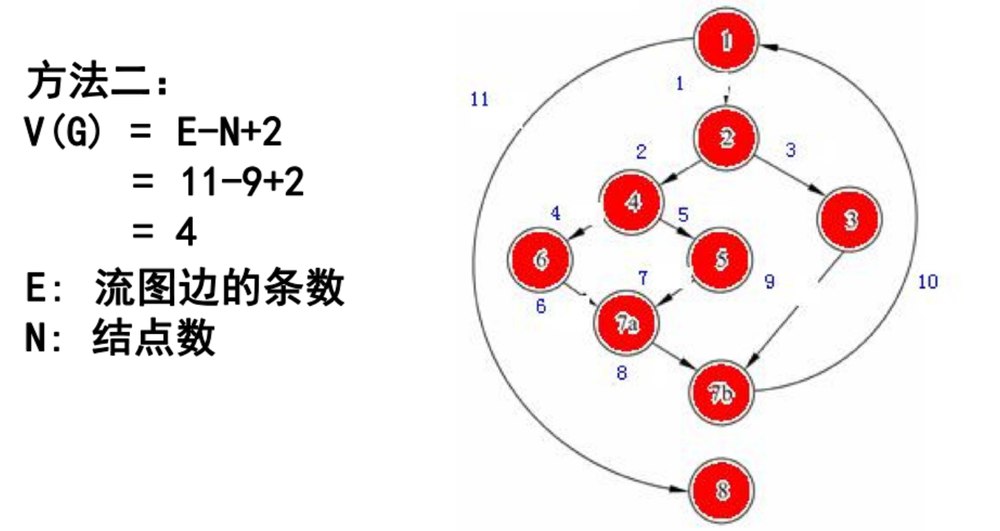

**方法三：**

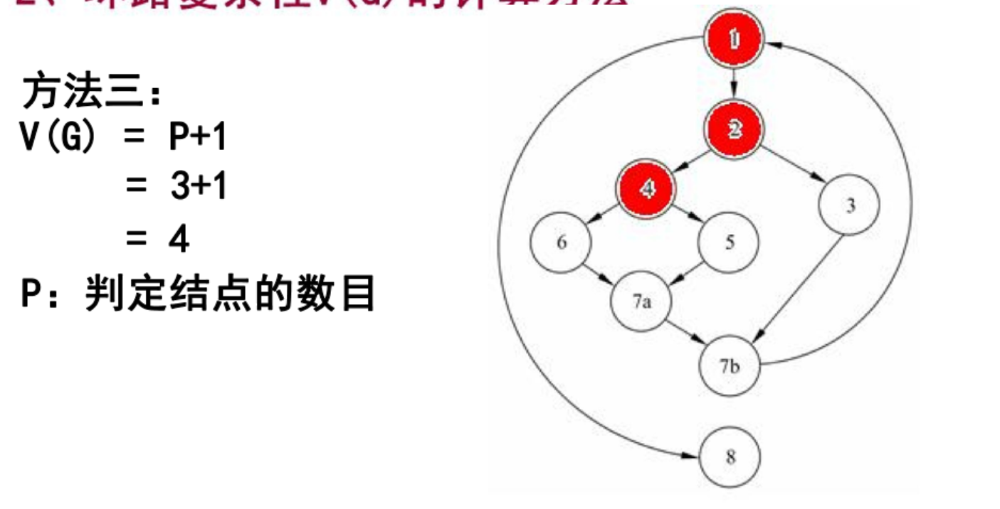

!!! tip
	考场甄选

### Halstead方法

N = N1 + N2 

- **N1**：运算符出现的总次数

- **N2**：操作数出现的总次数 

  预测程序长度的公式为：$$H = n_1 \log_2 n_1 + n_2 \log_2 n_2 $$