# 第7章 实现-编码方法

## 第7章 编码方法概览
!!!danger
	程序工作着不是将软件设计模型机械地转换成源程序代码

软件编码是**设计的继续**，会影响**软件质量和可维护性**。

1. 正确地理解用户需求和软件设计思想 
2. 正确地根据设计模型进行程序设计
3. 正确地而高效率地编写和测试源代码

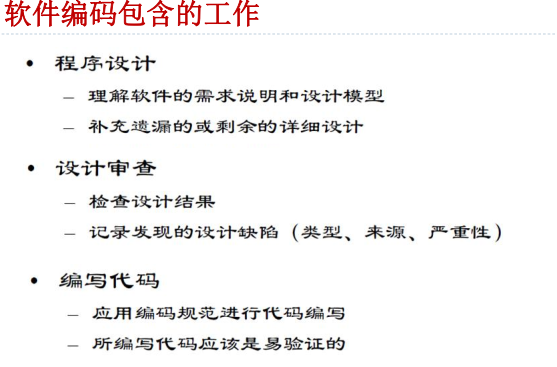

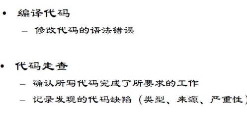


## 7.1 程序设计语言

### 一、程序设计语言的分类
1. **机器语言**：用二进制代码表示的低级语言，计算机直接使用。(没有通用性、 不能移植)
2. **汇编语言**：使用助记符表示的低级语言，需经汇编程序翻译成机器语言。(没有通用性、 不能移植)
3. **高级语言**：面向用户，独立于计算机种类和结构。(接近于算术语言和自然语言)
4. **第四代语言（4GL）**：抽象层次更高，只需说明“做什么”。

### 二、程序设计语言的选择
- 考虑项目应用领域、算法复杂性、数据结构复杂性、效率、可移植性、人员水平和系统模式。

## 7.2 编码风格

!!! danger
	不是能跑则灵

- 高质量的代码应**正确、易读、易于修改、扩展和维护。**（给人看的）

- 编码风格实际上是一种编码原则，20世纪70年代以来，强调**清晰胜于效率**。

### 编码规范

与特定语言相关的描写如何编写代码的规则集合。

#### 为什么要有编码规范

1. 软件全生命周期的70%成本是维护
2. 软件在其生命周期中很少由原编写人员进行维护目的

所以需要编码规范①提高编码质量，避免不必要的程序错误②增强程序代码的可读性、可重用性和可移植性。

#### 编码规范要求

**基本要求：**

- 程序结构清析且简单易懂，**单个函数的行数一般不要超过100行**(特殊情况例外)。
- 算法设计应该简单且直接了当。
- 尽量使用标准库函数(类方法)和公共函数(类方法)。
- 最 好 使 用 括 号 以 避 免 二 义 性。

!!! note
	可 读 性 第 一 ， 效 率 第 二 。

**可读性要求：**

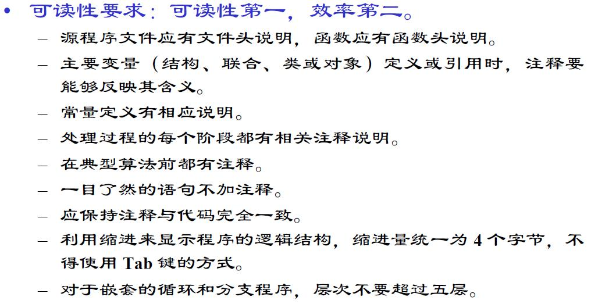

!!! tip
	没有必要加注释就不加

### 编码风格详细说明

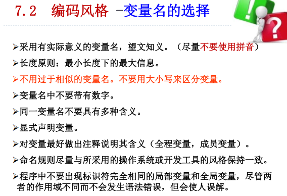


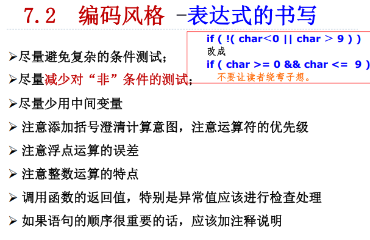

#### IF语句

- 布尔变量的正确使用：
  - 使用 `if (flag)` 表示 `flag` 为真。
  - 使用 `if (!flag)` 表示 `flag` 为假。
  
- 整型变量与零值比较：
  - 应当将整型变量用 `==` 或 `!=` 直接与 0 比较。例如：`if (i == 0)` 或 `if (i != 0)`。
  
- 指针变量比较：
  - 应当将指针变量用 `==` 或 `!=` 与 `NULL` 比较。例如：`if (ptr == NULL)` 或 `if (ptr != NULL)`。
  - 有具体类型的指针应该先判断算不算空指针，然后解引用。
  
- 浮点变量比较：
  - **不可将浮点变量用 `==` 或 `!=` 与任何数字比较。这是因为浮点数计算存在舍入误差，直接比较可能会导致不准确的结果。**
  
  - 应该设法将浮点变量比较转化成大于或小于的形式
    ````c
    const float EPSINON = 0.00001;
    if ((x >= - EPSINON) && (x <= EPSINON)
    ````
  
- `if`语句必须要带有`{}`，这是因为可能随时去添加一些内容。

````c
//写出 char  *p 与“ 零值 ”比较的 if 语句：
if (p == NULL)
if (p != NULL)
````


#### 循环

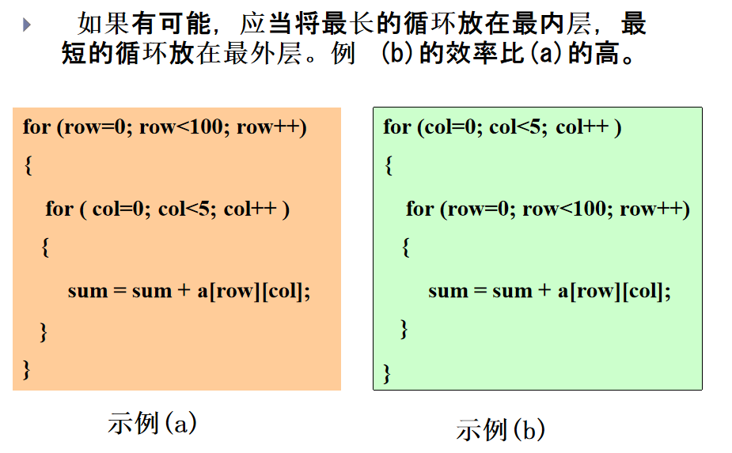

这个有歧义：

!!! danger
	按照软件工程，长的循环放到里面，这样可以减少CPU的跳转频率。
	但是按照计组的理解，如果目标机器按照行主序，那么是另一种结果。
	所以在考试的时候要分类讨论。

- 不可在for   循环体内修改循环变量，防止for   循 环失去控制。
- 建议for 语句的循环控制变量的取值采用“半开  半闭区间”写法。

````c
for (int i = 0; i <= n - 1; i++)// 不好！
{}
for (int i = 0; i < n; i++)// 好！
{}
````

#### switch语句

- 每个case语句的结尾**不要忘了加break**，否则将导致  多个分支重叠（除非有意使多个分支重叠）。	  
- 不要忘记最后那个default分支。即使程序真的不需  要default处理，也应该保留语句 default : break ;因为可能会加东西。

#### goto

goto有害论

#### other

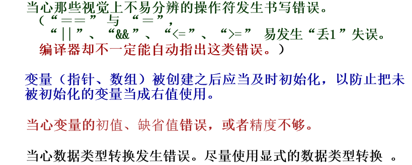


#### 输入输出

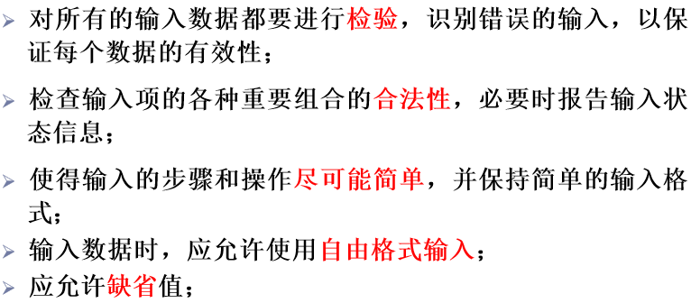

### 典型例题

````c
// 第一个
for (i=0; i<N; i++)
{
    if (condition){
    	DoSomething () ;
    }
    else {
        DoOther thing () ;
    }
}
// 第二个
if (condition)
{
    for (i=0; i<N; i++)
    	DoSomething () ;
}
else
{
    for (i=0; i<N; i++)
    	DoOther thing () ;
}
````

|      | 第一个                                                       | 第二个       |
| ---- | ------------------------------------------------------------ | ------------ |
| 优点 | 程序简洁                                                     | 循环的效率高 |
| 缺点 | ①多执行了N-1次逻辑判断，②打断了循环“流  水线 ”作业，使得编译器  不能对循环进行优化处理  , 降低了效率。 | 程序不简洁   |

## 7.3 程序内部文档

- 描述性注释、序言性注释和功能性注释的编写。

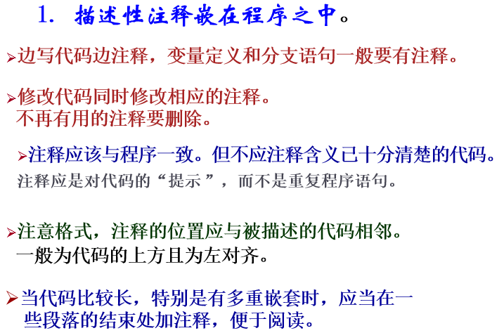

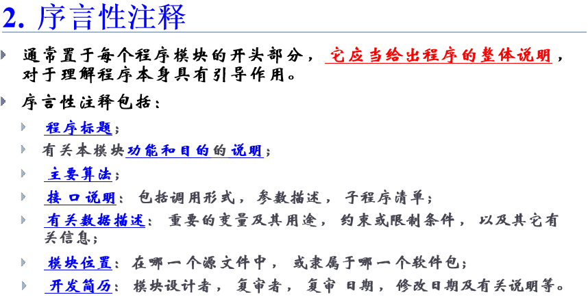


## 7.4 程序效率
- 程序效率指**执行速度**和**存储空间占用**。
- 追求效率时**不牺牲代码的清晰性、可读性和正确性。**

### 注意点

1. 效率是一种性能需求， 目标值应当在**需求分析 阶段给出**。**软件效率应以需求为准，不应以人力所 及为准。**（满足要求就好）
2. 好的**设计**可以提高效率。
3. 代码效率与代码的**简单性**相关。

- 全局效率为主，局部效率为辅。
- 优化数据结构和算法，再优化执行代码。
- 时间效率和空间效率可能对立，此时应当分 析那个更重要，作出适当的折衷。例如多花费一些 内存来提高性能。

### 如何提高代码效率
- 简化表达式、优化循环、减少多维数组使用等。

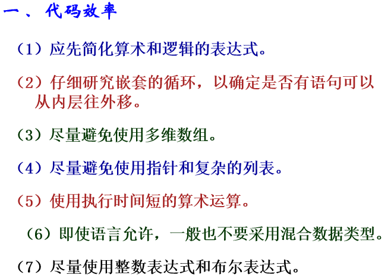


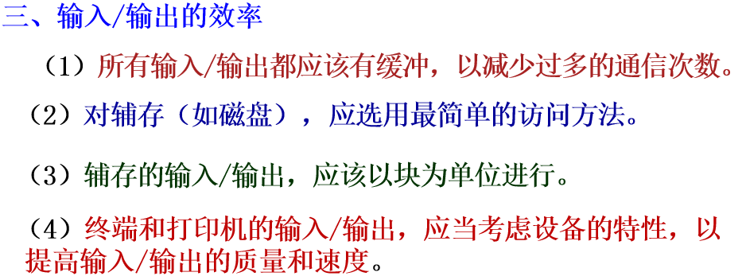

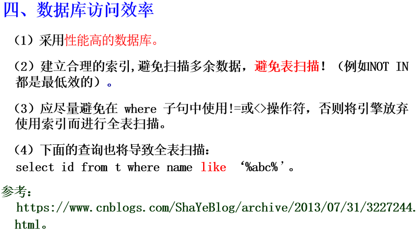

## 7.5 设计方法论
- 自顶向下和自底向上的程序开发方法。
- 程序设计自动化、代码文档化、数据说明、语句构造。

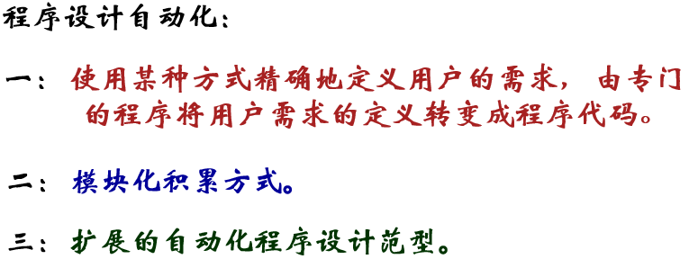


### 程序设计工具

编译程序、代码管理系统