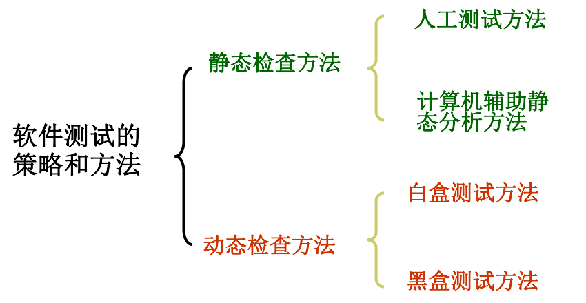
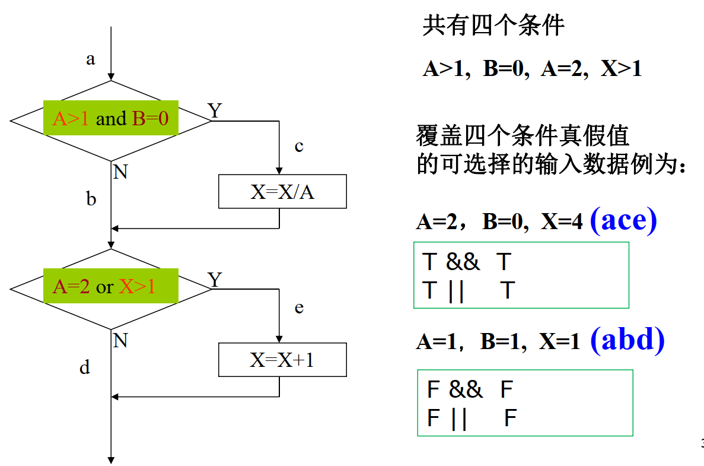

# 软件工程导论 – 第7章 实现-软件测试

---

### 目录

- 7.1 检验的基本概念
- 7.2 测试的基本概念
- 7.3 白盒法
- 7.4 黑盒法
- 7.5 测试步骤
- 7.6 单元测试
- 7.7 集成测试
- 7.8 确认测试
- 7.9 调试
- 7.10 软件可靠性

## 检验的基本概念

**软件检验的手段：**

  - 动态检查：测试
  - 静态检查：人工评审软件**文档**或**程序**

注意：

1. 检查时只以**找出错误**为目的，“排错”应由软件开发方完成。
2. 最终的检验验收工作应由检验部门来实施。
3. 检验的目的就是要找出错误，而不是证明软件是对的。

---

### 静态检查（评审、review）

- 基本特征是在对软件进行分析、检查和审阅，**不实际运行被测试的软件**。
- 可以人工检查，也可以由计算机辅助检查（注意不运行实际的程序）
- 静态测试约可找出**30～70%**的逻辑设计错误. 
- 对需求规格说明书、软件设计说明书、源程序做检查和审阅。
  是否符合标准和规范；
  通过结构分析、流图分析、符号执行指出软件缺陷。

--------

需求设计  --  需求设计复查 
概要设计  --  概要设计复查 
详细设计  --  详细设计复查 
程序        --  程序复查走查

!!! note
	对事而不对人，致力于发现错误，不是纠正错误。**时间不宜过长**

### 动态检查（测试）

### 静态检查与动态测试

## 测试的基本概念

### 基本概念以及目标

通过程序的**执行**，发现在**设计**和**制造阶段**植入的bug.

!!! danger
	是为了发现问题，而不是证明这一个软件是对的

### 软件错误无处不在

只要是人编写的软件，就不能避免软件错误的发生。

通常叫做BUG，但是这样的叫法太过于笼统

### 软件错误到软件失效一条龙

软件错误（error）--》软件缺陷（defect）--》软件故障（fault）--》软件失效（failure）

软件错误：人为错误。

软件错误————》一个或者多个软件缺陷

一个软件缺陷激活——————》软件故障。（同一个缺陷在不同条件下激活，产生不同故障）

如果软件故障没有及时容错，就会导致软件失效。（同一个故障在不同条件下产生不同的失效）

-----

#### 软件错误（Error）
- **定义**：人为错误。
- **说明**：开发人员在编写代码时产生的错误。

#### 软件缺陷（Defect）
- **定义**：由于软件错误导致的一个或多个代码中的问题。
- **说明**：一个软件错误可能导致一个或多个缺陷。

#### 软件故障（Fault）
- **定义**：当一个或多个软件缺陷在特定条件下被激活时，导致软件行为异常。
- **说明**：同一个缺陷在不同条件下激活，可能产生不同的故障。

#### 软件失效（Failure）
- **定义**：如果软件故障没有及时被检测和修复，就会导致软件失效，即软件无法按预期运行。
- **说明**：同一个故障在不同条件下可能导致不同的失效。

#### 总结流程

感觉上面这张图片完全理解不了，: (

### 现状

- 与一些发达国家相比，国内测试工作还存在一定的差距。国内测试人员所占比例小。
- 微软的开发工程师与测试工程师的比例是1:2，国内一般公司是6:1。
- 与发达国家相比，我们的差距主要在测试意识、测试理论的研究、测试工具软件的开发以及从业人员的数量等方面。
- 优秀测试人员匮乏。
- 人工功能测试人员需求较大。

## 软件测试准则

### 一、所有测试都应该能追溯到用户需求

### 二、尽早地和 不断地进行软件测 试

**软件测试**不等于**程序测试**。软件测试应贯 穿于软件定义与开发的 整个期间；

!!! tip
	越早发现问题，解决的代价就越小

### 三、pareto原则

pareto原则：测试发现的错误中的**80%**很可能是由程序中**20%**的模块造成的。

## 测试项设计概述

测试项目 = 测试输入数据 + 预期的输出结果

- 测试项目不应重复
- 测试项目，测试观点不应遗漏；除了检查应作的，还要检查是否作了不应作的
- 结果的确认方法应妥当（debug，日志，目视等）
- 测试项目应该进行复查
- 测试用例应该长期保留

在近乎无限的测试项目中， **抽出可以有效发现bug的 测试项**。为了达到这个目的，需要 使用各种测试设计技法。

A＋B＋C＋D ＝软件全体的bug

## 测试项设计——白盒法

允许测试人员利用**程序内部的逻辑结构**及有关信息，来**设计或选择测试用例**， 对程序**所有逻辑路径进 行测试**。

1. 明确程序的构造，流程
2. 确认所有应该网罗的对象（命令，条件分支）
3. 追加使得程序主要处理/通路获得执行的对象
4. 设计输入数据
5. 设计预测值

### 例题

!!! danger
	在对X指定值的时候，一定要注意第一个判定是走不走Y分支，因为这一分支对X的值有更改。

!!! tip
	一般选择的测试项数目要尽可能少，不然会被改卷老师Gank

### 语句覆盖法-每个语句至少被执行一遍

有些分支没有语句，那么就不需要管

### 判定覆盖法-每一个分支至少被执行一遍

每一个分支只要被走过一遍就好了，不管多个分支之间的关联。

### 条件覆盖法-每个条件获得各种可能的结果

#### 与判定覆盖的关联

条件覆盖中每一个单独的条件都独立地取到了True和False，一般比判定覆盖强。

BUT有逻辑运算符的时候，....

### 判定/条件覆盖法ー每一个分支，每个条件至少被执行一遍

### 条件组合覆盖法-每个条件的可能组合获得各 种可能的结果

#### 步骤一、列出若干个判断框中条件的组合

#### 步骤二、条件组合的分析

#### 步骤三、测试项的设计

### 五种覆盖的关系

### 基本路径测试

#### 论如何确定基本路径

!!!danger
	课件好像错了，这个应该是有4条路径

1. 1 -> 2 -> 3 -> 4 -> 5
2. 1 -> 2 -> 3 -> 5
3. 1 -> 3 -> 5
4. 1 -> 3 -> 4 -> 5

话说好像和上面的基本路径没啥关系，我认为

## 测试项设计——黑盒法

已知产品的功能设计规格，可测试确认每个功能是否符合要求。

- **等价分类法：**
  - 程序的输入集合分割为有限的等价类，选取代表值进行测试
  - 例如：输入参数为0以上6以下的整数

- **边缘值分类法：**
  - 注意等价类的边界，对边界进行测试
  - 边界值分析不仅考虑输入条件，还要考虑输出空间产生的测试情况

- **错误推测法：**
  - 根据过去的开发经验，程序的构造，处理等预测可能发生的bug

- **原因-结果图：**
  - 将程序的输入条件、环境条件等的原因，和处理、输出等的结果的逻辑关系，变换为逻辑图，从而作成判定表，设计测试项目

### 划分等价类

注意：这里有三个等价类，小于的，有效的，大于的。

注意：计算总数目的公式如下
$$
\sum_{i=1}^8(26+10)^i = 2901713047668
$$

共有4个等价类

### 边缘值分类法——（等价类的边界值）

1. 先确定等价类，然后确定边界值
2. 每一个边界可以取3个值
3. 七值法的内涵：下界取3个，上界取3个，正常系取1个

### 错误推测法

### 原因-结果图

将程序的输入条件，环境条件等的原因，和处 理，输出等的结果的逻辑关系，变换为逻辑图，从而作成判定表，进而设计测试项目。

> 第1列的文字是‘A’ 或‘B’，第2列的文字是数字。
> 满足这种条件时更新文件。 
> 第1列的文字不正确的话，打印X12的message。 
> 第2列的文字不正确的话，打印X13的message 。

处理步骤：

1. 划分原因和结果
2. 画出原因结果图
3. 画出判定表

① 第1列的文字是‘A’ 
② 第1列的文字是 ‘B’ 
③ 第2列的文字是 数字

70 更新文件
71 打印X12的message 
72打印X13的message 

---

## 测试步骤 - 软件测试策略

---

### 单元测试

---

### 集成测试

- 集成测试是**测试和组装软件**的系统化技术，其主要目标是发现**与接口有关的问题**

---

### 确认测试（系统测试）

- **确认测试包括：**
  - 功能测试（Function Testing）
  - 负荷测试（Stress Testing）
  - 大容量测试（Volume Testing）
  - 存储量测试（Storage Testing）
  - 安全性测试（Security Testing）
  - 性能测试（Performance Testing）
  - 可靠性测试（Reliablity Testing）
  - 恢复测试（Recovery Testing）
  - 使用性测试（Usabiliry Testing）
  - 文档测试（Documentation Testing）
  - 工序测试（Procedure Testing）

- 由软件需求规格说明书，系统构成图、使用说 明书等获得测试项目。
- 确认测试通常使用**黑盒测试法**。

### 验收测试

### 回归测试

---

### 调试

- 调试是在测试发现错误之后**排除错误**的过程
-  输出储存器内容、打印语句、自动工具
- 主打一个快速找到错误
- 策略有：试探法，回朔法，对分法，询问他人寻求帮助

### 测试计划

---

### 软件可靠性

#### 软件可靠性（Software Reliability）
**定义**：软件可靠性是指软件在给定的**时间间隔内**，按照规格说明书的规定，**成功地运行的概率**。

**详细解释**：

- **时间间隔**：软件可靠性关注的是一段时间内的软件表现，例如一个小时、一周或一个月。
- **成功运行**：指软件能够按照预期的功能和性能指标正常运行，没有发生故障或错误。
- **概率**：可靠性通常以概率的形式表示，例如0.99表示99%的概率在给定的时间间隔内软件能够成功运行。

**示例**：
假设一个系统的可靠性为0.98，意味着在任何给定的24小时内，这个系统有98%的概率能够持续正常运行，不发生故障。

#### 软件可用性（Software Availability）
**定义**：软件可用性是指软件在给定的**时间点**，按照规格说明书的规定，**成功地运行的概率**。

**详细解释**：

- **时间点**：软件可用性关注的是特定时刻的软件状态，例如某天的上午9点，或某个特定的瞬间。
- **成功运行**：指在该时间点软件能够按照预期的功能和性能指标正常运行，没有发生故障或错误。
- **概率**：可用性也以概率的形式表示，例如0.995表示在任何给定的时间点上，软件有99.5%的概率能够正常运行。

**示例**：
如果一个系统的可用性为0.995，意味着在任何特定的时间点上，这个系统有99.5%的概率是可用的，不处于故障状态。

#### 区别与联系
- **时间维度不同**：可靠性关注的是一段时间内的表现，而可用性关注的是某一特定时刻的表现。
- **衡量指标**：可靠性通常用于衡量软件在较长时间内的稳定性和性能，而可用性更多地用于衡量软件在特定时刻的在线和正常运行状态。
- **相关性**：高可靠性的系统通常也具有高可用性，因为系统在大多数时间段内能保持正常运行状态。但是，一个系统可以在短时间内非常可靠（高可靠性），但如果在关键时刻经常出问题，可用性就可能较低。
