# 第一章

## 什么是软件？软件的特点是什么？本质特征是什么？

### 软件定义

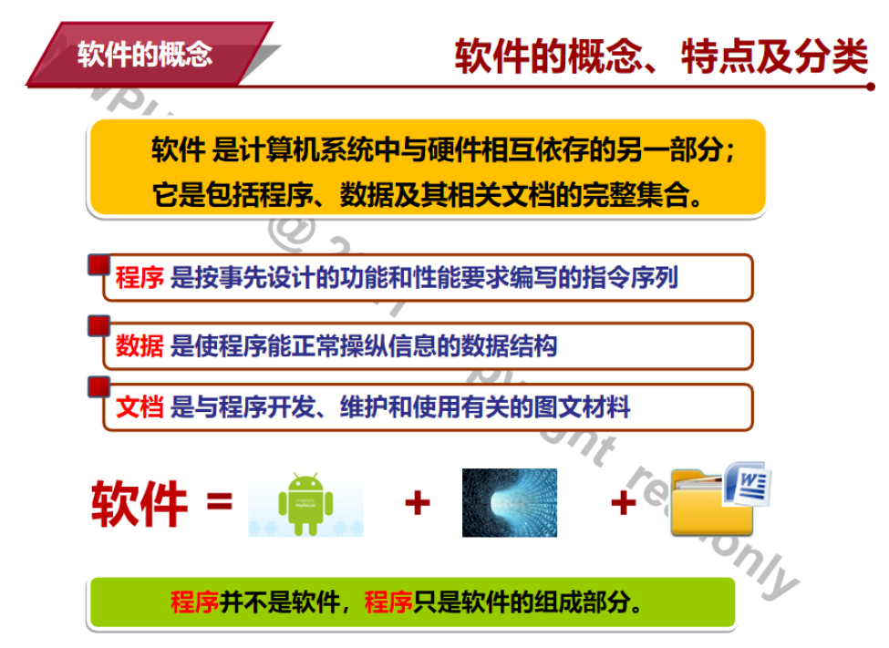{width="6.3in"
height="4.594153543307087in"}

软件是一组计算机程序、相关数据以及文档所构成的集合，这些程序和数据文档用于操作计算机硬件和执行特定任务。

-   程序：按事先设计的功能和性能需求执行的指令序列 （数据结构＋算法 =
    程序）

-   数据：【软件的核心】是程序能正常操纵信息的数据结构

-   文档：【配置文档是软件的一部分】与程序开发、维护和使用有关的图文材料

### 软件的特点

（1）软件是一种**逻辑实体**。

（2）软件的开发，是人的**智力的高度发挥**，而不是传统意义上的硬件制造。

（3）软件维护与硬件的维修有着本质的差别。

（4）软件的开发和运行常常受到计算机系统的限制，对计算机系统有着不同程度的依赖性。

（5）软件的开发至今尚未完全摆脱手工艺的开发方式，使软件的开发效率受到很大限制。

（6）软件的开发是一个复杂的过程。

（7）软件的成本非常高昂。

（8）相当多的软件工作涉及到社会因素。

### 本质特征

**复杂性、一致性、可变性、不可见性**

{width="6.3in"
height="0.5961286089238845in"}

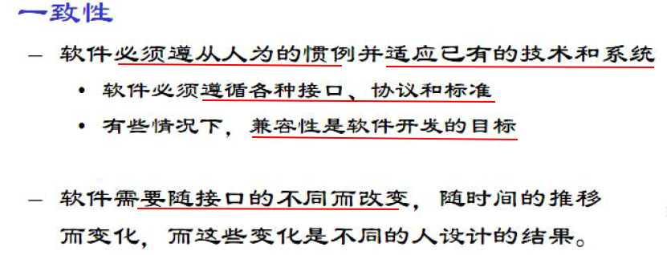{width="6.3in"
height="2.4108300524934383in"}

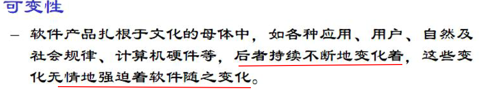{width="6.3in"
height="1.287166447944007in"}

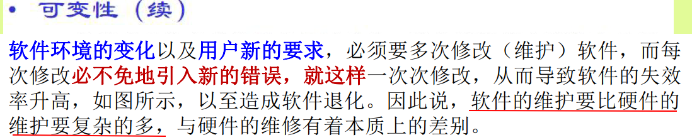{width="6.3in"
height="1.279507874015748in"}

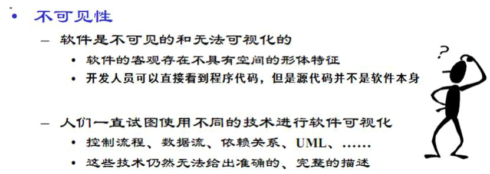{width="6.3in"
height="2.2440430883639544in"}

## 软件危机的定义，软件危机的现象

### 软件危机的定义

在计算机软件的**开发和维护**过程中所遇到的 **一系列严重**问题。

### 现象

1.  软件成本比重上升

2.  对软件开发成本和进度的估算很不准确

3.  质量很不可靠

4.  用户很不满意

5.  没有适当的文档难于维护

6.  供不应求：软件开发生产率跟不上计算机应用迅速深入的趋势

## 软件可以有哪些分类

### 按照功能分类

系统软件：与计算机硬件紧密配合，使计算机系统各个部件、
相关的软件和数据协调、高效地工作。如操作系统、数据库管理系统（DBMS）、设备驱动程序以及通信处理程序、编译器

应用软件：在特定的领域内开发，为特定目的服务。如CAD计算机辅助制造、
计算机辅助教学系统、停车
场管理系统，OA系统、ERP系统（财务、进销存、生产、 人力资源）。

支撑软件（软件开发环境）：支撑各种软件 的开发与维护
的软件。环境数据库、各种接口软件和工具组。

### 规模

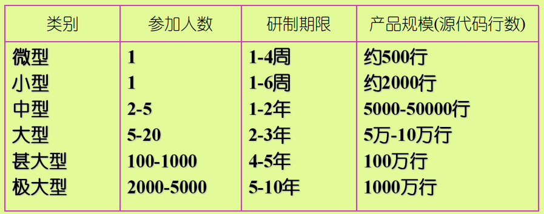{width="6.3in"
height="2.4862871828521436in"}

### 开发划分

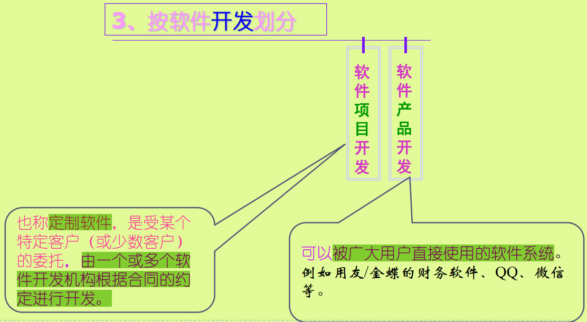{width="6.3in"
height="3.4616010498687664in"}

## 产生软件危机的原因？软件危机现在还存在吗？

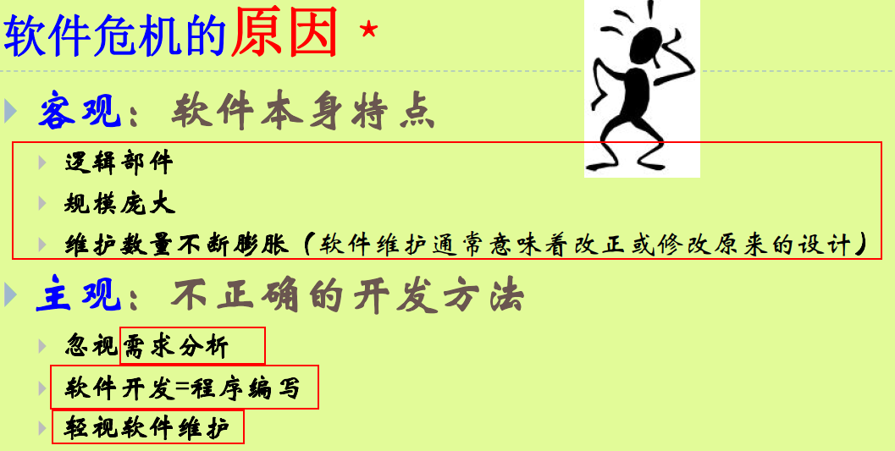{width="6.3in"
height="3.1768208661417323in"}

1.  软件不同于硬件，软件是逻辑部件而不是物理部件，缺乏可见性。

2.  软件不同于一般程序规模庞大，程序的复杂性随着程序规模的增加而呈指数上升。

3.  在软件的维护过程会对原来的设计进行更改修正。

```{=html}
<!-- -->
```
1.  对用户的要求没有准确的认识就开始编写程序。

2.  把软件开发当做了程序编写，实际上程序编写只在很小一部分时间。

3.  轻视软件的维护，许多软件产品使用寿命长达十年甚至20年，在维护过程中需要不断拓展和改进原来的系统。

**重新整合：**

1.  **客观原因：**

-   **软件产品的本质特征：复杂性，一致性，可变性，不可见性**

-   **维护数量不断膨胀**

2.  **主观原因：**

-   **轻视维护**

-   **开发==编码**

-   **质量控制**

-   **需求分析不合理**

### 软件危机现在还存在吗？

软件危机仍然存在，并且在当今时代可能比以往更复杂。以下是一些原因：

1.  **复杂性增加**：现代软件系统变得越来越复杂，涉及更多的功能、集成和依赖。这使得设计、开发、测试和维护变得更加困难。

2.  **快速变化的技术**：新技术和工具不断涌现，开发团队需要不断学习和适应。这种快速变化可能导致项目延误和质量问题。

3.  **安全性问题**：随着网络攻击的增加，软件安全性成为一个重大问题。确保软件的安全性需要大量的资源和专业知识。

4.  **用户期望提高**：用户期望软件快速、稳定和易于使用。满足这些期望需要更多的时间和精力，特别是在用户需求不断变化的情况下。

5.  **全球化和分布式团队**：越来越多的项目涉及全球分布的团队，这给沟通、协作和项目管理带来了挑战。

6.  **遗留系统**：许多企业仍然依赖于老旧的遗留系统，这些系统难以维护和升级，与现代技术不兼容。

7.  **需求不明确**：软件需求常常在项目进行过程中发生变化，导致范围蔓延和资源超支。

综上所述，虽然我们有了更好的工具和方法来管理软件开发，但软件危机的问题仍然存在，并且随着技术的进步和复杂性的增加而不断演变。

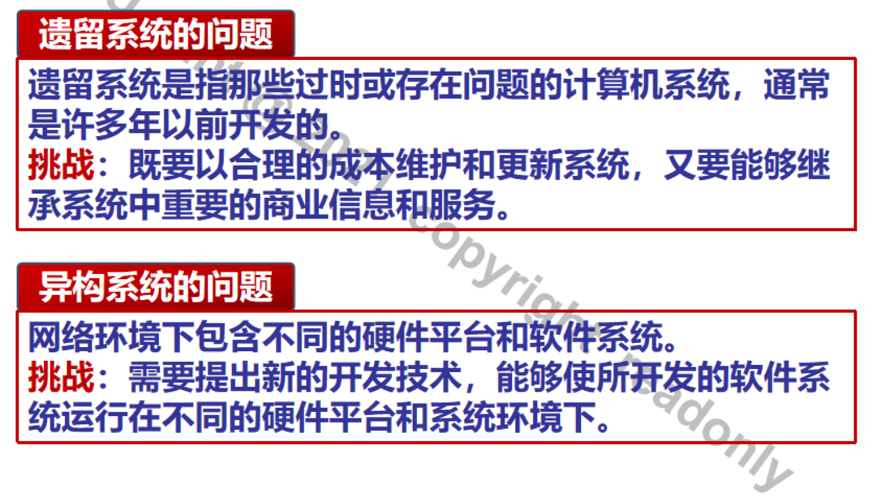{width="6.3in"
height="3.554491469816273in"}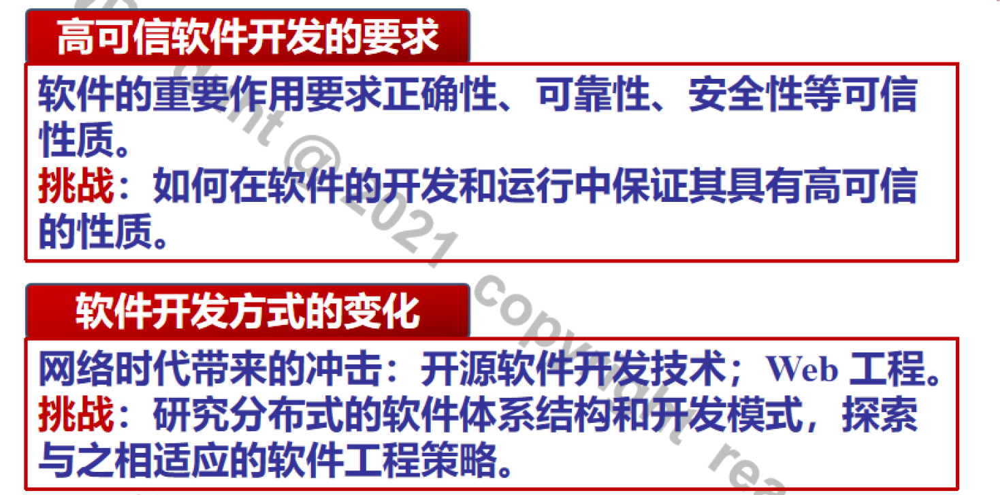{width="6.3in"
height="3.1221237970253717in"}

## 解决软件危机的途径是什么？

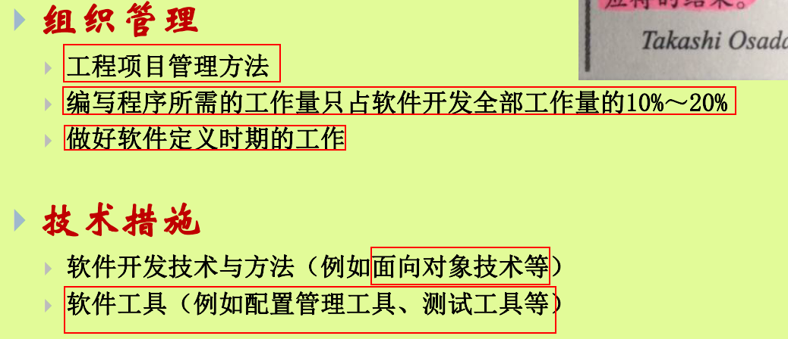{width="6.3in"
height="2.7190748031496064in"}

## 什么是软件工程？

（课本定义）

概括地说,软件工程是指导**计算机软件开发和维护**的一门**工程学科**。

采用工程的**既念、原理、技术和方法**来**开发与维护软件**,把经过时间考验而证明正确的**管理技术**和当的能够得到的最好的**技术方法结合起来**，以经济地开发山高质量的软件并有效地维护它,这就是软件工程。

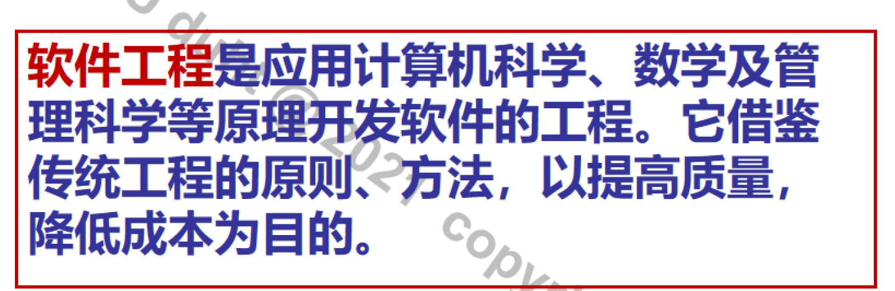{width="6.3in"
height="2.048922790901137in"}

### 软件工程的定义 ：

1.  应用计算机科学，数学以及管理科学等原理开发软件。

2.  借鉴传统工程的原则，方法。

3.  提高质量，降低成本为目的。

{width="6.3in"
height="1.8449387576552931in"}

## 软件工程研究的内容是什么？中心课题是什么？

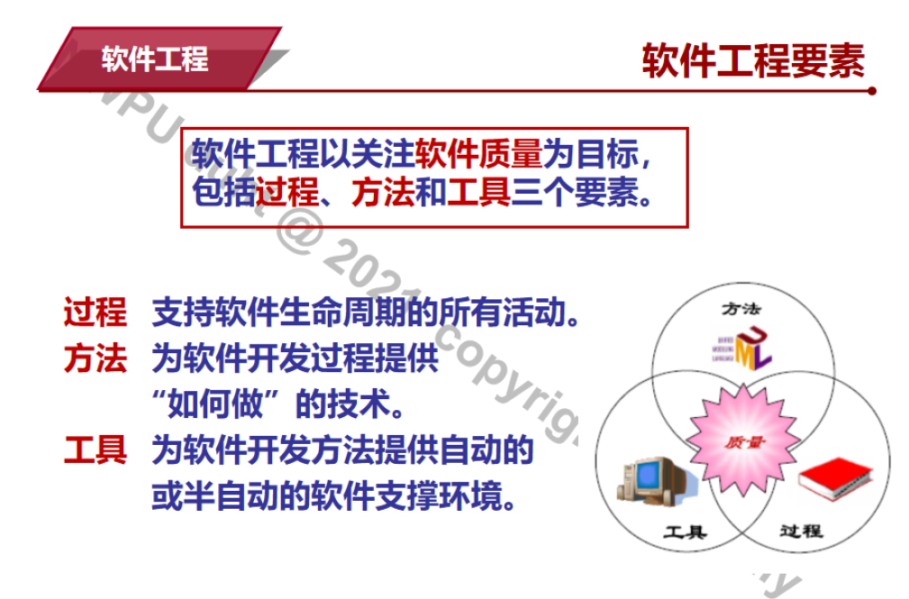{width="6.3in"
height="4.152130358705162in"}

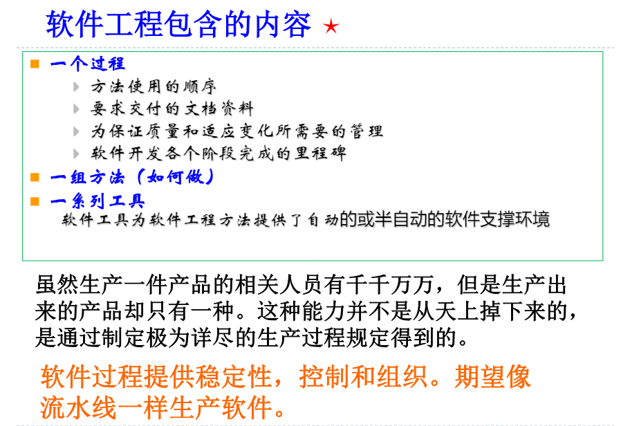{width="6.3in"
height="4.2599343832021in"}

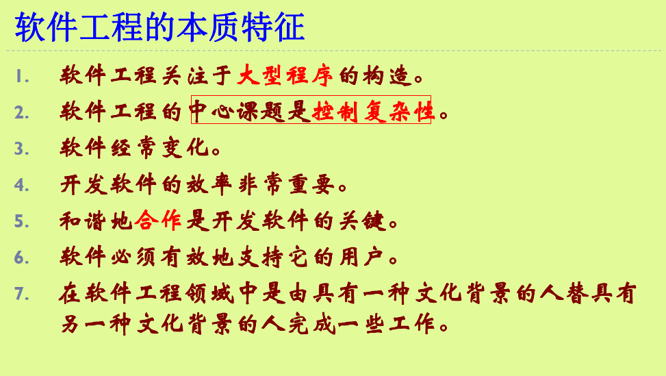{width="6.3in"
height="3.554676290463692in"}

## 软件工程的基本原理

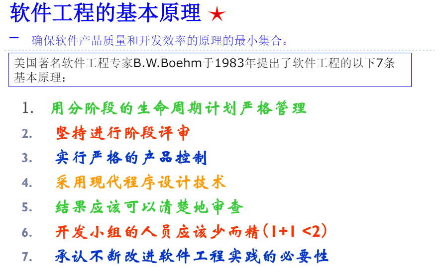{width="6.3in"
height="3.941062992125984in"}

## 软件工程方法学

目前使用得最广泛的两种软件工程方法学：生命周期方法学或结构化范型；面向对象方法学。

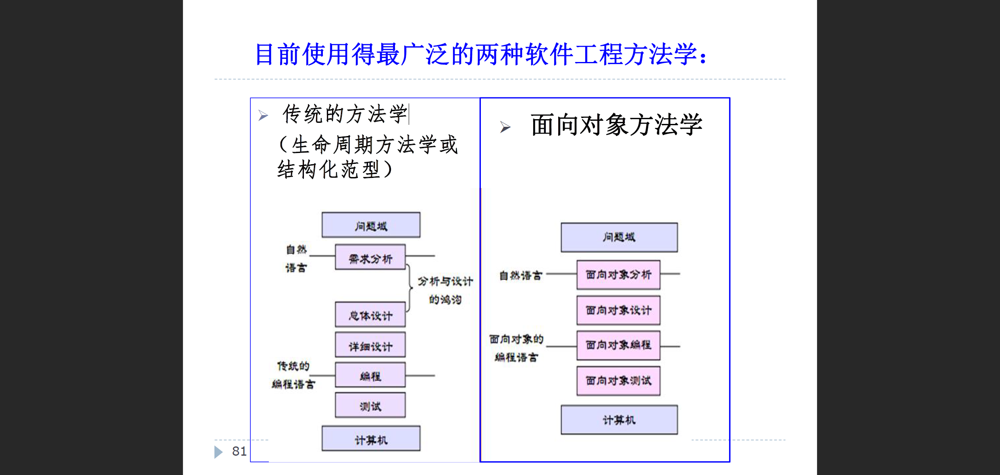{width="6.3in"
height="2.996372484689414in"}

## 软件质量

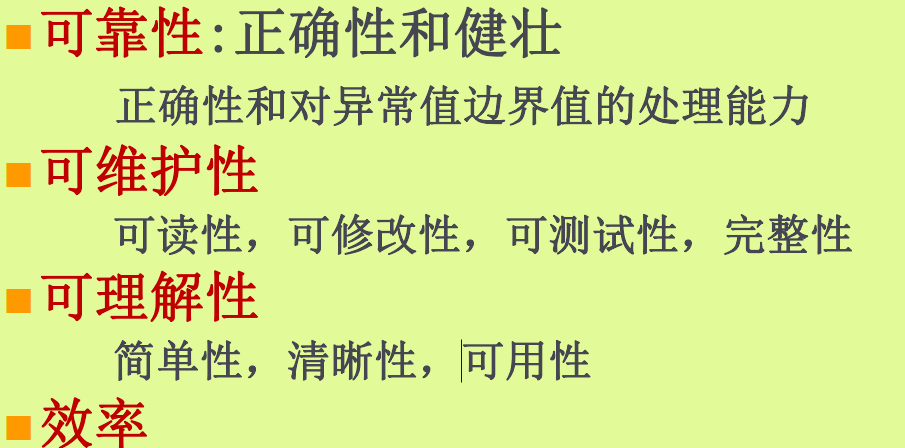{width="6.3in"
height="3.118674540682415in"}

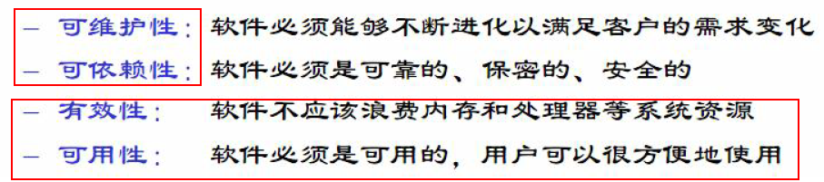{width="6.3in"
height="1.3961406386701662in"}

## 提高软件质量的手段

**需求明确和管理**：

-   确保需求清晰、明确，并且在开发过程中保持需求的管理和跟踪。

-   采用需求管理工具，如JIRA、Confluence等。

**用户反馈和监控**：

-   定期收集用户反馈，了解实际使用中的问题和需求，及时改进软件。

-   实施应用性能监控（APM）工具，如New
    Relic、Datadog等，实时监控软件运行状态和性能。

**文档和知识共享**：

-   编写全面的文档，包括代码注释、架构文档和使用手册，帮助团队成员理解和维护系统。

-   组织技术分享和培训，提高团队整体技术水平。

**使用现代开发方法**：

-   采用敏捷开发（Agile）、精益开发（Lean）等方法，提高响应变化的能力和交付效率。

-   实施DevOps实践，缩短开发与运营之间的距离，提升软件发布的频率和可靠性。

**持续集成和持续交付（CI/CD）**：

-   采用持续集成和持续交付流程，确保代码在每次提交后自动构建、测试和部署。

-   使用CI/CD工具，如Jenkins、CircleCI、Travis CI等。

**代码质量工具**：

-   使用静态代码分析工具，如SonarQube、ESLint、Checkstyle等，检测代码中的潜在问题和不良实践。

-   定期进行代码重构，保持代码简洁、可维护。

**代码审查和同行评审**：

-   定期进行代码审查和同行评审，确保代码质量，减少错误和缺陷。

-   使用工具如GitHub、GitLab的Pull Requests或Merge Requests。

**自动化测试**：

-   实施单元测试、集成测试和端到端测试，确保代码在不同层面的正确性。

-   使用自动化测试框架，如JUnit、Selenium、Cypress等。

**安全性审查**：

-   进行安全性评估和渗透测试，发现和修复安全漏洞。

-   遵循安全编码标准和最佳实践，确保软件的安全性。

## 什么是软件生命期？

一个软件从**被提出开始研制**至软件**最终被废弃不再使用**为止的全过程，称为软件生命期

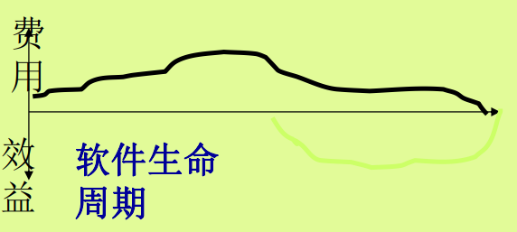{width="2.375in"
height="1.067088801399825in"}

生命型模型的优点：

1.  每个阶段的**工作结果用书面形式描述出来**，使得"不可见"的软件变成了"**可见"的文档资料**。

2.  以交付某种特定规格的文档作为标志某个阶段完成的里程碑，使"难于管理的思考过程"变为"**可以管理的生产过程"**。

分为三个周期：

1.  软件定义时期：问题定义，可行性研究

2.  软件开发时期：需求分析，总体设计，详细设计，编码，测试

3.  软件运行时期：软件安装运行，维护

（不是重点）

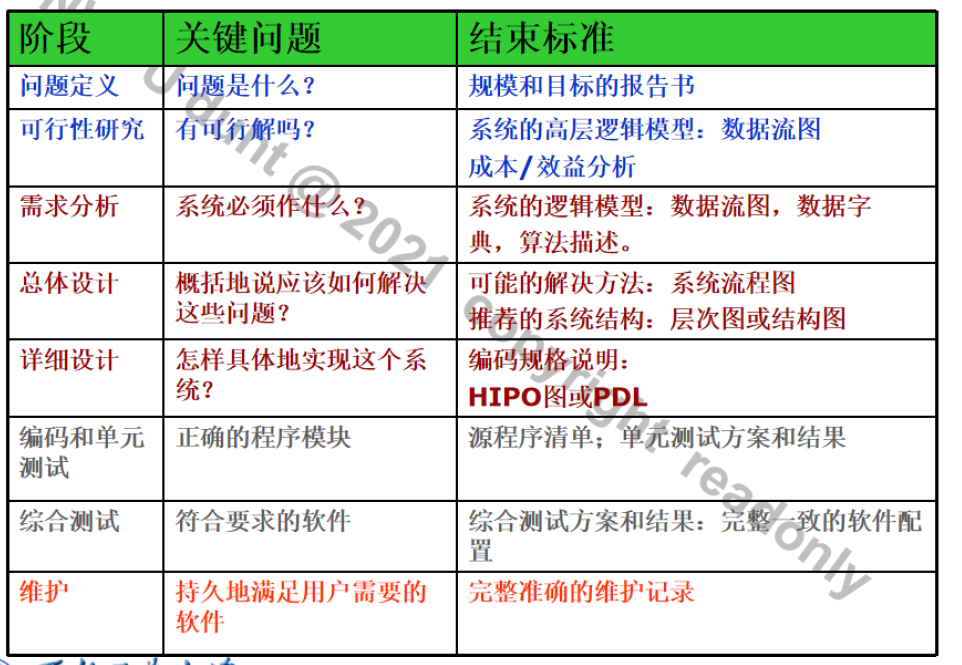{width="6.3in"
height="4.354989063867016in"}

## 瀑布模型每一阶段的含义。瀑布模型的优缺点。

瀑布模型是软件开发生命周期中的一种传统方法，它**将软件开发过程划分为一系列顺序的阶段**。

1.  每个阶段都必须在进入下一个阶段之前完成。

2.  并且一般不会回溯到前一个阶段。

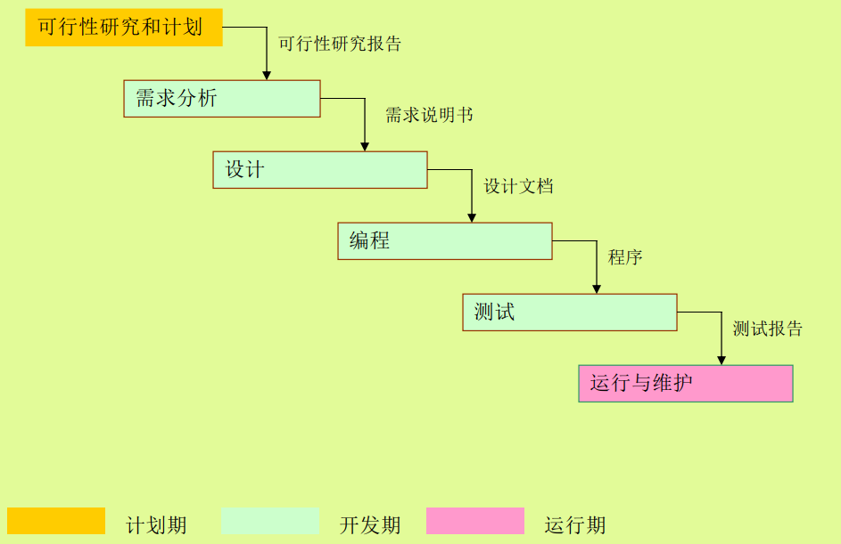{width="6.3in"
height="4.081972878390201in"}

每一阶段的含义（自己手拼的）

### 瀑布模型的各个阶段

1\. **可行性研究（Feasibility Study）**

确定项目**是否值得进行**，评估技术、经济和操作可行性。

2\. **需求分析（Requirements Analysis）**

收集和分析用户需求，编写**需求规格说明书**。

3\. **设计（Design）**

制定系统和软件的设计方案，包括架构设计和详细设计。

4\. **编码（Implementation or Coding）**

将设计文档转化为计算机可执行的代码。

5\. **测试（Testing）**

对代码进行测试，确保其满足需求且没有缺陷。

6\. **运行和维护（Operation and Maintenance）**

部署软件并进行日常维护和更新，修复bug，适应新需求。

### 优点

1.  强调开发的**阶段性**：阶段间具有顺序性和依赖性

2.  强调早期计划及需求调查：**推迟实现**的观点

3.  强调**评审，强调产品测试**：质量保证的观点

### 缺点

1.  依赖于早期进行的唯一一次需求调查，不能适应需求的变化；

2.  由于是单一流程，开发中的经验教训不能反馈应用于本产品的过程；

3.  风险往往迟至后期的开发阶段才显露，因而失去及早纠正的机会。　　　　

4.  文档驱动的，这对于非专业的用户来说是难以阅读和理解的。

### 选取依据

1.  当需求很确定，有一个**稳定的产品定义和很容易被理解的技术解决方案**时，纯瀑布模型特别合适。

2.  当你对一个定义得很好的版本进行**维护或将一个产品移植**到一个新的平台上，瀑布模型也特别合适。

3.  对于那些容易理解但很复杂的项目，采用纯瀑布模型比较合适，因为可以用顺序方法处理问题。

4.  在质量需求高于成本需求和进度需求的时候，它尤为出色。

5.  当开发队伍的技术力量比较弱或者缺乏经验时，瀑布模型更为适合。

## 快速原型、增量模型的定义，特点，选取依据。

### 快速原型

快速建立起来的，可以在计算机上运行的程序，它所完成的功能往往是最终产品完成功能的一个子集，让用户在计算机上试用快速原型，通过实践了解目标系统的样貌。然后提出修改意见，重新建立原型并使用，一旦用户确认这个原型系统确实是他们想要的，就可以完成规格说明文档，这个文档就是用户的真实意愿。

原型的分类：

-   **抛弃型原型：**用于试验某些概念，试验完系统将无用处

-   **进化型原型：**原型系统不断被开发和被修正，最终它变为一个真正的系统。

#### 优点：

1.  从实践中学习(Learning by doing)

2.  改善通信

3.  **改善用户参与**

4.  **使部分已知需求清晰化**

5.  **展示描述的一致性和完整性**

6.  **提高系统的实用性、可维护性**

7.  **节省开发的投入、缩短整个软件的开发周期**

#### 缺点

1.  原型法要求开发者与用户密切接触，有时这是不可能的。例如外包软件。

2.  用户有时误解了原型的角色，例如他们可能误解原型应该和真实系统一样可靠。

3.  缺少项目标准，进化原型方法有点像编码修正。

4.  缺少控制，由于用户可能不断提出新要求，因而原型迭代的周期很难控制。

5.  额外的花费：研究结果表明构造一个原型可能需要10%额外花费。

6.  为了尽快实现原型，采用了不合适的技术，运行效率可能会受影响。

#### 选择依据：

适用于**用户驱动的系统**（即需求模糊或随时间变化的系统）。

### 增量模型

**增量模型**也称为**渐增模型**，使用增量模型开发软件,把软件产品作为一系列的**增量构件**米设计、编码.集成和测试。每个构作由多个相互作用的模块构成井且能够完成特定的功能。第一个增量构作往往实现基本要求。

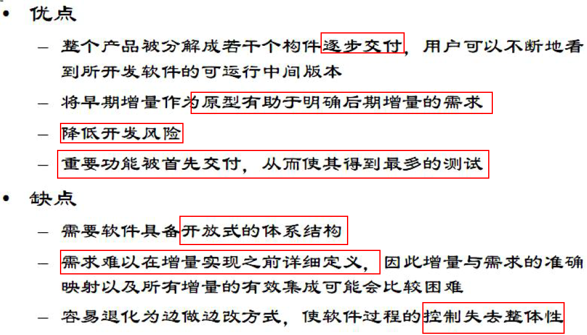{width="6.3in"
height="3.598196631671041in"}

应用场景：

1.  **需求不完全明确的项目**

    a.  用户需求不清晰或可能会变化，通过逐步交付软件版本，可以不断调整和完善需求。

2.  **风险较高的项目**

    a.  通过逐步开发和交付，可以在早期发现并解决技术难题和潜在风险，减少项目失败的风险。

3.  **需要快速交付的项目**

    a.  可以先交付一个基本功能的版本，满足用户的急需，然后逐步增加功能，改进系统。

4.  **资源受限的项目**

    a.  可以根据现有资源逐步开发和交付，而不需要一次性投入大量资源。

5.  **复杂度较高的项目**

    a.  通过分阶段开发，可以逐步解决复杂问题，降低系统的复杂度和开发难度。

6.  **客户反馈重要的项目**

    a.  通过定期交付增量版本，获取用户的反馈，不断改进和优化软件系统。

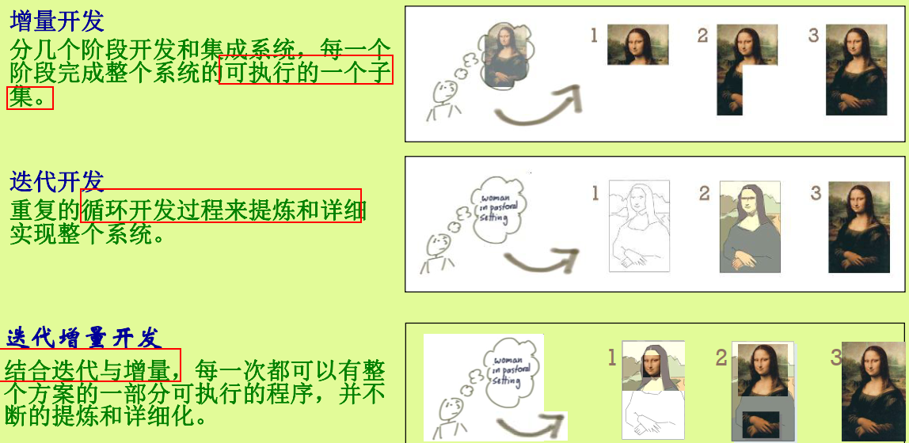{width="6.3in"
height="3.073170384951881in"}

## 螺旋模型的定义，适用的软件项目。

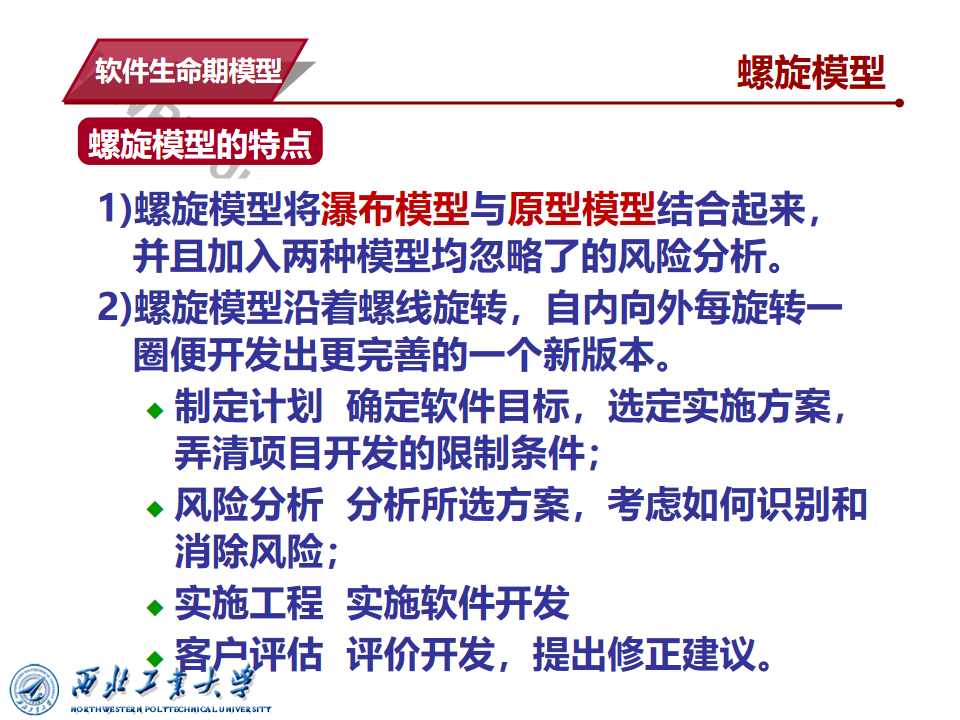{width="6.3in"
height="4.725in"}

螺旋模型基本的做法是在"瀑布模型" 的每一个开发阶段之前，引入非常严格
的风险识别、风险分析和风险控制。直 到采取了消除风险的措施之后，才开始
计划下一阶段的开发工作。否则，项目 就很可能被取消。 

四个步骤：确定目标、风险分析、开发和验证、评价结果。

优点：

　 a.强调严格的全过程风险管理。

　 b.强调各开发阶段的质量。

　 c.提供机会检讨项目是否有价值继续下去。

缺点：

　a.引入非常严格的风险识别，风险分析，和风险控制，这对风险管理

的技能水平提出了很高的要求。

b.这需要人员，资金，和时间的投入比较复杂，需要相当的风险评

估技术，且成功依赖于这种技术。

适用的软件

1.  **大型复杂项目------**逐步实现和集成各个模块，降低整体风险。

2.  存在较高的技术风险、市场风险或管理风险。

3.  **创新和前沿技术项目------**逐步探索新技术的可行性和适用性。

4.  **需求不明确或易变的项目------**不断获取用户反馈，逐步明确和完善需求，适应变化。

软件过程的基本活动

-   \- 分析、设计、实现、测试、维护

chat版本：

## 软件过程的基本活动

1\. **分析（Analysis）**

-   分析是软件开发过程的起点，**旨在明确和理解用户的需求**。这个阶段涉及与客户、用户和其他利益相关者进行沟通，收集和记录他们对系统的功能和性能要求。通过需求分析，可以将模糊的用户需求转化为明确的系统需求，编写需求规格说明书（SRS），为后续的设计和开发奠定基础。

2\. **设计（Design）**

-   设计是**将需求转化为软件系统的体系结构和详细设计的过程**。在系统设计阶段，开发团队确定系统的整体结构，包括模块划分、接口设计和数据流。在详细设计阶段，对每个模块进行具体的设计，包括算法、数据结构和逻辑流程。设计文档记录了这些设计方案，为实现阶段提供蓝图和指导。

3\. **实现（Implementation）**

-   **实现是将设计文档中的设计转化为可执行代码的过程。**在这一阶段，开发人员根据详细设计编写源代码，实现系统的各个功能模块。编码完成后，进行代码审查和评审，确保代码质量和规范性。版本控制系统（如Git）用于管理代码的版本和变更，确保代码库的有序和安全。

4\. **测试（Testing）**

-   测试是对软件系统进行验证和验证的过程，旨在确保系统符合需求且无缺陷。测试活动包括单元测试、集成测试、系统测试和验收测试。在单元测试中，对各个模块进行独立测试；在集成测试中，验证模块之间的接口和交互；在系统测试中，对整个系统进行全面测试；在验收测试中，与用户一起确认系统是否满足需求。通过这些测试活动，可以发现和修复系统中的缺陷，确保软件的质量。

5\. **维护（Maintenance）**

-   维护是软件系统在交付后的持续支持和改进过程。维护工作包括修复发现的缺陷、适应新的需求和环境、优化系统性能等。由于软件产品的使用寿命通常较长，维护工作占据了软件生命周期的很大一部分。通过及时和有效的维护，可以确保软件系统长期稳定运行，满足用户不断变化的需求。

## 软件工程过程管理原则有哪些？

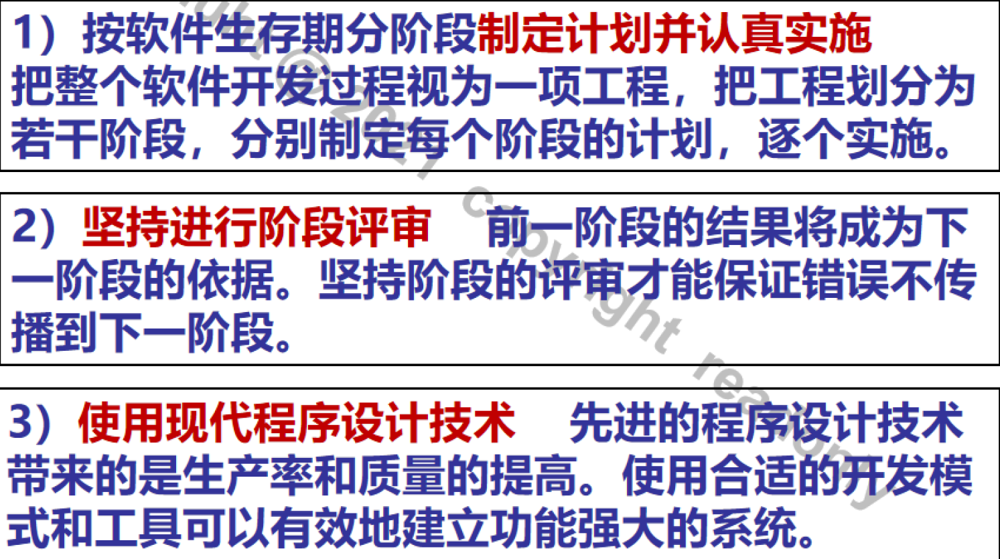{width="6.3in"
height="3.523442694663167in"}

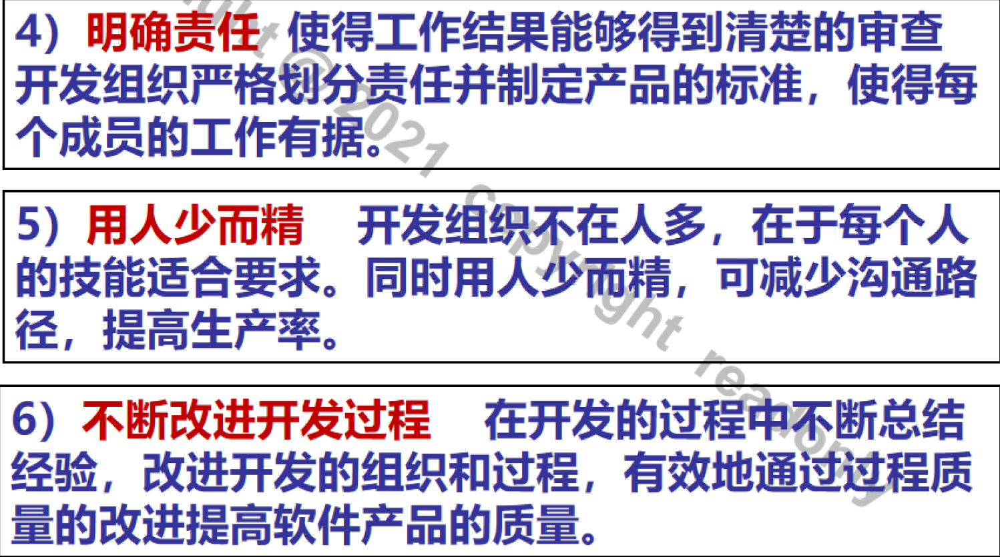{width="6.3in"
height="3.5116819772528434in"}

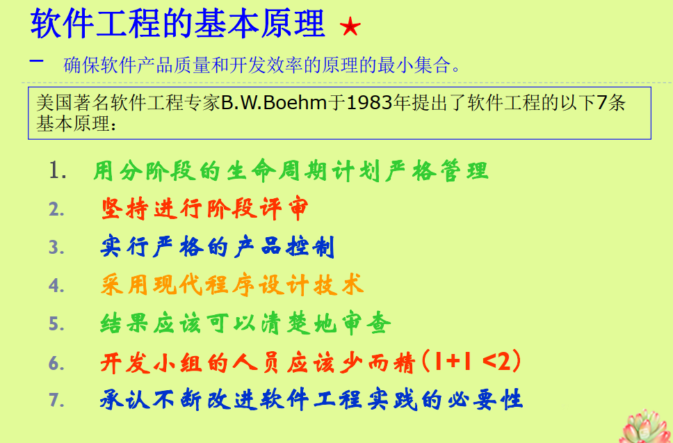{width="6.3in"
height="4.145764435695538in"}

## 敏捷模型解决什么问题

软件开发的新挑战

➢快速的市场进入时间，要求高生产率

➢快速变化的需求

➢快速发展的技术

## 极限编程（XP）关键词

用户故事、简单设计、测试驱动开发 （TDD）、持续集成、重构、结对编程

## 用户故事

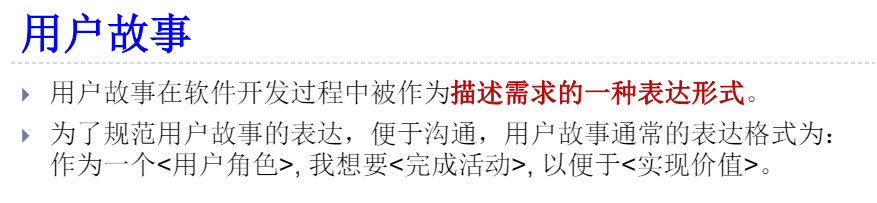{width="6.3in"
height="1.4582666229221348in"}

## Scrum开发模型关键词

Sprint、Backlog、Sprint Backlog

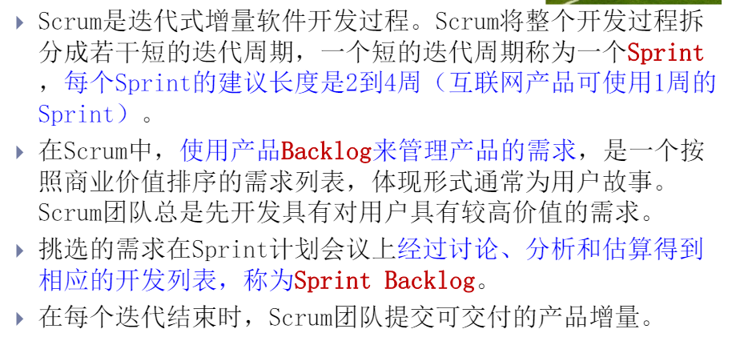{width="6.3in"
height="3.0574540682414697in"}

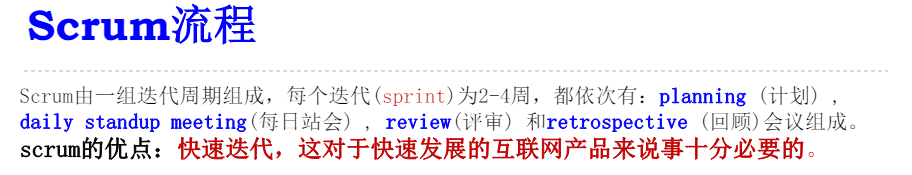{width="6.3in"
height="1.2088812335958006in"}
