# 第七章

## 测试的目的，测试和审查（静态测试）的关系

### 测试的目的

"广义的测试"：

{width="6.3in"
height="3.4586679790026245in"}

通过程序的**执行**，发现在**设计**和**制造阶段**植入的bug.

（注）是为了发现问题，而不是证明这一个软件是对的

### 动态测试和静态测试

------------------ ------------------------------------------------ --------------------------------------------------------
| **方面**         | **动态测试**                                   | **静态审查**                                           |
| ---------------- | ---------------------------------------------- | ------------------------------------------------------ |
| **定义**         | 在软件运行时进行测试，检查**实际运行中的问题** | 不执行代码，通过分析**源代码、文档和设计来检查问题**   |
| **是否执行代码** | 需要**执行代码**                               | **不**执行代码                                         |
| **发现问题类型** | 运行时错误（如内存泄漏、崩溃、性能问题）       | 语法错误、编码规范问题、潜在逻辑错误                   |
| **应用阶段**     | 开发后期阶段（如测试阶段）                     | 开发早期阶段（如编码完成后，提交之前）                 |
| **测试类型**     | 单元测试、集成测试、系统测试、验收测试         | 代码审查、静态代码分析、模型审查                       |
| **效率和成本**   | 时间较长，资源较多，但能真实反映软件性能和功能 | 成本较低，能快速发现问题                               |
| **优点**         | 真实反映软件的实际表现                         | 早期发现问题，减少后期修复成本和时间                   |
| **缺点**         | 只能发现运行时暴露的问题，测试覆盖不全面       | 不能发现运行时的性能问题，需要依赖代码质量和审查者经验 |

------------------ ------------------------------------------------ --------------------------------------------------------

静态审查通常在开发早期阶段进行，可以在代码提交之前发现并修正问题；动态测试则是在开发后期阶段进行，通过运行软件来验证其功能和性能。

静态审查可以作为动态测试的前置步骤，确保代码在动态测试之前已经过基本的检查，从而提高动态测试的效率和有效性。两者结合使用，可以提供更全面的质量保证。

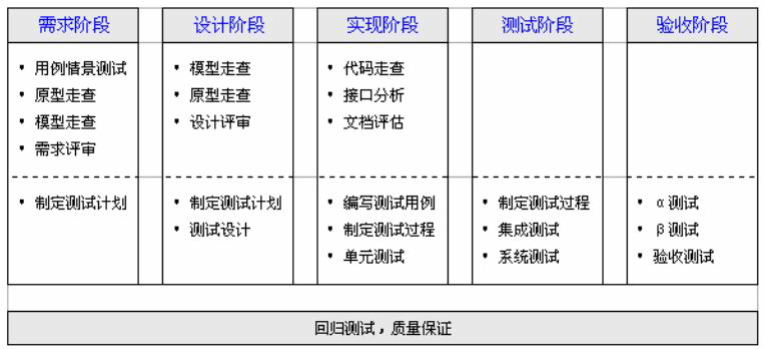{width="6.3in"
height="2.877879483814523in"}

## 什么是软件缺陷，试举一些软件缺陷的例子

### 基本概念

1.  **软件错误（Error）**：软件错误是一种人为错误，通常是由于开发人员在编写代码时的疏忽或误解引起的。这些错误是问题产生的最初来源。

2.  **软件缺陷（Defect）**：软件缺陷是在软件中存在的错误点，这些缺陷可能不会立即导致程序出现问题，只有在特定条件下才会被触发。

> 软件错误必定会产生一个或多个软件缺陷。

3.  **软件故障（Fault）**：当一个软件缺陷被激活时，它就会产生一个软件故障。这意味着程序在某些条件下不能正确工作，可能会出现不同的表现形式，如程序崩溃或错误输出。

> 同一个软件缺陷在不同条件下被激活，可能产生不同的故障。

4.  **软件失效（Failure）**：如果软件故障没有被及时的容错措施捕捉和处理，就会导致软件失效。这意味着程序无法完成预期的功能，造成系统崩溃或严重错误。

> 同一个软件缺陷在不同条件下可能产生不同的失效类型。

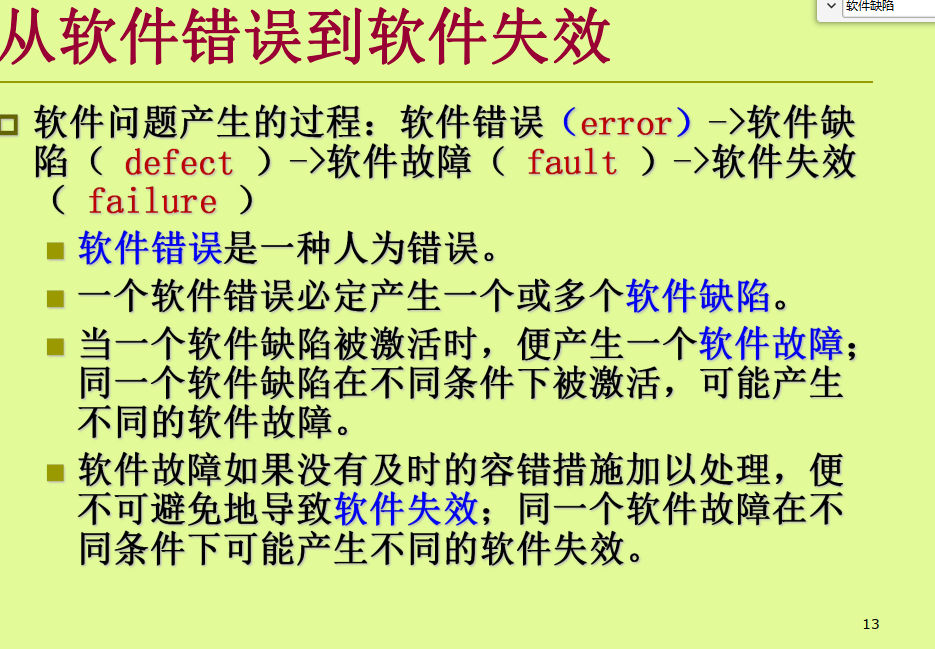{width="6.3in"
height="4.37294072615923in"}

### 软件缺陷的例子

-   程序异常终止；

-   未达到需求说明书指明的要求；

-   出现了需求说明书中指明不会出现的错误；

-   功能超出了需求说明书指明的范围；

-   未达到需求说明书未指明但是应达到的要求；

-   难以理解，不易使用，运行速度缓慢；

## 为什么说：测试发现的错误中的80%很可能是由程序中20%的模块造成的。如何使用这个原理

因为pareto原则：测试发现的错误中的80%很可能是由程序中20%的模块造成的。

软件系统中某些模块由于**功能复杂**、代码行数多或者依赖性强，**更容易出现错误。**这些复杂模块往往只占整个代码库的一小部分，但由于其非常重要，，成为错误的高发区域。

### 使用法则

1.  通过分析和识别最容易出现问题的关键模块，测试团队可以集中精力在这些高风险区域进行深入测试，从而更高效地发现和修复大多数问题。（chatGPT）

2.  应该从"小规模"测试开始，并逐步进行"大规模"测试。

{width="6.3in"
height="3.6452405949256343in"}

## 满足条件覆盖的测试用例，是否一定满足判定覆盖

不一定，满足条件覆盖，但是不满足判定覆盖的情况如下：

如果取：

-   A = True, B = False;

-   A = False, B = True;

这样使得所有条件均进行了遍历，但是仅覆盖了if语句的true分支。

## 什么是白盒测试，什么情况需要进行白盒测试？

### 什么是白盒测试

白盒测试是一种允许测试人员利用程序内部的**逻辑结构及有关信息**，**来设计或选择测试用例**，
**对程序所有逻辑路径**进行测试。

### 需要进行白盒测试的情况

1\. **单元测试和集成测试**：

-   **单元测试**：用于验证每个单元（如函数、方法或类）的功能是否正确。

-   **集成测试**：确保多个单元或模块组合在一起时能够正确工作。

2\. **发现隐藏的逻辑错误和缺陷**：

-   通过深入了解代码，可以发现隐藏的逻辑错误、边界条件问题和潜在的缺陷，确保软件在各种条件下都能正常运行。

3\. **代码逻辑复杂**：

-   当软件的代码逻辑非常复杂时，白盒测试能够检查所有逻辑分支和路径，确保没有遗漏任何错误。

4\. **安全性要求高、关键性业务功能**：

-   对于对安全性有严格要求的软件系统，白盒测试有助于识别和修复潜在的安全漏洞和弱点，确保系统的安全性和可靠性。

-   对于关键业务功能模块，白盒测试确保这些模块的正确性和稳定性，因为它们对于整个系统的运行至关重要。

## 为什么需要白盒测试

1.  白盒测试能够验证代码的每一个分支、循环和条件，确保所有代码路径都被执行和测试。这样可以保证代码的全面覆盖，减少未测试代码中的潜在错误。

2.  白盒测试有助于发现边界条件问题，例如数组越界、溢出等问题，这些问题通常难以通过黑盒测试发现。

3.  对于实现复杂算法的模块，通过白盒测试可以确保算法的每个步骤都被正确执行，并且能够处理各种输入情况。

4.  可以发现与功能设计之外的特殊处理逻辑的BUG

## 只进行功能测试是否可以

不可以

1.  功能测试只关注输入和输出，无法确保所有代码路径、分支和条件都被充分测试。这意味着可能有很多代码在测试过程中未被执行，从而隐藏了潜在的错误。

2.  功能测试只能验证软件的外部行为，而不能检测内部逻辑错误和实现细节中的问题。（边界值）

## 白盒测试方法有哪些

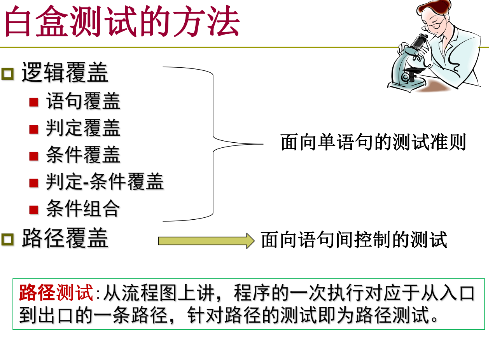{width="6.3in"
height="4.279705818022747in"}

## 什么是基本路径，如何根据流图寻找基本路径？

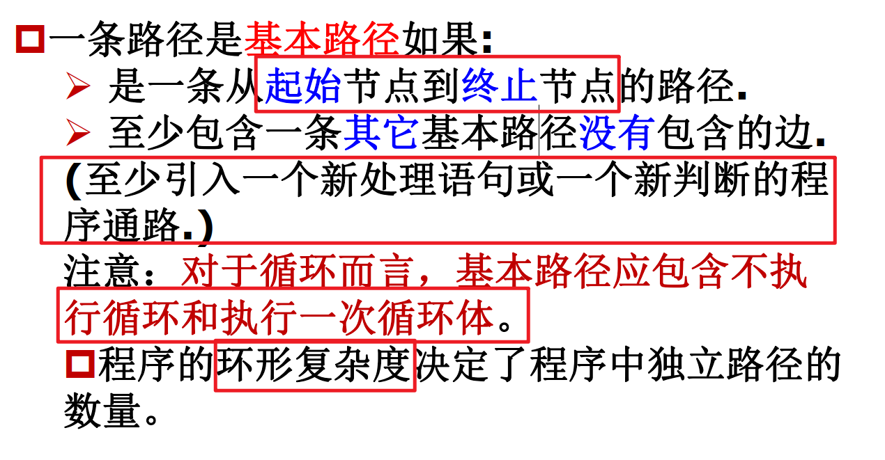{width="6.3in"
height="3.278976377952756in"}

### 寻找方法

1.  画出流图

2.  计算环形复杂度

3.  基本路径的数目和环形复杂度一样

4.  注意找到的路径要符合基本路径的定义

## 如何计算环形复杂度

三种方式，算出来的应该是一样的

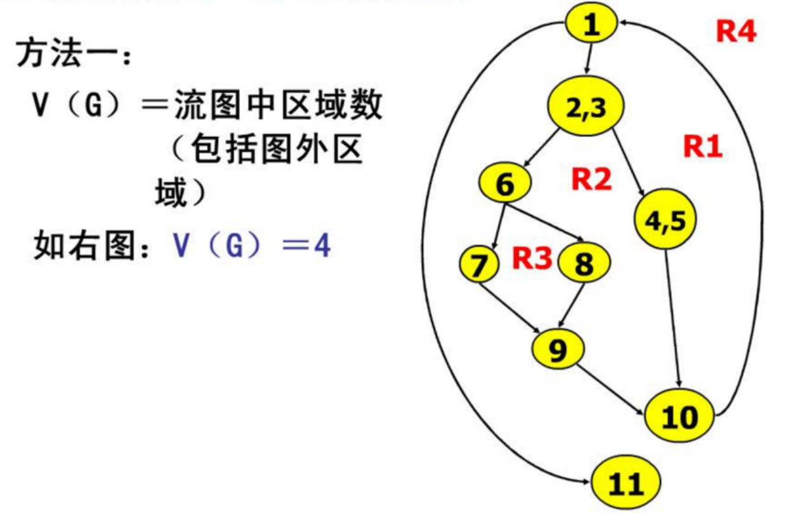{width="6.3in"
height="4.051784776902887in"}

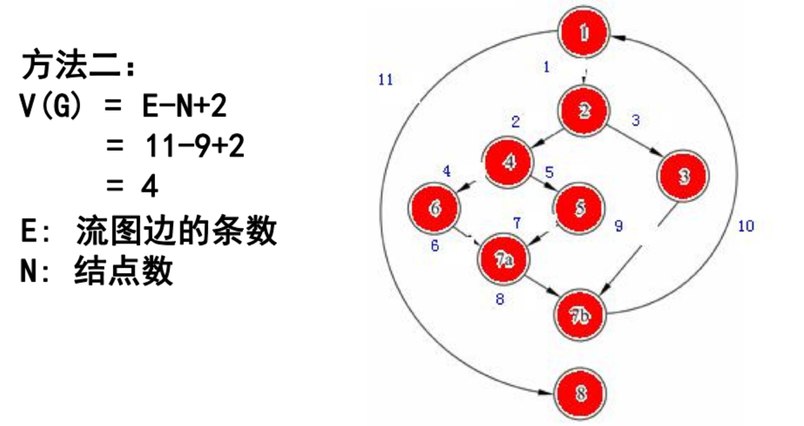{width="6.3in"
height="3.3457370953630794in"}

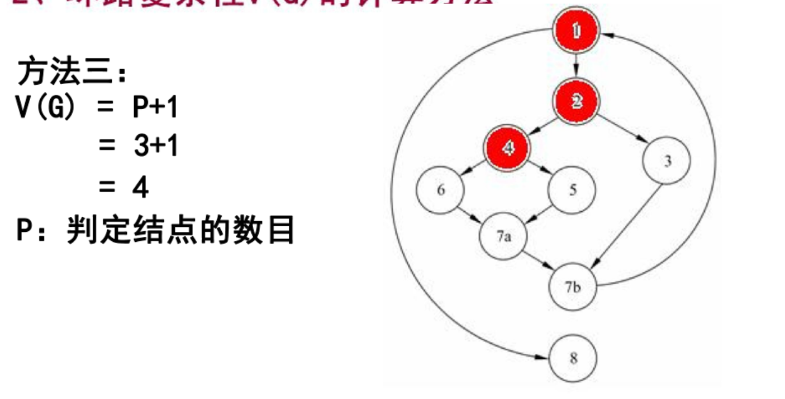{width="6.3in"
height="3.2105336832895888in"}

## 遇到循环语句，如何进行测试？

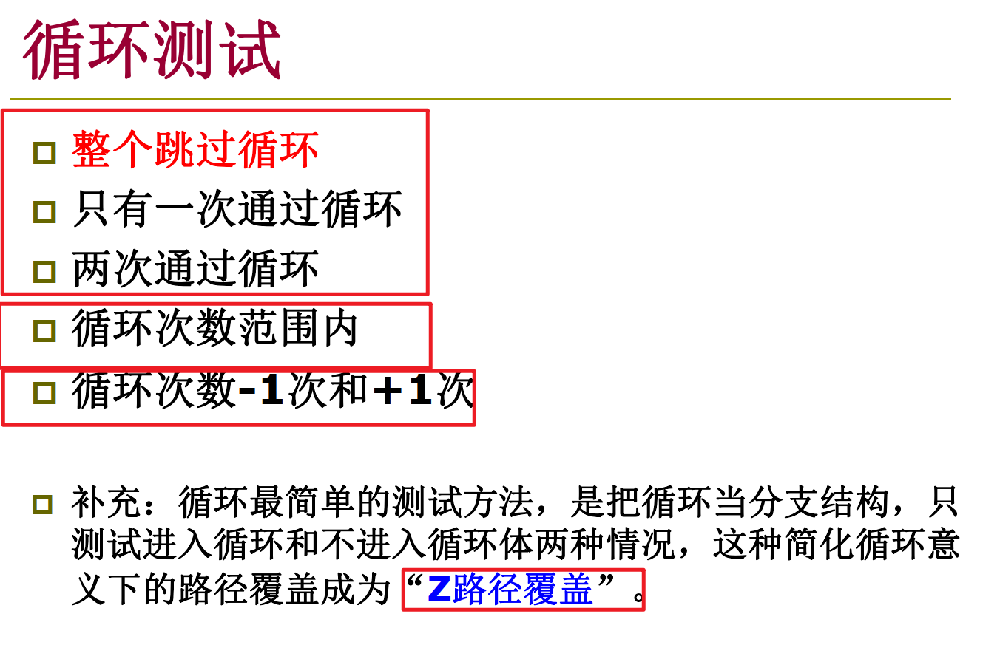{width="6.3in"
height="4.06797353455818in"}

## 代码完成后，应当按照什么样的测试步骤进行测试

1.  测试准备，明确测试的目标和范围，确定需要测试的功能、模块和组件。

2.  静态测试：对文件、对代码进行审查。

3.  动态测试：

-   单元测试（根据代码逻辑编写详细的单元测试用例，覆盖各种输入和输出情况。）

-   集成测试：写测试用例，验证模块间的交互和集成效果。

-   系统测试：根据需求和设计文档编写系统级测试用例，涵盖所有功能和非功能需求。

-   回归测试：确保修改后的代码没有引入新的缺陷。

-   验收测试

4.  形成测试文档

## 单元测试如何完成

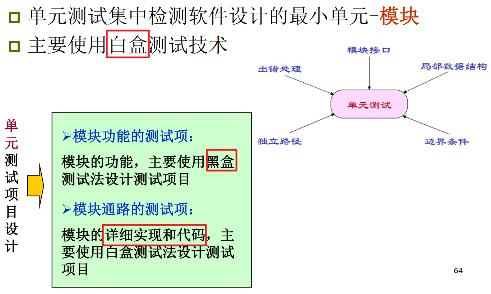{width="6.3in"
height="3.7836865704286966in"}

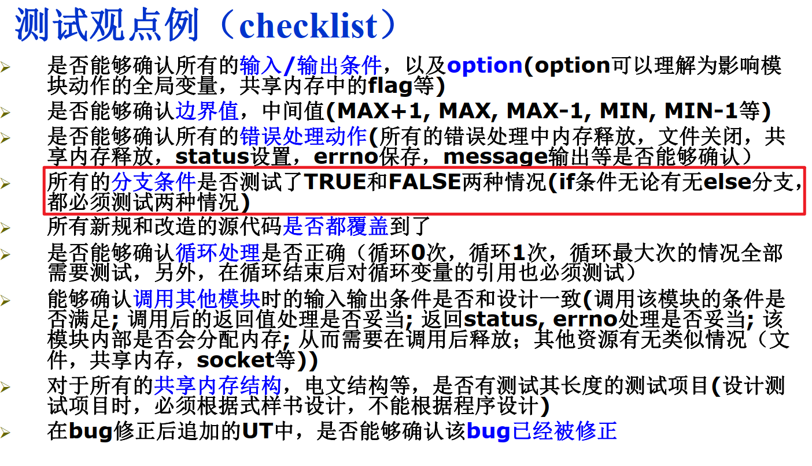{width="6.3in"
height="3.625640857392826in"}

## 什么是驱动模块，什么是桩模块？

驱动模块：驱动模块是用于测试下层模块（通常是被测模块）的模拟上层模块或组件。它负责调用被测模块的功能，并提供必要的输入数据，同时捕获和验证输出结果。

桩模块是用于测试上层模块时，模拟下层模块或组件的简化实现。它提供被测模块所需的接口，但只返回预定的结果或行为。

## 自顶向下集成测试，需要构筑驱动模块还是桩模块？

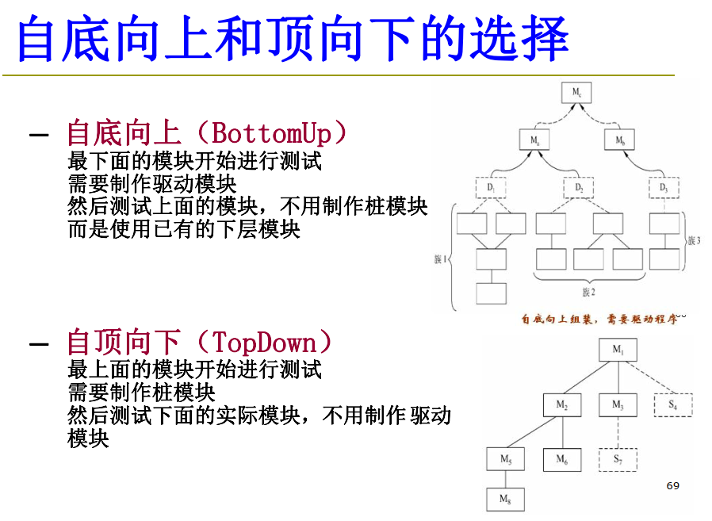{width="6.3in"
height="4.60924321959755in"}

## 什么是黑盒测试，黑盒测试有哪些方法？什么情况进行黑盒测试？

在这种方法中，测试人员**不需要了解软件内部的代码实现和内部结构**，只关注**输入和输出**的正确性。黑盒测试的目标是验证**软件功能是否符合需求规格说明书的要求**。

黑盒测试的方法：

-   等价分类法：

程序的输入集合分割为有限的等价类，选取代表值进行测试

例如：输入参数为0以上6以下的整数

-   边缘值分类法：

注意等价类的边界，对边界进行测试。

边界值分析不仅考虑输入条件，还要考虑输出空间产生的测试情况。

-   错误推测法：

根据过去的开发经验，程序的构造，处理等预测可能发生的bug。

-   原因-结果图：

将程序的输入条件、环境条件等的原因，和处理、输出等的结果的逻辑关系，变换为逻辑图，从而作成判定表，设计测试项目。

**应用场景：**

功能测试

确认软件的每个功能模块按照需求文档的描述正确工作。

系统测试

检验整个系统在不同的环境下是否能正常运行，包括性能测试、负载测试、兼容性测试等。

验收测试

由最终用户或客户进行的测试，以确保软件满足其需求和期望。

回归测试

在修改或修复软件后，重新进行测试以确认未引入新的错误。

用户界面测试

测试软件的界面，确保用户界面符合设计标准和用户体验要求。

## 除功能测试之外，系统测试还需要包含哪些测试（至少枚举3条）

确认测试（系统测试）

功能测试（Function Testing）

负荷测试（Stress Testing）

大容量测试（Volume Testing）

存储量测试（Storage Testing）

安全性测试（Security Testing）

性能测试（Performance Testing）

可靠性测试（Reliablity Testing）

恢复测试（Recovery Testing）

使用性测试（Usabiliry Testing）

文档测试（Documentation Testing）

工序测试（Procedure Testing）

## 什么是回归测试？为什么要进行回归测试？

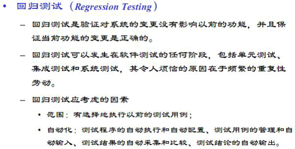{width="6.270833333333333in"
height="3.1770833333333335in"}

## Alpha测试和Beta测试是什么含义？

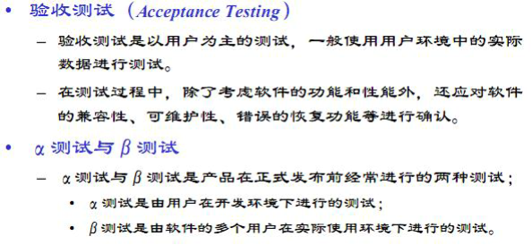{width="6.1875in"
height="2.8541666666666665in"}
