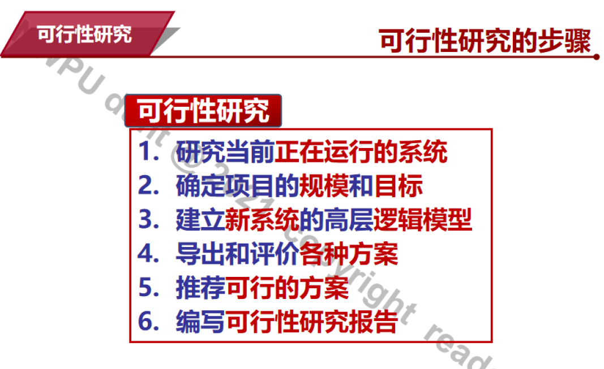
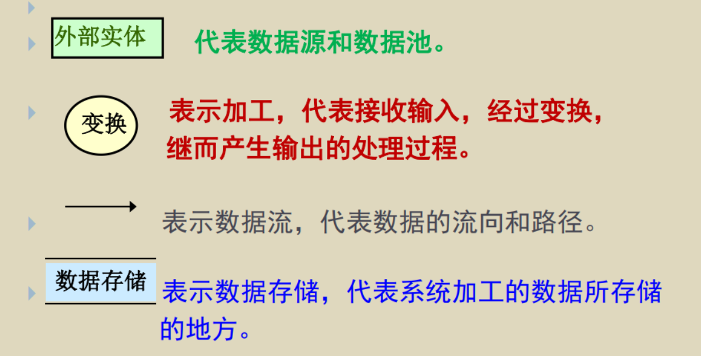
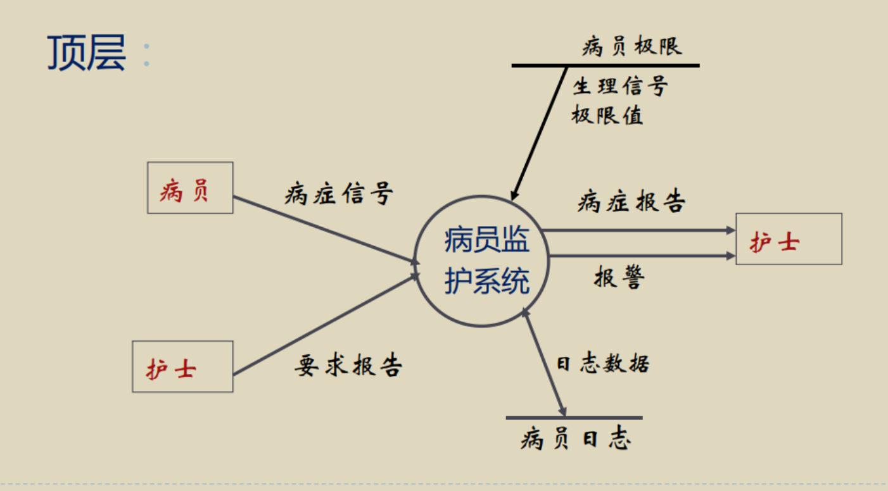
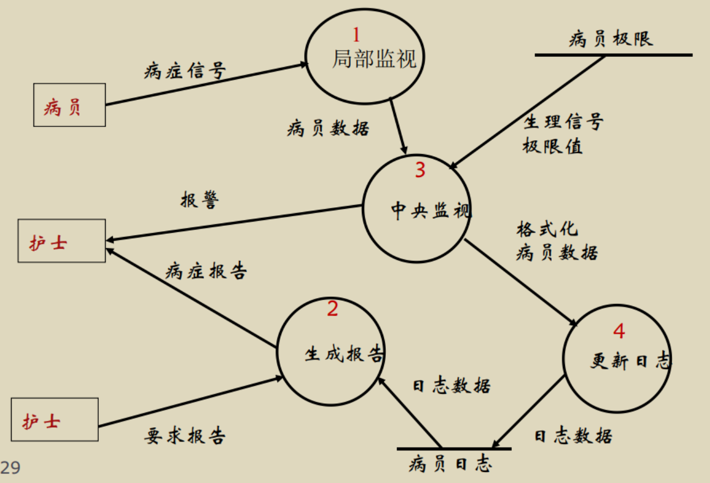
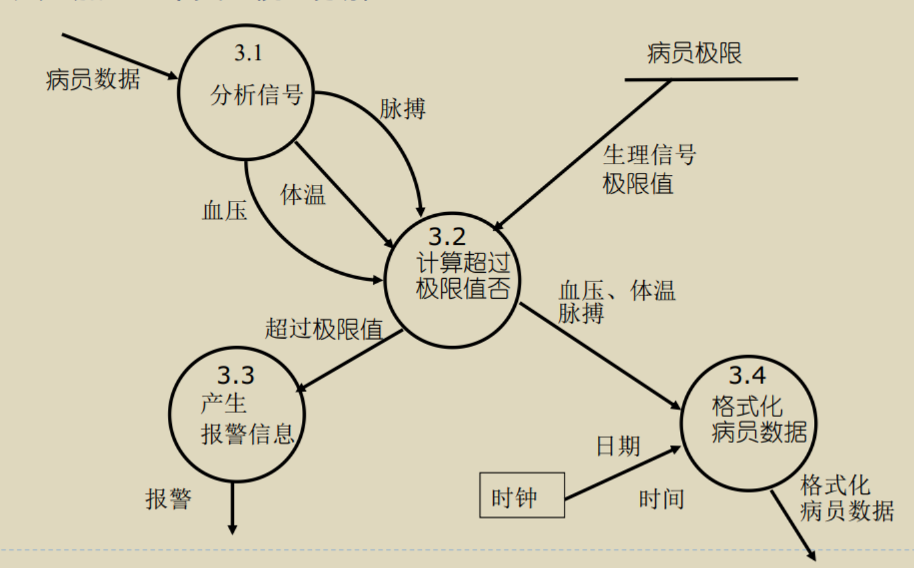
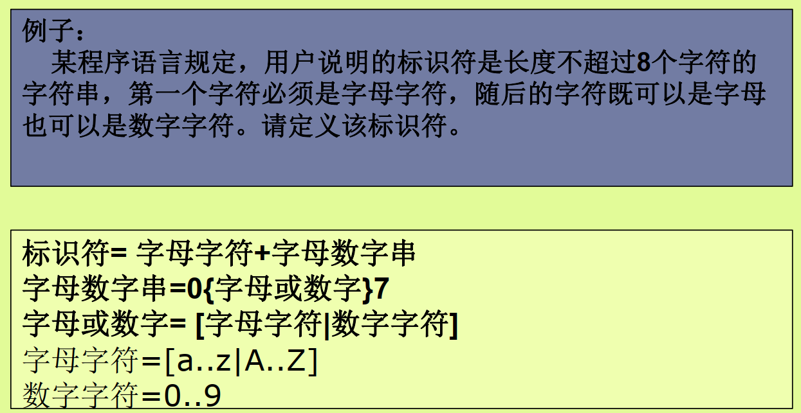
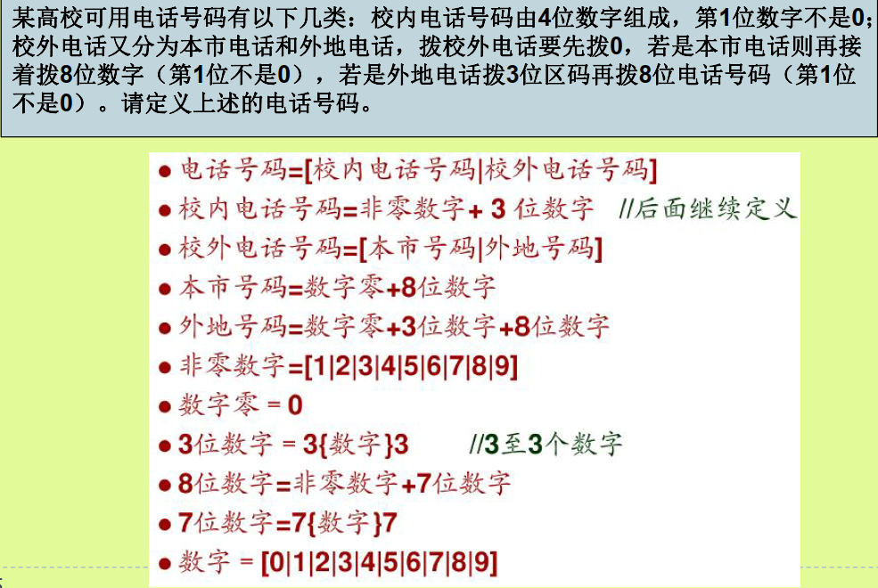

# 第二章

## 可行性分析任务是什么？

弄清要计算机解决的问题根本所在，确定新系统的作用域，以及项目所需的资源和经费。

用最小的代价在尽可能短的时间确定问题是否可以解决、是否值得解决。

## 可行性分析的内容？【不知所云】

### 可行性的方面

1.  **技术可行性**

使用现有的技术能实现系统吗？ 这些程序员的编程语言能不能胜任？

-   使用的技术实用化程度

-   技术解决方案合理程度

-   参与人员的工作基础

-   基础硬件/软件的可用性

-   软件工具实用性

2.  **经济可行性**

基于计算机系统的成本由四部分组成：

1.  购置软、 硬件及有关设备费用

2.  系统开发费用

3.  系统安装和维护费用

4.  人员培训费用

```{=html}
<!-- -->
```
3.  **操作可行性**

系统的操作方式在这个用户组织内能行得通吗？

1.  用户类型 外行型、熟练型、专家型

2.  用户的操作习惯

3.  用户单位的计算机使用情况、普及情况

4.  用户单位的规章制度

```{=html}
<!-- -->
```
4.  **法律可行性**

5.  **社会效益**

### 可行性研究的过程

{width="6.3in"
height="3.855576334208224in"}

1\. **复查系统规模和目标**

-   分析员需要重新审查系统规模和目标，确保所有的描述清晰准确。通过与关键人员访谈和分析相关材料，进一步确认和改正含糊或不确切的叙述，确保分析员解决的问题正是用户要求解决的问题。

2\. **研究目前正在使用的系统**

-   现有系统是信息的重要来源，分析员应仔细阅读和分析现有系统的文档资料和使用手册，并实地考察现有系统。了解现有系统的功能、工作原理和使用成本，以便为新系统的开发提供参考。

3\. **导出新系统的高层逻辑模型**

-   根据现有系统的逻辑模型，结合目标系统的需求，设计出新系统的高层逻辑模型。使用数据流图（DFD）和数据字典定义新系统的逻辑模型，从而为新系统的设计提供基础。

4\. **进一步定义问题**

-   与用户一起复查新系统的逻辑模型，确保分析员和用户对新系统的需求和功能有一致的理解。如果发现问题或遗漏，应及时进行修正。

5\. **导出和评价供选择的解法**

-   从系统逻辑模型出发，提出若干个物理实现方案，并进行技术可行性、操作可行性和经济可行性分析。通过成本/效益分析，筛选出在各方面都可行的系统方案。

6\. **推荐行动方针**

-   根据可行性研究结果，分析员需要明确是否继续进行系统开发。如果继续，应选择最优方案，并说明选择理由，通常包括详细的成本/效益分析。

7\. **草拟开发计划**

-   为推荐的方案制定开发计划，估计所需开发人员和资源，制定系统生命周期各阶段的进度表和成本估计，特别是下一个阶段（需求分析）的详细进度表和成本估计。

8\. **书写文档提交审查**

-   将可行性研究的结果写成清晰的文档，提交用户、客户组织负责人及评审小组审查，以决定是否继续开发工程及接受推荐方案。

## 经济可行性

包含以下四个方面：

1.  购置软、 硬件及有关设备费用

2.  系统开发费用

3.  系统安装和维护费用

4.  人员培训费用

## 代码行技术(LOC代码规模统计)；

参见习题就好\....

## LOC是什么的含义，是什么的单位。

LOC 是 \"Lines of
Code\"（代码行数）的缩写，是用来度量软件**规模和复杂度**的一个单位。

什么是人月，人月是什么的单位。"人月"与"人时"的换算关系；

-   **人月**（Person-Month）是项目管理中用于**估算工作量**的单位，它表示**一个人一个月的工作量**。

-   **人时**（Person-Hour）是工作量的另一个单位，它表示一个人一小时的工作量。

-   1 人月 = 20 个工作日 × 8 小时/工作日 = 160 人时

## 数据流图包含的要素，数据流图的画法。

要素：

{width="6.3in"
height="3.2051017060367455in"}

DFD可以分层表示信息流和功能的细节， 既提供了**功能建模**的机制，
又提供了**信息流建模**的机制。

第0层：也被称为**基本系统模型**或**语境模型**。

DFD没有提供显式的处理顺序， 过程或顺序式隐含在DFD中的，
显式的推迟到系统设计时。

顶层图说明了系统的边界， 即系统的输入输出数据流，顶层图只有一张。

中间层的数据流图描述了某个加工的分解， 而它的组成部分又要进一步被分解。

底层由不必再分解的加工组成， 称为基本加工。

1.  分解应自然， 概念上合理， 清晰； 上层可以分解的快些，
    而在下层应分解的慢一些。

2.  （重要）数据守恒 ------
    父图中某个加工的输入输出数据流应该同相应的子图的输入输出相同。

3.  子图的编号就是父图中相应加工的编号， 由图号，
    小数点，局部号连接而成。

4.  一个加工一般最多分解成7个子加工； （葫芦娃）

### 画法及注意事项

从外向内：

1.  画系统的输入输出

2.  画系统的内部

3.  画加工的内部

适当的命名： 反映全体的情况； 避免空洞的名字

画数据流而不是控制流

先考虑稳定状态

忽略枝节

随时准备重画

赏析：医院病房监护系统

描述如下

1、监视病员的病症(血压、体温、脉搏等)。（需要有一个单独的小型计算机）

2、定时更新病历。

3、病员出现异常情况时报警。（异常情况要提前存在计算机中）

4、随机地产生某一病员的病情报告。（要求了才会产生，所以有"要求"这一个输入）

{width="6.3in"
height="3.4870188101487316in"}

{width="6.3in"
height="4.286452318460192in"}

{width="6.3in"
height="3.9242891513560805in"}

八股文中的映射关系：

1.  提到**日志**，一定有一个输入是时间，一定有一个工序叫做序列化

2.  但凡有**比较**，一定有输入的标准的数据

3.  随机地产生某一病员的病情报告。（**要求了才会产生**，所以有"要求"这一个输入）

## 数据字典的内容；

1\) 词条描述 ------
对于在**模型中每一个被命名的图形元素，均加以定义**，其内容有:
名字，别名或编号，分类，描述，定义，位置，其它，等。

2\) 数据结构的描述

3)  基本加工逻辑说明

{width="6.3in"
height="3.2537346894138235in"}

{width="6.3in"
height="4.221319991251094in"}

经典编译原理
