# 第五章

## 什么是SD（结构程序设计）

是一种设计程序的技术，它采用

1.  **自顶向下逐步求精的设计方法**

2.  和**单入口单出口的控制结构。**

**好处如下（不考察）**

1.  自顶向下逐步求精的方法**符合人类解决复杂问题的普遍规律**，可以**显著提高软件开发的成功率和生产率**。

2.  先全局后局部、先整体后细节、先抽象后具体的逐步求精过程开发出的**程序有清晰的层次结构**。

3.  使用单入口单出口的控制结构而不使用 GOTO
    语句，使得程序的**静态结构和它的动态执行情况比较一致**。

4.  控制结构有确定的逻辑模式，编写程序代码**只限于使用很少几种直截了当的方式**。

5.  程序清晰和模块化使得在修改和重新设计一个软件时**可以重用的代码量最大**。

6.  程序的逻辑结构清晰，**有利于程序正确性证明**。

## 详细设计的内容是什么

1.  确定每个模块的**算法**。

2.  确定每一个模块的**数据**组织。

3.  为每个模块设计一组**测试用例**。

4.  **编写详细设计说明书**。

（猜的！）

这是chat GPT 的补充

### 1\. 确定每个模块的算法

-   **算法描述**：详细说明每个模块所使用的算法，包括输入、处理过程和输出。

-   **伪代码**：编写算法的伪代码或流程图，以便于理解和实现。

-   **复杂度分析**：对算法的时间复杂度和空间复杂度进行分析，确保其效率满足需求。

### 2\. 确定每一个模块的数据组织

-   **数据结构设计**：确定每个模块所使用的数据结构，如数组、链表、树、图等。

-   **数据流图**：展示数据在各模块之间的流动情况，确保数据组织和传递合理。

-   **数据库设计**：详细设计数据库的表结构，包括表的字段、类型、索引、关系等。

### 3\. 为每个模块设计一组测试用例

-   **测试用例描述**：为每个模块设计具体的测试用例，详细说明测试的输入、预期输出、测试步骤等。

-   **边界测试**：设计边界条件下的测试用例，确保模块在各种极端情况下的正确性。

-   **异常测试**：设计异常情况下的测试用例，验证模块在异常输入或环境下的处理能力。

### 4\. 编写详细设计说明书

-   **模块功能说明**：详细描述每个模块的功能，包括输入、输出、主要处理逻辑等。

-   **接口设计**：详细说明模块之间的接口，包括接口的参数、返回值、调用方式等。

-   **设计图纸**：包括类图、时序图、流程图、状态图等，帮助理解系统的设计和实现。

### 5\. 其他详细设计内容

-   **错误处理机制**：描述各模块的错误处理策略，确保系统的健壮性。

-   **性能优化**：在设计中考虑性能优化措施，如缓存、负载均衡等。

-   **安全设计**：包括用户认证、数据加密、权限管理等安全方面的设计。

详细设计说明书（Detailed Design Document，DDD）是详细设计阶段的重要产出物，它详细描述了系统各个模块的设计细节，指导后续的开发和测试工作。

## 详细设计的工具有哪些。都有哪些优缺点

-   程序流程图，盒图、pad 图，PDL语言。

-   会将代码，或者程序流程图转换为盒图。

### 程序流程图

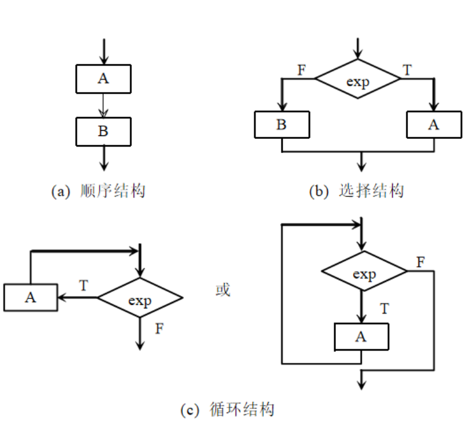{width="6.3in"
height="5.718103674540682in"}

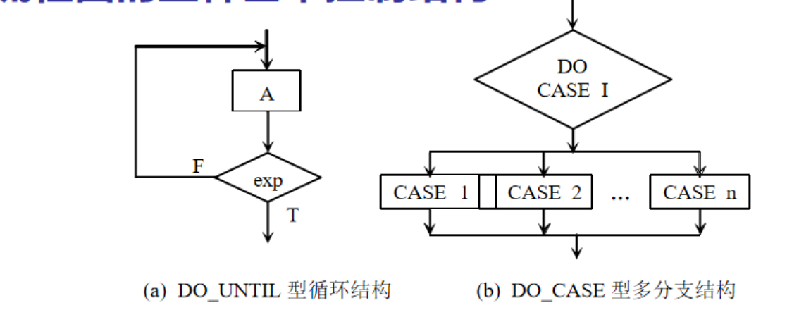{width="6.3in"
height="2.4444444444444446in"}

**优点：**

1.  **独立于任何一种程序设计语言**

2.  **直观和清晰**地描述过程的控制流程

3.  易于**学习掌握**

4.  至今仍是软件开发者**最普遍采用** 的一种工具。

**缺点：**

1.  由于程序流程图的特点，它本身并**不是逐步求精的好工具**。它**使程序员容易过早地考虑程序的具体控制流程**，而**忽略了程序的全局结构**。

2.  程序流程图中用箭头代表控制流，这使得程序员不受任何约束，可以完全**不顾结构程序设计的精神，随意转移控制**。就是箭头就相当于是goto

3.  程序流程图在表示**数据结构**方面存在不足。

### 盒图（N-S图）

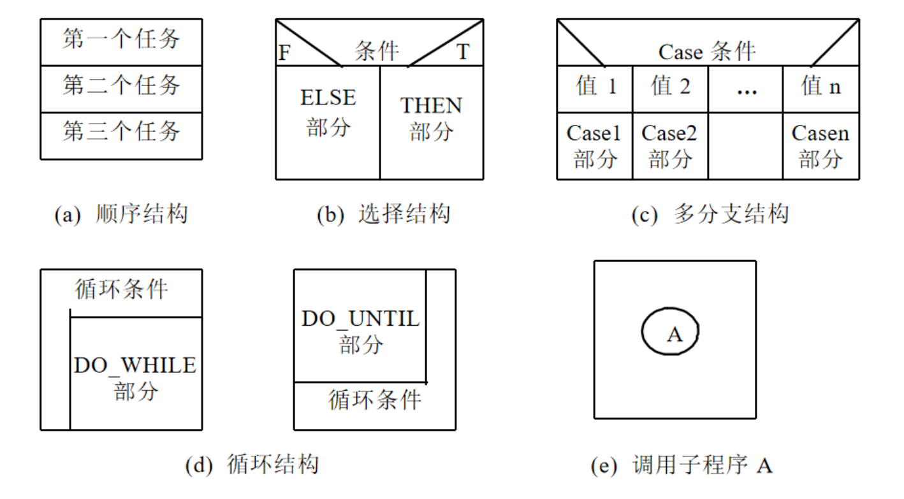{width="6.3in"
height="3.478772965879265in"}

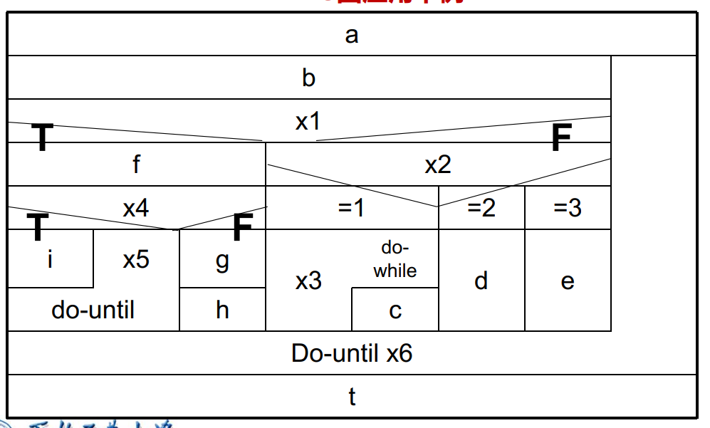{width="6.3in"
height="3.7976935695538057in"}

**优点**

1.  **功能域**（即某一个特定控制结构的作用域）有**明确的规定**，并且可以很直观地从N-S图上看出来。

2.  它的**控制转移不能任意规定，必须遵守结构化程序设计的要求**。（一定只有顺序选择循环）

3.  很容易**确定局部数据和全局数据的作用域**。

4.  很容易表现**嵌套关系，也可以表示模块的层次结构**。

**缺点**

1.  **复杂性限制**：N-S图适合用来描述简单或中等复杂度的算法。但对于复杂的系统或算法，其图表会变得非常复杂和难以阅读。

2.  **空间消耗大**：由于N-S图的结构化特点，图表可能会占用大量的空间，特别是在处理大型程序或多层次的嵌套结构时。

3.  **可读性下降**：对于具有大量条件和循环结构的算法，N-S图可能会变得杂乱无章，导致可读性和理解性下降。

4.  **维护困难**：当程序代码发生变更时，维护和更新N-S图可能会变得繁琐，需要花费大量时间重新绘制图表。

### PAD图

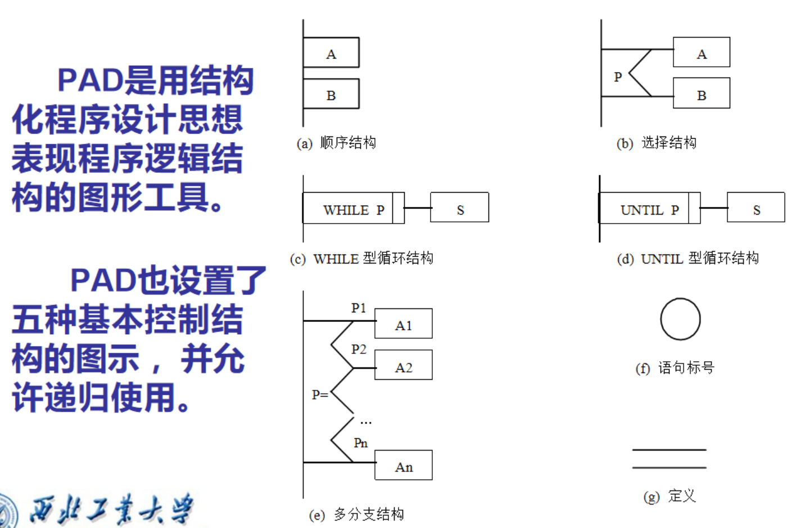{width="6.3in"
height="4.109645669291338in"}

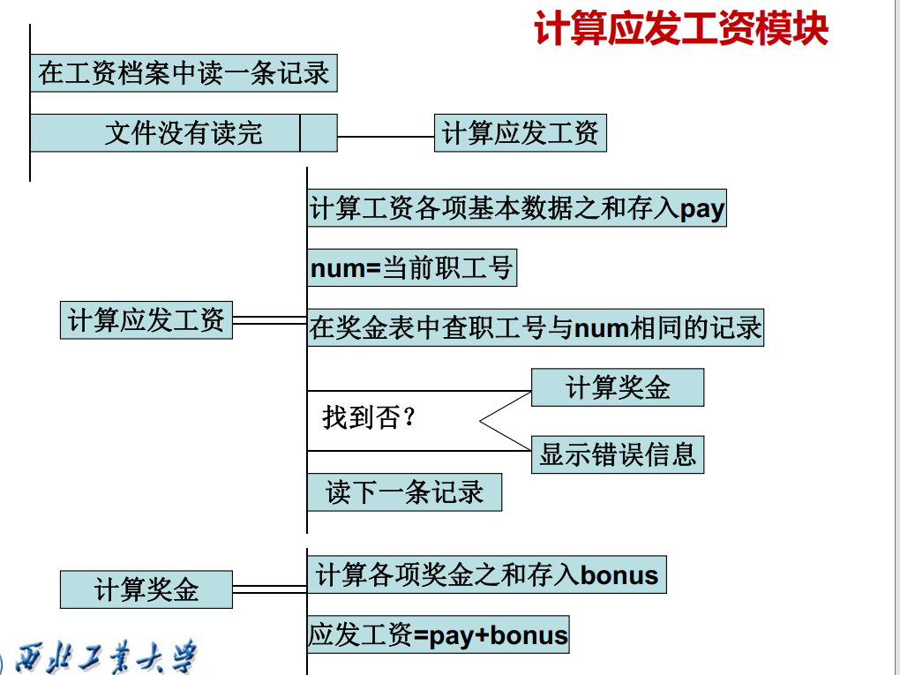{width="6.3in"
height="4.725in"}

**优点**

1.  **清晰度和结构化程度高**。

2.  PAD图中的最左面的线是程序的主干线,即程序的 第一层结构。
    随着程序层次的增加 ，PAD图逐渐 向右延伸。 因此 ，PAD图**可读性强。**

3.  利用PAD图设计出的程序必定是**结构化的程序**。

4.  容易将PAD图转化成高级语言源程序。

5.  PAD图支持自顶向下**逐步求精**的方法。

**缺点**

1.  **复杂性:当系统规模较大、问题较为复杂时,PAD图可能会变得非常复杂和难以管理,影响可读性和理解性。**

2.  **在数据结构方面表现不足（我猜的）**

### PDL语言（过程设计语言、伪代码）

过程设计语言 (PDL) 的特点如下：

**优点：**

1\. PDL 采用严格的关键字外部语法，用于**定义控制结构和数据结构**。

2\. 支持**结构化构件**、**数据说明机制**和**模块化**。

3\.
处理部分采用自然语言描述，表示实际操作和条件的内部语法通常灵活自由，以适应各种工程项目的需要。

4\. PDL 可以说明简单和复杂的数据结构。

5\. 子程序的定义与调用规则不受具体接口方式的影响，具有很大的灵活性。

6.  PDL
    是一种"混杂"语言，使用自然语言的词汇，同时使用结构化程序设计语言的语法。

**缺点：**

1.  然而，PDL 的**缺点是不如图形工具形象直观。**

2.  标准化缺乏：PDL没有统一的标准，不同的开发团队可能使用不同的PDL风格和语法，这会导致在不同团队之间交流和理解上的困难。

3.  可读性因人而异：由于PDL的自由度较高，不同开发人员编写的PDL可能风格各异，增加了阅读和理解的难度，尤其是在大型团队或继承他人代码时。

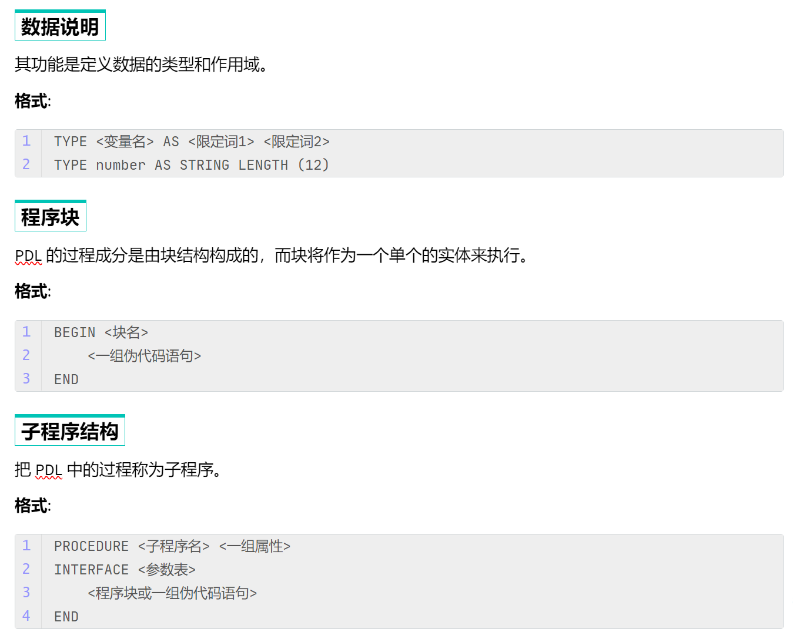{width="6.3in"
height="5.081096894138232in"}

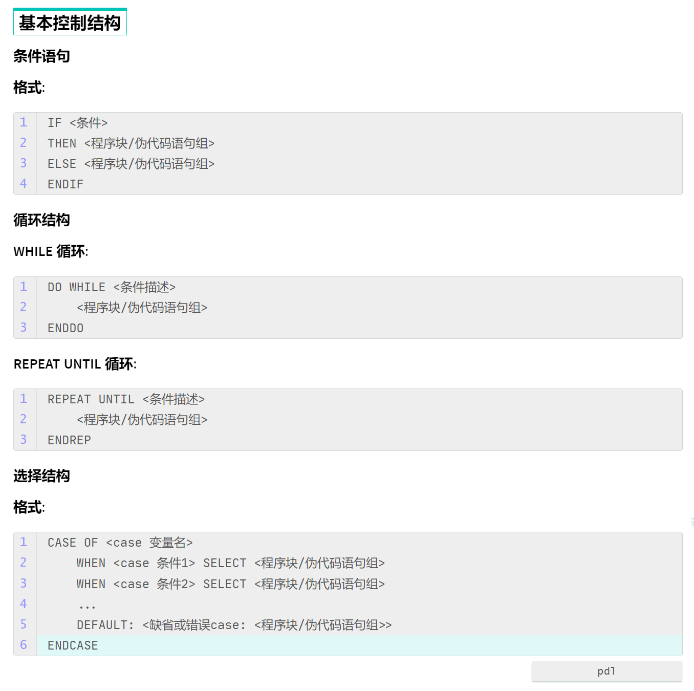{width="6.3in"
height="6.272123797025372in"}

## 流图画法

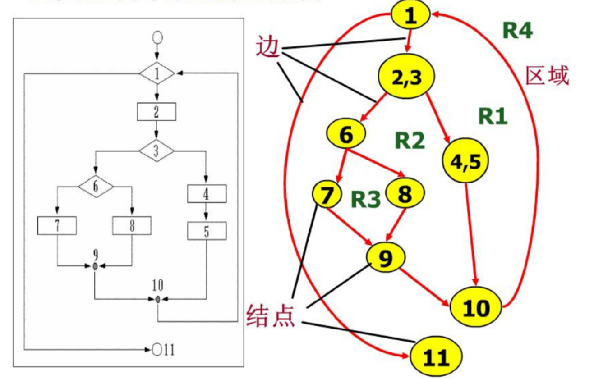{width="6.3in"
height="4.023006342957131in"}

## 什么是环形复杂度，如何计算程序的环形复杂度

根据程序控制流的复杂程度，定量度量程序的复杂度。

**方法一：**

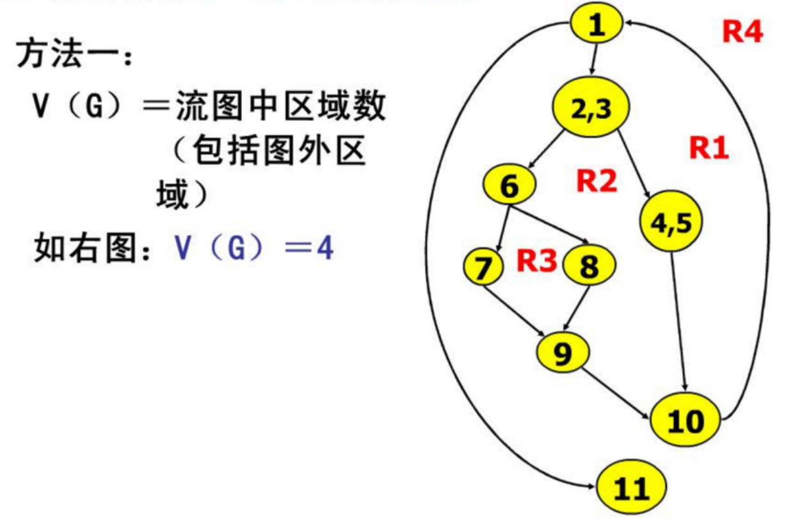{width="6.3in"
height="4.051784776902887in"}

1\. 所有的闭合的就是区域

2\. **不要忘了加上最外层的区域**

**方法二：**

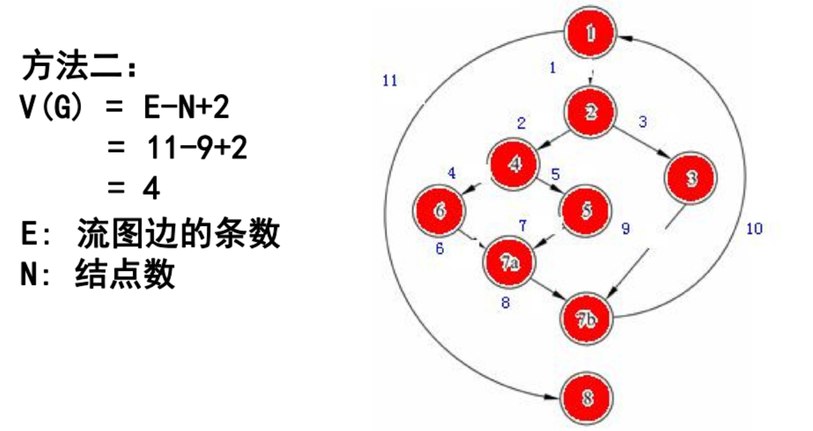{width="6.3in"
height="3.3457370953630794in"}

**方法三：**

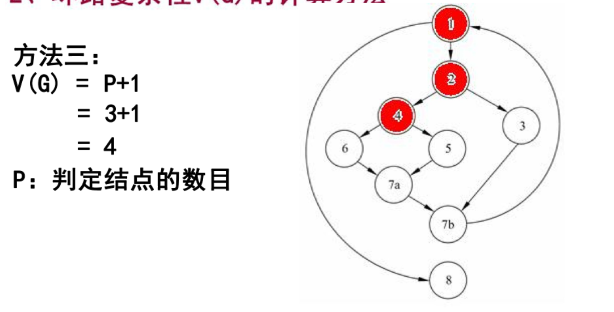{width="6.3in"
height="3.2105336832895888in"}

## 环路复杂度对编程有什么指导意义

### 1-指导编码过程中的复杂程度

McCabe研究大量程序后发现，环形复杂度高
的程序，往往是最困难、最容易出问题的程序。

模块规模以V(G)≤10为宜，也就是说，V(G)=10
是模块规模的一个更科学更精确的上限。

### 2-测试覆盖

环路复杂度为测试工作提供了一个有效的指标。环路复杂度数值越高，表示程序路径越多，需要更多的测试用例来覆盖所有可能的执行路径。通过分析环路复杂度，测试人员可以更好地确定测试用例的数量和覆盖范围，确保代码质量。
