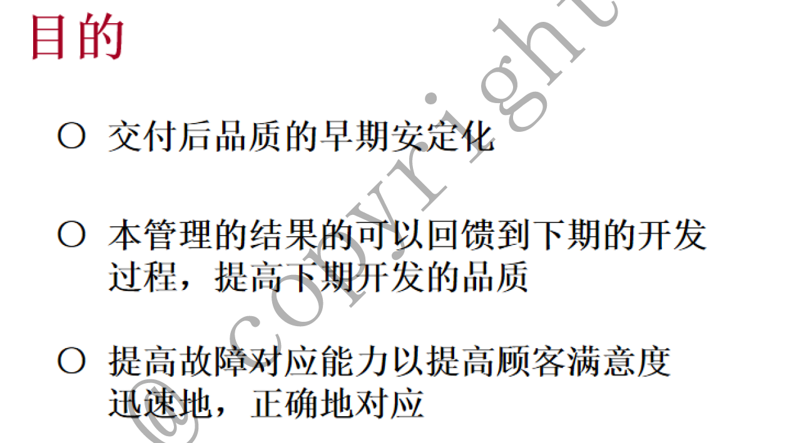
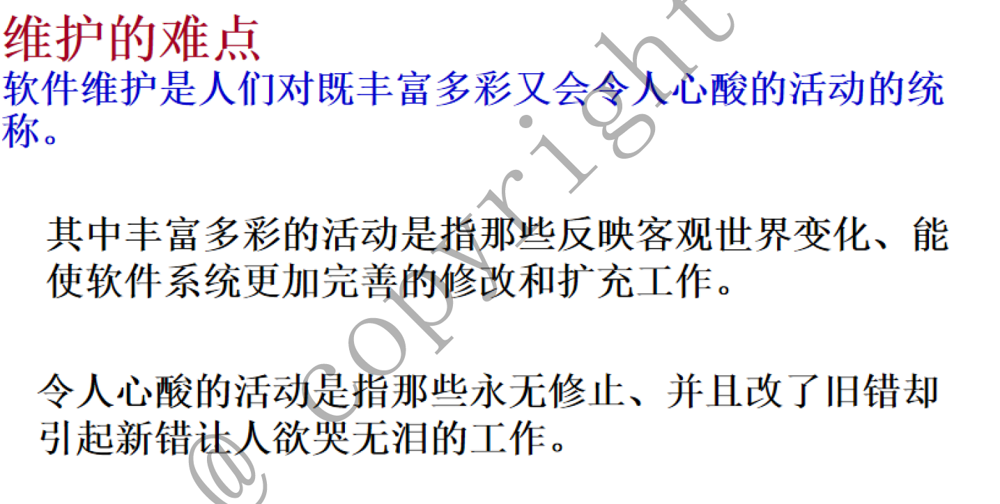
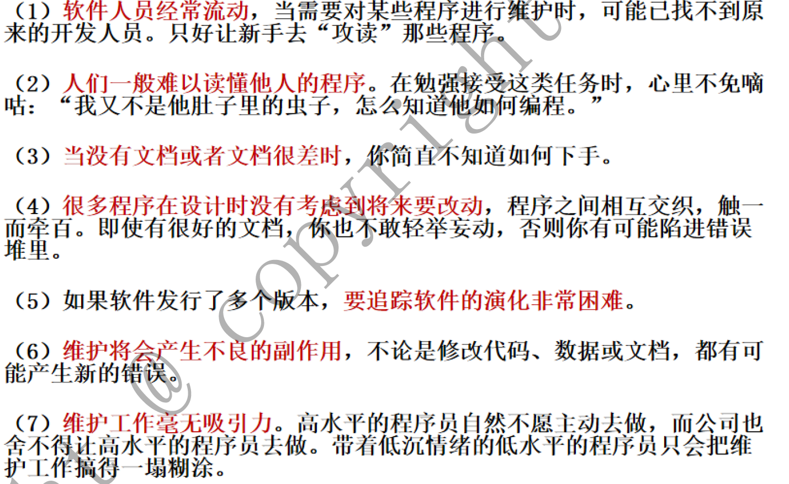
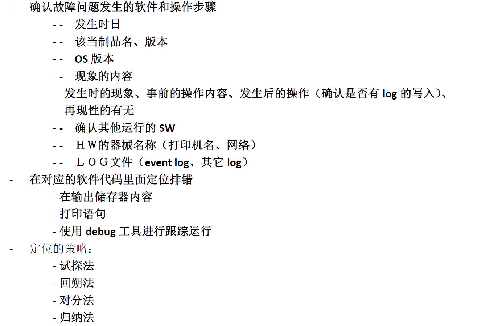
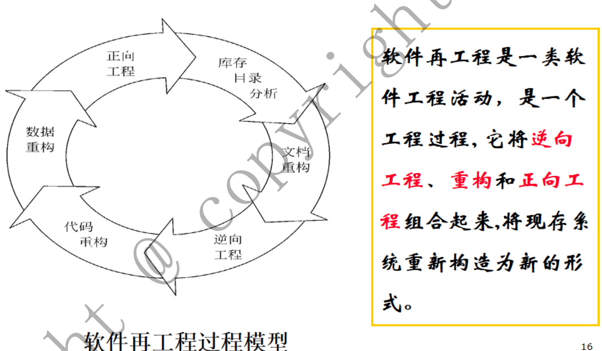
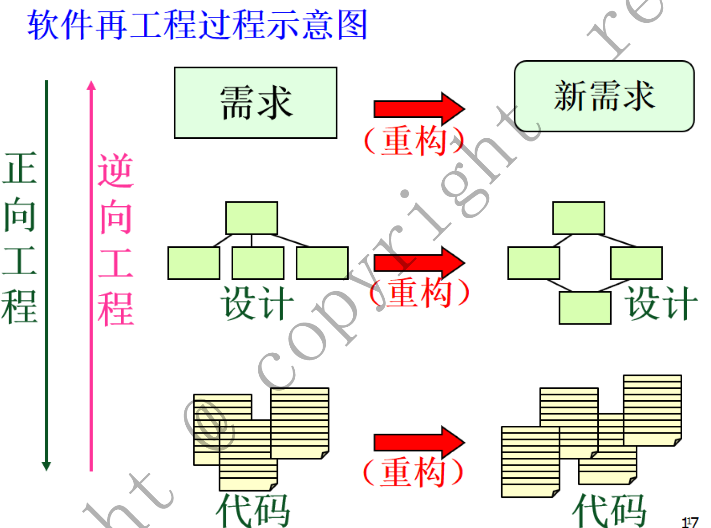

# 第八章

## 1\.维护的概念

所谓软件维护就是在软件**已经交付使用以后**，为了**改正错误**或**满足新的需要**而**修改软件**的过程。

{width="6.3in"
height="3.5198578302712162in"}

## 2\.维护的种类、各类的特点。维护工作的难点在哪里？

种类及特点

（1）纠错性维护。

由于前期的测试不可能揭露软件系统中所有潜在的错误，用户在使用软件时

仍将会遇到错误，诊断和改正这些错误的过程称为纠错性维护。

（2）适应性维护。

由于新的硬件设备不断推出，操作系统和编译系统也不断地升级，为了**使软**

**件能适应新的环境**而引起的程序修改和扩充活动称为适应性维护。

（3）完善性维护。

在软件的正常使用过程中，用户还会**不断提出新的需求**。为了**满足用户新的**

**需求**而增加软件功能的活动称为完善性维护。

（4）预防性维护

为了改进应用软件的可靠性和可维护性，为了适应未来的软/硬件环境的变化，应主动增加**预防性的新的功能**，以使应用系统适应各类变化而不被淘汰。

**维护工作难点**

{width="6.3in"
height="3.178536745406824in"}

{width="6.3in"
height="3.866409667541557in"}

## 3\.纠错型维护的方法：程序运行发现了错误，如何定位错误、确认问题点？（综合问题，答案在维护和调试里面）

{width="6.3in"
height="4.134231189851269in"}

## 4\. 修改错误代码的注意点有哪些？试着枚举至少3条

-   **设计思想的一致性**

-   **修改的处所尽可能的少，不要比需要修改的地方多**

-   尽量不使用共享系统中的已有变量，而使用局部量

-   不要建立公用子程序，**而建立各自独立的子程序**

-   **坚持修改后的复审**

-   **建立修改文档**

-   **注意修改相应的文档**

## 5\.什么是再工程。

将现存系统重新构造为新的形态。

{width="6.3in"
height="0.44318788276465443in"}

{width="6.3in"
height="3.679608486439195in"}

## 6\.什么是逆向工程

软件逆向工程又称软件反向工程，是指**从可运行的程序系统出发**，运用**解密、反汇编、系统分析、程序理解等多种计算机技术**，对软件的**结构、流程、算法、代码等进行逆向拆解和分析，推导出软件产品的源代码、设计原理、结构、算法、处理过程、运行方法及相关文档**等。通常，人们把对软件进行反向分析的整个过程统称为软件逆向工程，把在这个过程中所采用的技术都统称为软件逆向工程技术。

{width="6.3in"
height="4.678498468941382in"}
