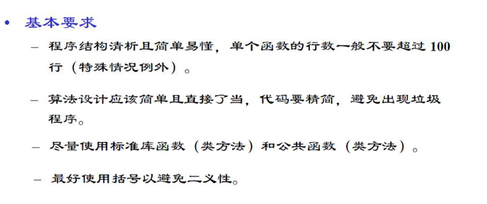
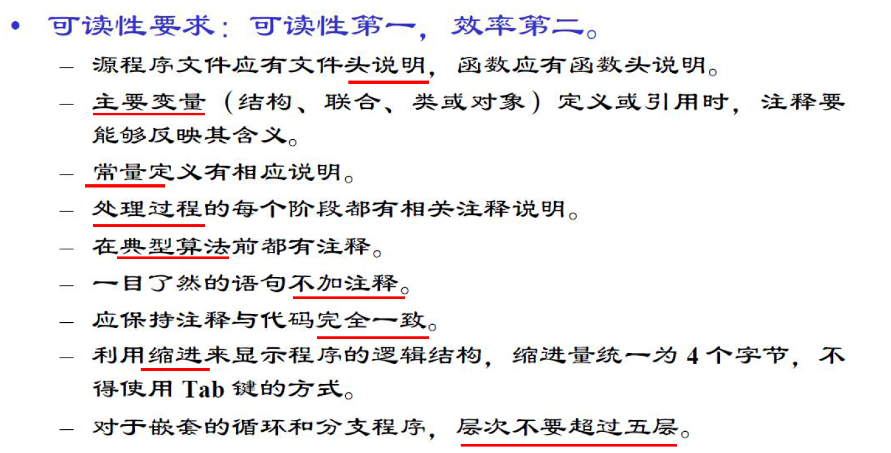
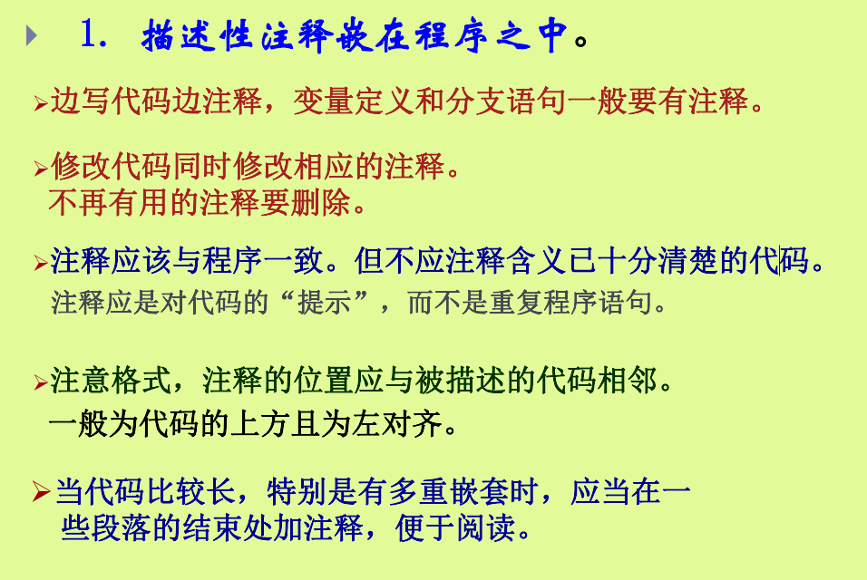
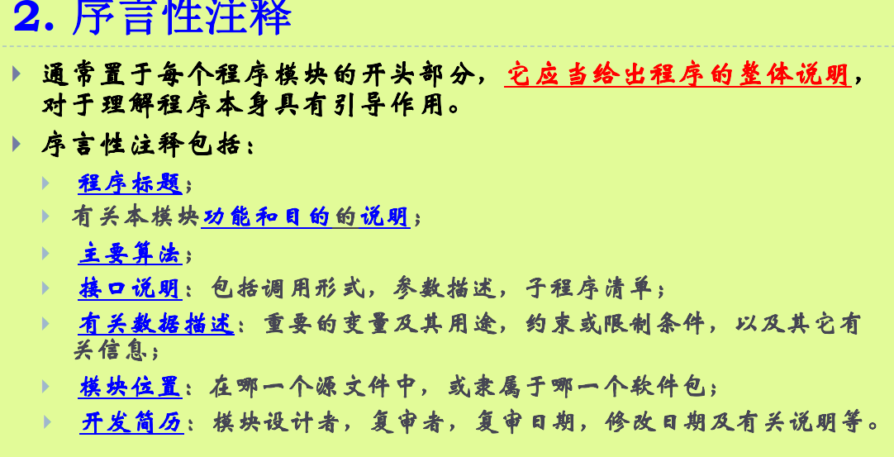
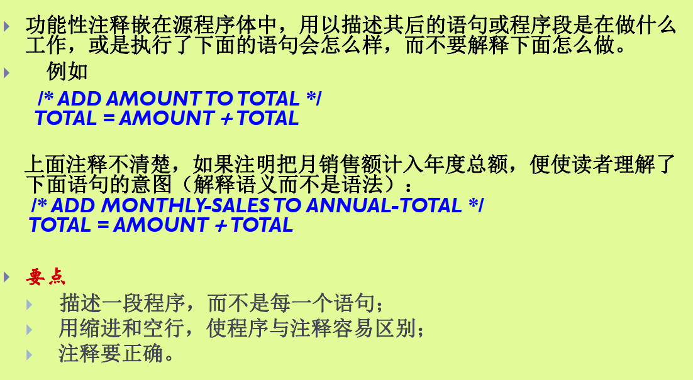
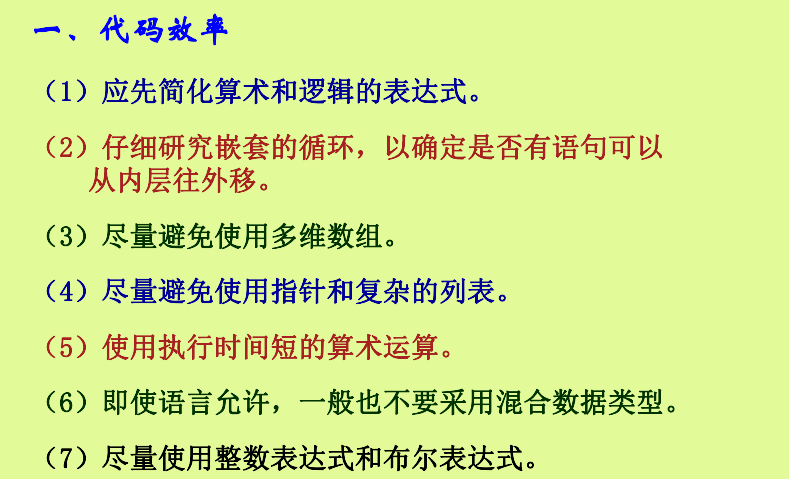
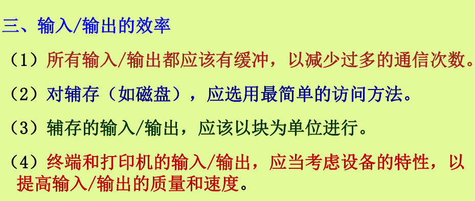
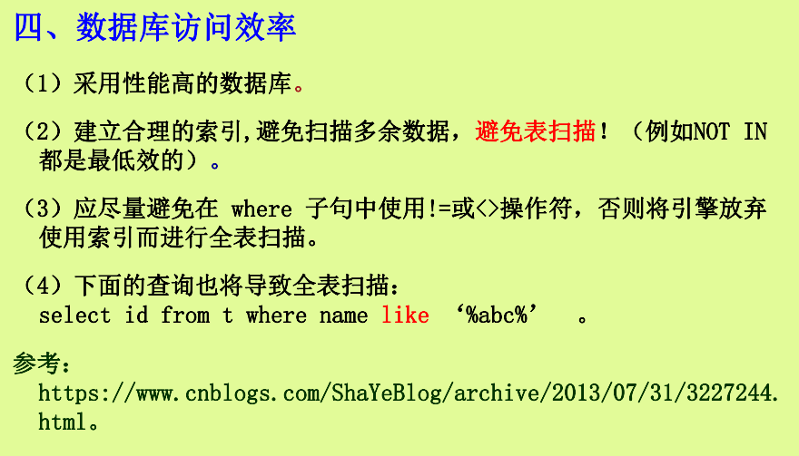

# 第六章

## 1.编程语言共有的特性有哪些

**类型说明**

-   数据类型的定义和使用，如整数、浮点数、字符串、自定义类型等。

**名字说明**

-   如何为变量、函数、类等命名，包括合法字符和命名风格。

**初始化**

-   变量和数据结构在声明时赋予初始值的方式。

**程序对象的局部性**

-   变量和函数的作用域范围，如局部变量、全局变量。

**循环控制结构**

-   实现循环的结构，如 \`for\`、\`while\`、\`do-while\`。

**分支控制结构**

-   实现条件分支的结构，如 \`if\`、\`else if\`、\`switch\`。

**异常处理**

-   处理运行时错误的机制，如 \`try-catch\` 块。

**程序模块**

代码的模块化和组织方式，如函数、类、模块、包等。

**独立编译**

-   代码模块的独立编译和链接方式，支持增量编译。

## 2.什么是编码规范，枚举一些常用的编码规范

### 编码规范定义

编码规范（Coding
Standards）是**与特定语言相关**的描写**如何编写代码**的**规则集合**。

这些规则旨在提高代码的**可读性、可维护性和一致性**，使得多个开发者可以协同工作，并减少代码中的错误和不一致性。

编码规范枚举：

### **为什么要有编码规范**

1.  软件全生命周期的70%成本是维护

2.  软件在其生命周期中很少由原编写人员进行维护目的

所以需要编码规范①提高编码质量，避免不必要的程序错误②增强程序代码的可读性、可重用性和可移植性。

### **编码规范要求**

{width="6.3in"
height="2.6432042869641297in"}

{width="6.3in"
height="3.207024278215223in"}

## 3.什么是程序内文档。如何做程序内文档（或者注意点有哪些）

程序内文档是指**嵌入在源代码中的注释和说明**，用于**帮助理解和维护代码**。其目的是使代码更具可读性，便于后续开发人员理解代码的意图和逻辑。

1\. **描述性注释**：

-   **定义**：简要说明代码的具体实现，解释**单个变量或特定语句**的用途和行为。

-   **示例**：\`int totalAmount = 0; // 初始化总金额为0\`

{width="6.3in"
height="4.217573272090989in"}

2\. **序言性注释**：

-   **定义**：位于每个程序模块的开头，提供模块的整体说明，包括标题、功能、算法、接口和数据描述等。

-   **示例**：

{width="6.3in"
height="3.2198709536307963in"}

3\. 功能性注释：

\- **定义：**代码和**，解**功能和预期结果，而不是具体实现细节。

{width="6.3in"
height="3.458711723534558in"}

## 4\.枚举提高程序局部效率（代码效率）的方法

{width="6.3in"
height="3.824714566929134in"}

{width="6.3in"
height="1.93544728783902in"}

{width="6.3in"
height="2.6651235783027123in"}

{width="6.3in"
height="3.601022528433946in"}
