# 第十三章

## 1\.**软件项目管理**的内容包含哪些。至少枚举3条

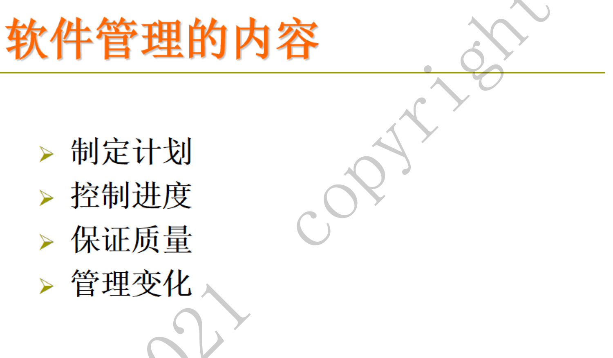{width="6.3in"
height="3.683400043744532in"}

**成本，人员，进度，质量，风险等。**

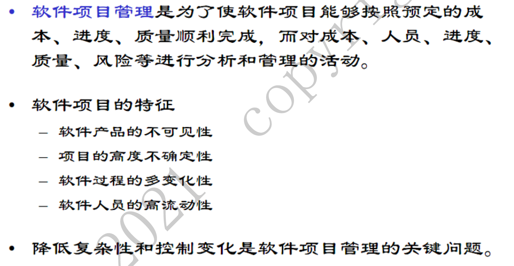{width="6.3in"
height="3.261760717410324in"}

**具体关注内容：**

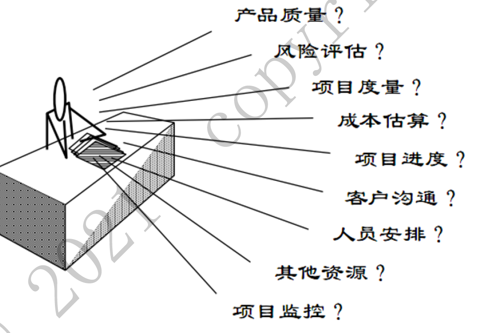{width="5.947916666666667in"
height="3.968536745406824in"}

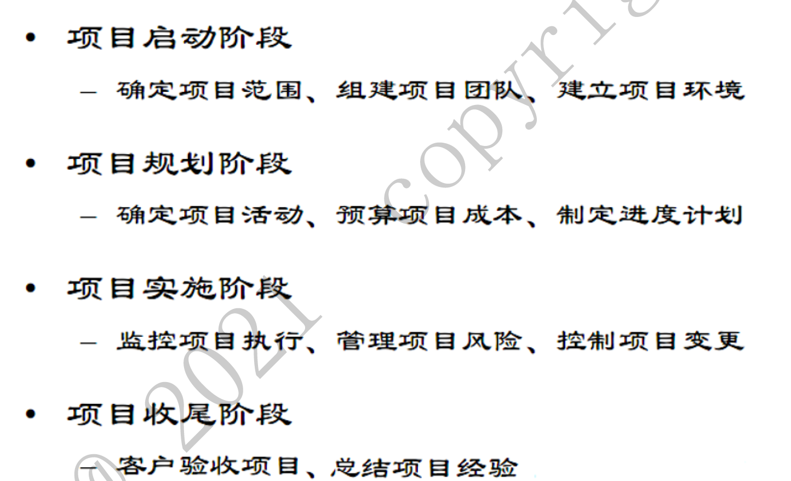{width="5.960227471566054in"
height="3.6322714348206473in"}

## 2\. 甘特图一般用来描述什么内容？试举例说明

是历史悠久，应用广泛的制定进度计划的工具。用来描述项目计划和进度。

**举例如下：**

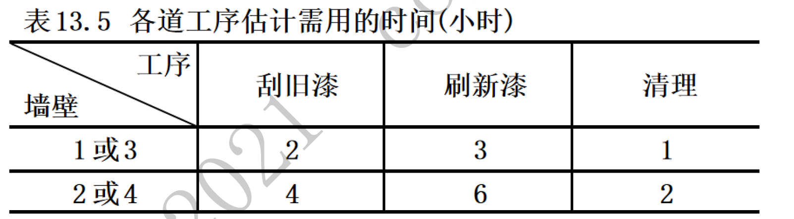{width="6.3in"
height="1.7449781277340333in"}

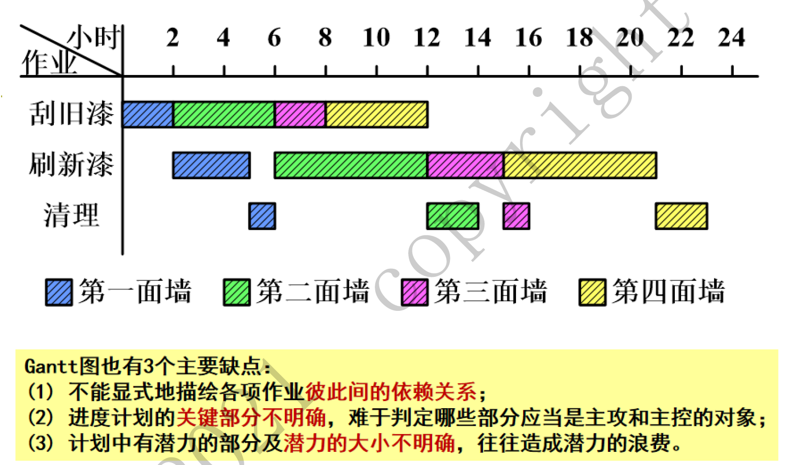{width="6.3in"
height="3.6129451006124236in"}

## 3\. 作为一个合格的软件开发人员的条件有哪些，试枚举5条以上

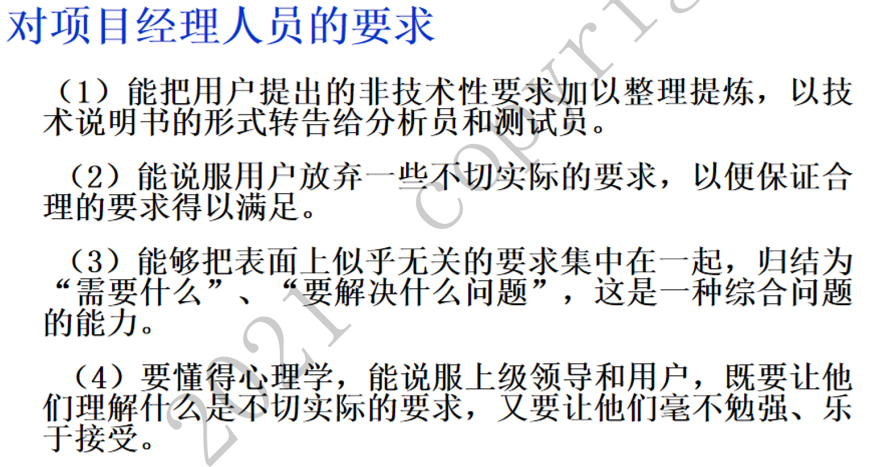{width="6.3in"
height="3.3115387139107613in"}

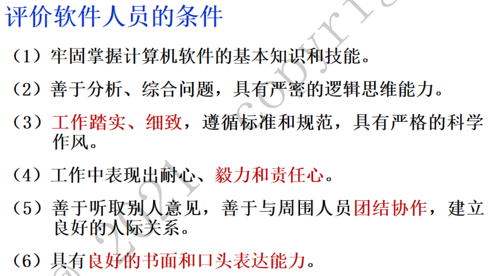{width="6.3in"
height="3.5220472440944883in"}

能力方面

1.  牢固掌握计算机软件的基本知识和技能。

2.  善于分析、综合问题。

3.  具有良好的书面和口头表达能力。

态度方面

1.  工作细致，遵循标准和规范。

2.  表现出耐心、毅力、责任心。

3.  善于听取别人的意见以及团队合作。

## 4\. 评价软件质量的因素（试枚举评价软件质量的方面）

1.  **正确性（Correctness）**

-   **定义**：软件的输出结果是否符合预期，是否按照需求规格说明书的要求执行。

-   **评价标准**：通过测试用例验证功能是否实现，检查逻辑和算法是否正确。

**2. 健壮性（Robustness）**

-   **定义**：软件在异常条件下（如输入错误、硬件故障等）是否仍能稳定运行。

-   **评价标准**：进行异常和边界测试，检查软件在极端情况下的反应和处理能力。

**3. 可理解性（Understandability）**

-   **定义**：软件的代码和文档是否易于理解，便于新开发人员快速掌握。

-   **评价标准**：代码注释、文档的清晰度和完整性，代码结构的清晰度。

**4. 可维护性（Maintainability）**

-   **定义**：软件是否容易修改和扩展，是否容易修复错误和增加新功能。

-   **评价标准**：代码的模块化程度、耦合度、重构难易程度、测试覆盖率。

**5. 可移植性（Portability）**

-   **定义**：软件在不同环境（操作系统、硬件平台等）下是否能运行。

-   **评价标准**：平台依赖性、跨平台测试结果、移植过程的复杂性。

**6. 效率（Efficiency）**

-   **定义**：软件在资源使用上的表现，包括运行速度、内存使用、带宽消耗等。

-   **评价标准**：性能测试结果（如响应时间、吞吐量）、资源使用率（CPU、内存）。

**7. 可用性（Usability）**

-   **定义**：用户界面的友好程度，用户在使用软件时的体验是否良好。

-   **评价标准**：用户满意度调查、可用性测试、界面的直观性和一致性。

**8. 安全性（Security）**

-   **定义**：软件是否能防止未授权访问和数据泄露，是否能抵御攻击。

-   **评价标准**：安全漏洞扫描结果、安全测试（如渗透测试）、加密和认证机制的有效性。

## 5\.什么是SQA

软件质量保证指的是：

通过制定和执行质量管理流程和活动，以确保最终交付给用户的软件产品符合预期的质量标准和用户需求。

软件质量保证不仅包括对软件产品本身的质量检验，还涉及到开发过程中的各个阶段及相关文档的质量保证。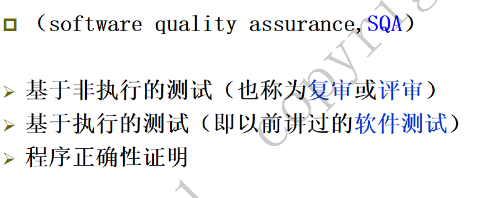{width="6.3in"
height="2.5290649606299214in"}

## 6\.软件配置管理的目标、内容和对象

**目标：**

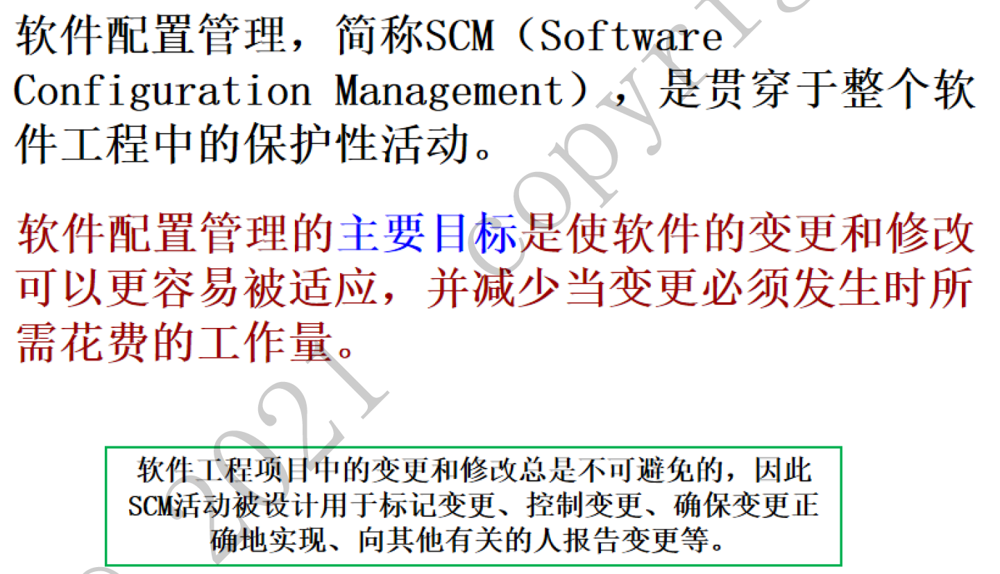{width="6.3in"
height="3.6199857830271216in"}

### 软件配置管理的内容

-   标识变化；

-   控制变化；

-   确保适当地实现了变化；

-   向需要知道这类信息的人报告变化。

### 软件配置管理的对象有哪些

-   文档

-   代码

-   数据

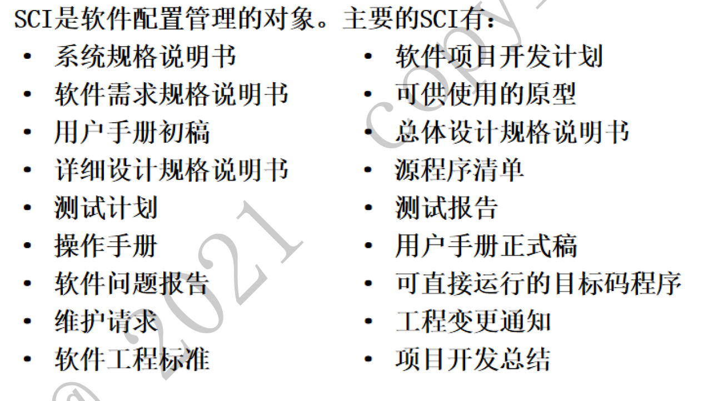{width="6.3in"
height="3.5703291776027997in"}

## 7\. 配置管理工具举例

-   Svn

-   Git

-   Sourcesafe

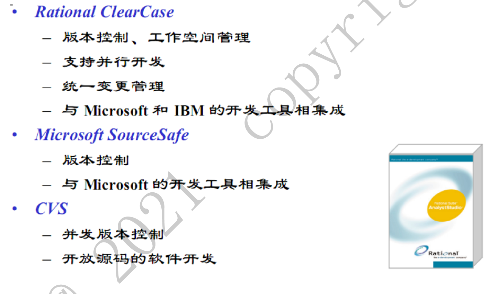{width="6.3in"
height="3.723921697287839in"}

## 8\. 基线的概念，什么是里程碑

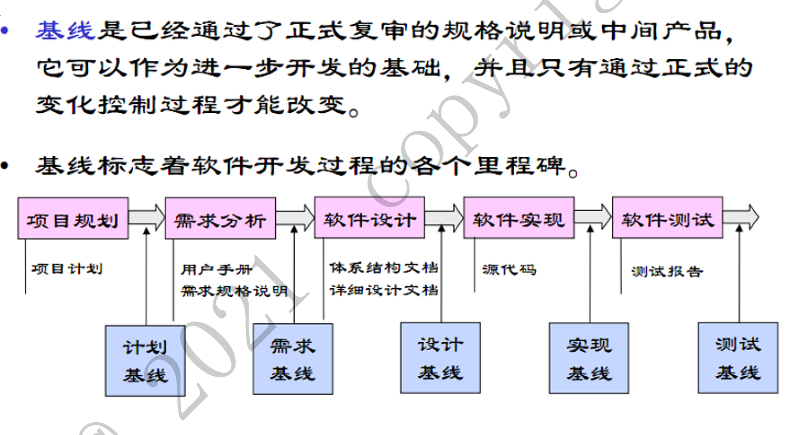{width="6.3in"
height="3.45in"}

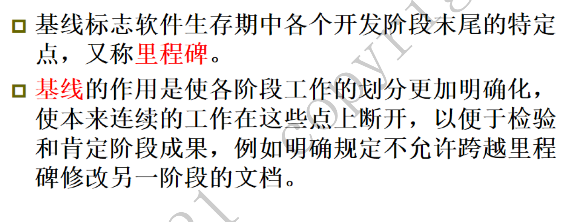{width="6.3in"
height="2.4in"}

## 9\. CMMI的5个级别

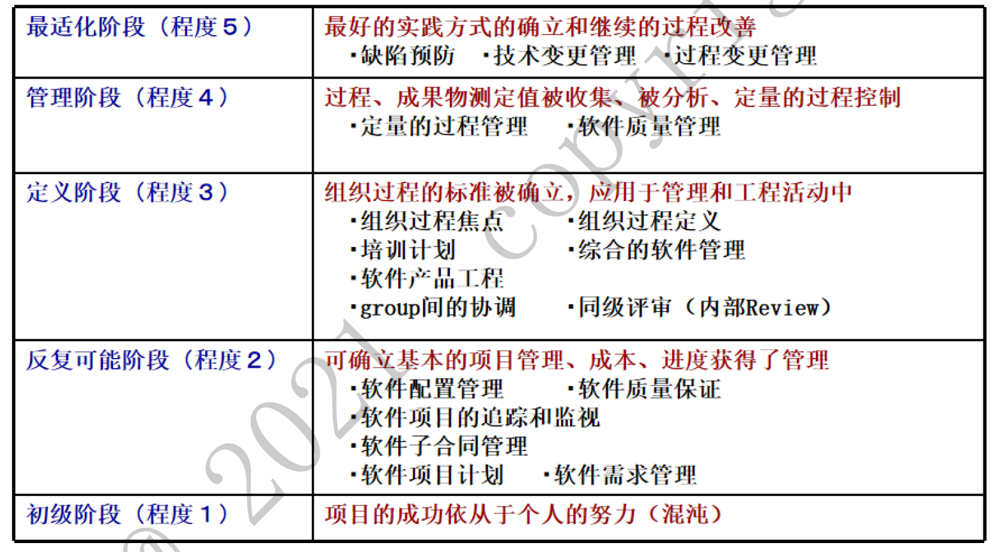{width="6.3in"
height="3.482108486439195in"}

## 10\. 如何确保软件的质量（综述题目）

-   正确的开发方式（需求获取、设计、编码这些环节的注意点，自行展开）

-   分阶段的评审（静态测试）

-   分阶段的测试（动态测试），确保代码覆盖、功能覆盖、非功能测试要注意。

需求管理：

-   确保需求清晰明确，并在开发过程中持续跟踪和管理。

-   使用需求管理工具，如JIRA和Confluence。

现代开发方法：

-   采用敏捷开发和精益开发，提高对变化的响应能力和交付效率。

-   实施DevOps实践，缩短开发与运营之间的距离，提高发布频率和可靠性。

代码审查：

-   定期进行代码审查和同行评审，确保代码质量，减少错误和缺陷。

-   使用GitHub或GitLab的Pull Requests或Merge Requests。

自动化测试：

-   实施单元测试、集成测试和端到端测试，确保代码正确性。

-   使用自动化测试框架，如JUnit、Selenium和Cypress。

持续集成与交付（CI/CD）：

-   采用CI/CD流程，每次代码提交后自动构建、测试和部署。

-   使用Jenkins、CircleCI或Travis CI等CI/CD工具。

代码质量：

-   使用SonarQube、ESLint和Checkstyle等静态代码分析工具，检测代码中的潜在问题。

-   定期进行代码重构，保持代码简洁和可维护。

文档与知识共享：

-   编写全面的文档，包括代码注释、架构文档和使用手册，帮助团队理解和维护系统。

-   组织技术分享和培训，提高团队整体技术水平。

用户反馈与监控：

-   定期收集用户反馈，了解实际使用中的问题和需求，及时改进软件。

-   使用New Relic和Datadog等APM工具，实时监控软件运行状态和性能。

安全审查：

-   进行安全评估和渗透测试，发现和修复安全漏洞。

-   遵循安全编码标准和最佳实践，确保软件安全性。

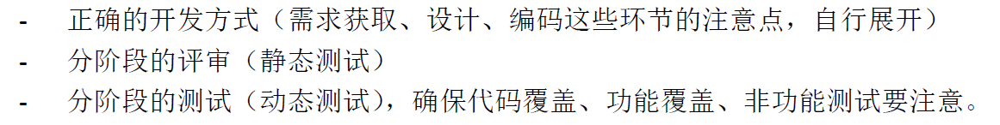{width="6.3in"
height="0.7922484689413823in"}
