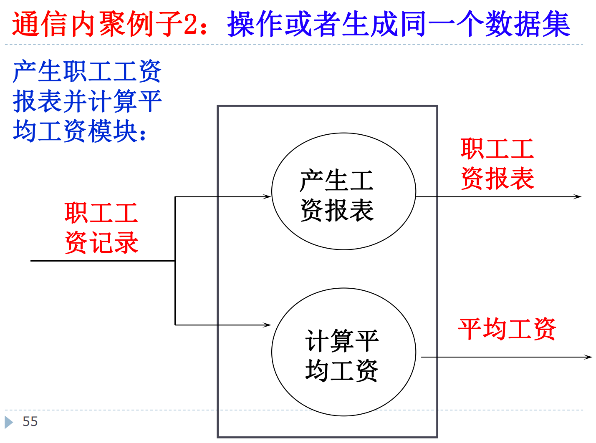

# 第四章

## 总体（概要）设计的内容是什么。

-   将系统划分成模块

-   决定每个模块的功能

-   决定模块的调用关系

-   决定模块的界面，即模块间传递的数据

## 模块的定义，模块化设计的重要指导思想是什么。为什么采用模块化进行软件设计？

### 模块的定义

模块(module)是数据说明和可执行语句等程序对象的集合，每个模块单独命名并且可以通过名字对模块进行访问。

### 模块化设计的重要指导思想

**分解、信息隐蔽、确保模块独立性**

{width="4.296875546806649in"
height="2.996700568678915in"}

{width="4.072916666666667in"
height="3.266982720909886in"}

{width="3.9933048993875766in"
height="2.9958038057742784in"}

{width="4.30198053368329in"
height="3.0494597550306213in"}

### 采用模块化进行软件设计的原因

降低系统的开发难度，增加系统的可维护性

{width="6.3in"
height="3.3015463692038494in"}

{width="6.3in"
height="3.866470909886264in"}

## 什么是耦合，具体由哪些耦合方式，每种的含义是什么？

**耦合**是对一个软件结构内不同模块之间互联程度的度量。

强弱取决于

1.  模块间接口的复杂程度。

2.  进入或访问一个模块的点。

3.  通过接口的数据。

{width="6.3in"
height="3.346875546806649in"}

### 非直接耦合

{width="6.3in"
height="4.401746500437445in"}

### 数据耦合

输入输出是最简单的数据结构，且全部被 被调用者使用。

{width="6.3in"
height="4.5247112860892384in"}

### 标记耦合（特征耦合）

{width="6.3in"
height="4.137312992125985in"}

### 控制耦合

{width="6.3in"
height="3.9352941819772527in"}

{width="6.3in"
height="4.103170384951881in"}

解决方法：

-   面向过程的修改方法：

    -   在调用点进行条件判断；

    -   将B函数按照子功能拆分：

{width="6.3in"
height="4.0283213035870515in"}

-   面向对象的修改方法：

{width="6.3in"
height="4.0203947944007in"}

### 外部耦合

{width="6.3in"
height="4.40209208223972in"}

### 公共耦合

{width="6.3in"
height="4.492174103237096in"}

{width="6.3in"
height="3.8259853455818025in"}公共耦合存在的问题：

-   公共部分的改动将影响所有调用它的模块；

-   公共部分的数据存取无法控制；

-   复杂程度随耦合模块的个数增加而增加。

解决方法:

-   通过使用信息隐藏来避免公共耦合。

### 内容耦合

{width="6.3in"
height="4.240720691163604in"}

## 模块之间联系的原则

-   尽量使用数据耦合，少用控制耦合，限制公共耦合的范围，完全不用内容耦合。

-   模块间相互调用时，传递参数最好只有一个。

### 例题

{width="6.3in"
height="1.5932075678040245in"}

{width="6.3in"
height="3.7846576990376204in"}

## 什么是内聚，内聚有哪些类型。设计时应追求什么内聚，哪种类型内聚性最差？

-   **内聚**是指模块内部**各组成部分**为了**执行处理功能**而组合在一起的相关程度

-   内聚标志着一个模块内部各个元素间彼此结合的紧密程度。简单地说，理想内聚的模块只做一件事情。设计时应该力求做到高内聚，通常中等程度的内聚也是可以采用的，而且效果和高内聚相差不多。但是，坚决不要使用低内聚。

-   内聚和耦合是密切相关的，**模块内的高内聚往往意味着模块间的低耦合**。内聚和耦合都是进行模块化设计的有力工具。实践表明，**内聚更重要**，应该把更多注意力集中到提高模块的内聚程度上。

{width="6.3in"
height="3.9501607611548555in"}

{width="6.3in"
height="0.7037839020122485in"}

### 偶然内聚

{width="6.3in"
height="3.9059995625546806in"}

### 逻辑内聚

{width="6.3in"
height="4.076470909886265in"}

{width="6.3in"
height="4.173417541557305in"}

### 时间内聚

{width="6.3in"
height="4.406410761154856in"}

### 过程内聚

{width="6.3in"
height="4.218583770778653in"}

{width="6.3in"
height="4.028867016622923in"}

### 通信内聚

{width="6.3in"
height="4.427272528433946in"}

{width="6.3in"
height="4.10294072615923in"}

{width="6.3in"
height="4.685294181977253in"}

### 顺序内聚

{width="6.3in"
height="3.863636264216973in"}

### 功能内聚

{width="6.3in"
height="4.348672353455818in"}

{width="6.3in"
height="4.618562992125984in"}

## 模块化的基本原则

-   高内聚，低耦合。

## 模块的评价标准

高内聚、低耦合为 基本准则。

-   可分解；可组装；可理解；连续性；保护性；

{width="6.3in"
height="2.7861975065616797in"}

## 什么是模块的深度广度

-   **深度** = 分层的层数。过大表示分工过细。

-   **宽度** = 同一层上模块数的最大值。过大表示系统复杂度大。

## 什么是扇入扇出

-   **扇出** = 一个模块直接调用\\控制的模块数。 3 ≤ fan-out ≤ 9

{width="6.3in"
height="3.1681036745406823in"}

-   **扇入** = 直接调用该模块的模块数

{width="6.3in"
height="3.530340113735783in"}

-   在不破坏独立性的前提下，**fan-in
    大的比较好，扇入越大说明复用性越好。**

-   尽可能减少高扇出结构，随着深度增大扇入如果一个模块的扇出数过大，就意味着该模块过分复杂，需要协调和控制过多的下属模块。应当适当增加中间层次的控制模块。

-   一般来说，顶层扇出高，中间扇出少，低层高扇入。

{width="6.3in"
height="5.371688538932633in"}

## 什么是控制域、作用域

-   **控制域**指该模块本身以及所有直接或间接从属于它的模块。

{width="6.3in"
height="1.5650317147856518in"}

-   **作用域**是指该模块中一个判断所影响的所有其它模块；

{width="6.3in"
height="0.7135925196850393in"}

-   模块的作用范围应保持在该模块的控制范围内

{width="6.3in"
height="3.6787018810148733in"}

## 模块设计时的启发式规则有哪些

1.  改进软件结构提高模块独立性

2.  深度、宽度、扇出和扇入应适中

3.  模块的作用域应该在控制域之内

4.  力争降低模块接口的复杂程度

5.  设计单入口、单出口的模块

6.  模块功能应该可以预测

## 什么是变化流，什么是事务流；会进行甄别

### 变换流（ Transform flow ）

根据基本系统模型，信息通常以"外部世界"的形式进入软件系统，经过处理以后再以"外部世界"的形式离开系统。信息沿输入通路进入系统，同时由外部形式变换成内部形式，进入系统的信息通过变换中心，经加工处理以后再沿输出通路变换成外部形式离开软件系统。当数据流图具有这些特征时，这种信息流就叫做**变换流**。

{width="6.3in"
height="4.480645231846019in"}

{width="6.3in"
height="4.391470909886264in"}

### 事务流（Transaction Flow）

**原则上所有信息流都可以归结为变换流**，但是当数据流图"以事务为中心"，也就是说：

数据沿输入通路到达一个处理T，这个处理根据输入数据的类型在若干个**动作序列**中选出一个来执行。这类系统的特征，是具有在多种事务中选择执行某种事务的能力。事务型结构由至少一条接受路径、一个事务中心和若干条动作路径组成。这类数据流应该划为一类特殊的数据流，称为**事务流**。

{width="6.3in"
height="4.849484908136483in"}

{width="6.3in"
height="4.0585651793525805in"}

## 如何画层次图，结构图

### 层次图

在总体设计中常用，用于描述软件的整体层次结构。

{width="6.3in"
height="3.78in"}

{width="6.3in"
height="3.6049048556430447in"}

### 结构图

{width="6.3in"
height="3.8287292213473316in"}

{width="6.3in"
height="3.5388353018372705in"}

### 注意点

{width="6.3in"
height="2.8358727034120736in"}

## 如何从数据流图导出系统初始结构。

{width="6.3in"
height="5.1536701662292215in"}

一般导出为 输入模块 -\> 计算模块 -\> 输出模块 即可。

{width="6.3in"
height="4.788414260717411in"}

## 习题

{width="6.3in"
height="3.910667104111986in"}

{width="6.3in"
height="3.4380260279965005in"}

{width="6.3in"
height="3.8037740594925635in"}

{width="6.3in"
height="3.749573490813648in"}

{width="6.3in"
height="3.505263560804899in"}{width="6.3in"
height="3.3867049431321083in"}
